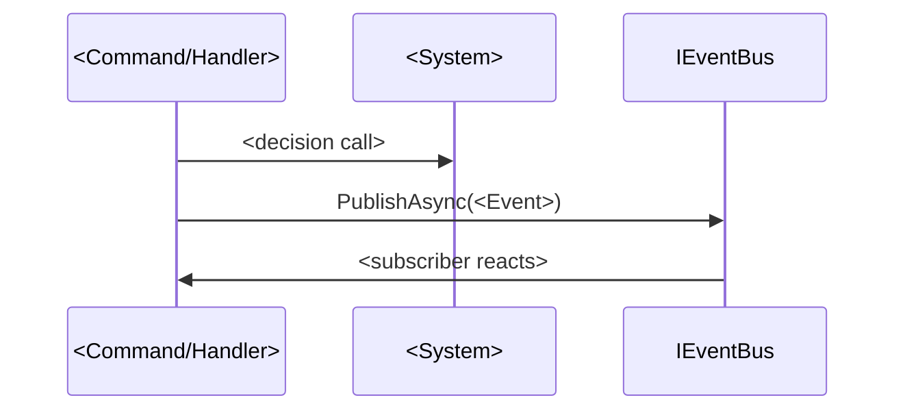

<!--
TEMPLATE: Flow / journey — docs/architecture/flows/<name>.md
A critical hot path or feature journey. Broad strokes, not a spec. Name systems and events,
NOT every method call. One journey per feature; plus a small set of cross-cutting runtime flows.
The mermaid stays at systems/events granularity. Delete these comments on copy.
-->
# <Journey or runtime flow>

> [Back to flows index](README.md). **Trigger:** one line — what kicks this off.

## Summary

The path in a paragraph: which systems participate, which events flow between them, the general logic. Enough for a developer to know *where to go hunting*. Reference other flows as `[Flow: <name>](<name>.md)`; never reproduce their diagram.

## Steps

<!-- Optional. List ONLY the major steps the path actually has (typically 3–7) — each names a
     system/event, the decision made, and the outcome, not call signatures. Do NOT pad to a
     fixed count. If the Summary + mermaid already convey the path, omit this section entirely. -->

## Where to look

- [`<EntryPoint>.cs`](../../../Core/Modules/<Feature>/...) — the entry point.
- [`<feature>.md`](../../features/<feature>/<feature>.md) — the feature it serves; its `<system>.md` docs for the internals.
