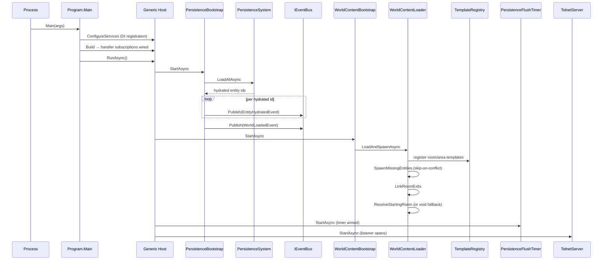
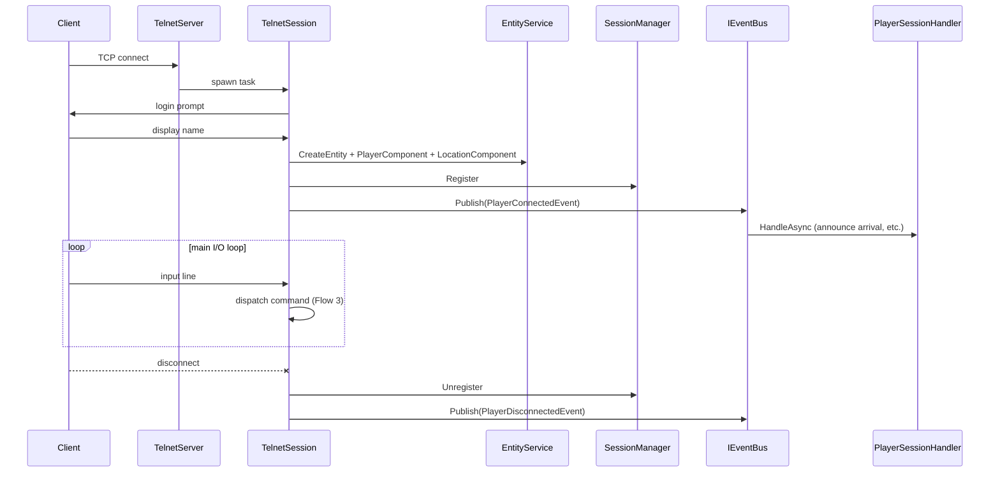
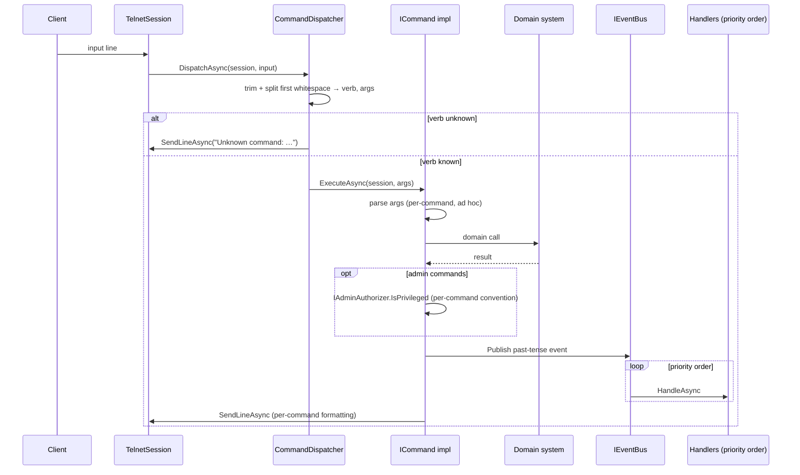
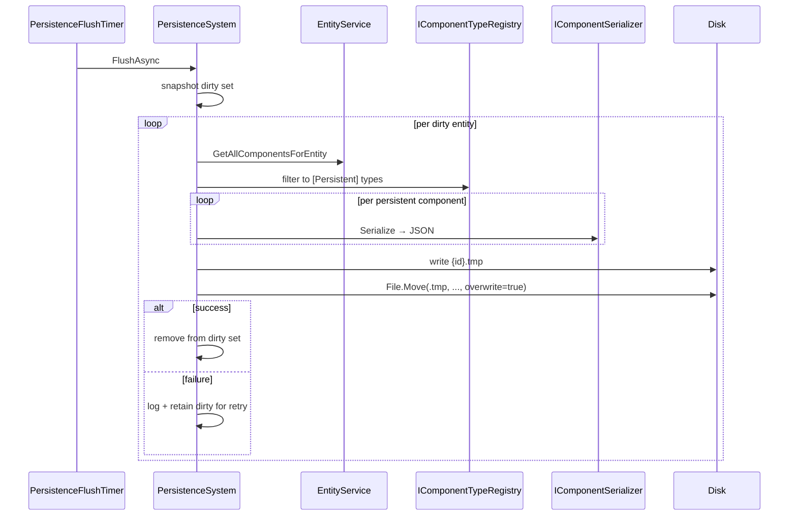
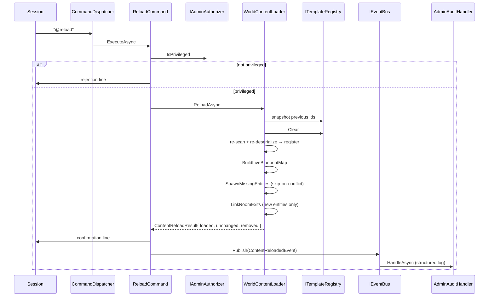

# Canonical Flows

> Living catalog of end-to-end runtime flows in Hedron. The static architecture lives in [00-overview.md](00-overview.md) through [05-configuration.md](05-configuration.md); the inventory of components/systems/handlers lives under [`../reference/`](../reference/). **This file traces what actually happens at runtime** — the dynamic call chains a developer or designer needs to understand "if I do X, what executes, and in what order?"
>
> **Update rule.** Every slice's PR must update this file to reflect the as-built code for any flow it introduces, modifies, or extends. CLAUDE.md ground rule 9 makes this a merge gate; the architecture-reviewer agent verifies the doc matches the diff.

---

## Index

| # | Flow | Trigger | Slice introduced |
|---|---|---|---|
| 1 | [Server startup](#flow-1--server-startup) | `dotnet run --project Server` | Phase 2 (extended in slice 2) |
| 2 | [Player connection](#flow-2--player-connection) | TCP client connects on the configured port | Phase 2 |
| 3 | [Player command lifecycle](#flow-3--player-command-lifecycle) | Player sends a line of input | Phase 2 (replaced by slice 3 framework) |
| 4 | [Persistence flush cycle](#flow-4--persistence-flush-cycle) | `PersistenceFlushTimer` ticks, or shutdown | Phase 3 slice 1 |
| 5 | [Content reload](#flow-5--content-reload-reload) | Privileged session sends `@reload` | Phase 3 slice 2 |

Flows that don't yet exist (combat round, player death, item pickup, mob wander tick, etc.) get added by the slice that introduces them.

---

## Flow 1 — Server startup

**Summary.** From `dotnet run --project Server` to "telnet listener accepting connections," the host runs DI registration, then drives hosted services in registration order. Persistence hydrates first; world content loads second; flush timer arms third; the listener opens last so a connection cannot land in a half-built world.

**Trigger.** Process start.

**Steps.**

1. `Program.Main` builds the generic host and registers DI singletons (`EntityService`, `IEventBus`, `ICommandDispatcher`, `ISessionManager`, broadcast, movement, world config) plus the persistence, world, and admin modules.
2. Hosted services are queued in this order: `PersistenceBootstrap`, `WorldContentBootstrap`, `PersistenceFlushTimer`, `TelnetServer`. The .NET host runs each `StartAsync` to completion before the next one starts.
3. Handler subscriptions to `IEventBus` are wired *after* `Build` and *before* `RunAsync` ([`Server/Program.cs`](../../Server/Program.cs)).
4. `PersistenceBootstrap.StartAsync` calls `PersistenceSystem.LoadAllAsync`, which scans `Persistence:DataDirectory` for `entity-*.json` files and silently re-attaches every component on each entity (no events fired during hydration). It returns the restored entity ids.
5. For each restored id, `PersistenceBootstrap` publishes `EntityHydratedEvent`. **Constraint:** handlers must not query other entities at this point — the world is partially loaded.
6. After the loop, `PersistenceBootstrap` publishes `WorldLoadedEvent`. Cross-entity startup work belongs on this event, not on per-entity hydration.
7. `WorldContentBootstrap.StartAsync` calls `WorldContentLoader.LoadAndSpawnAsync`. This: (a) reads YAML files under `World:ContentDirectory` and registers them with `TemplateRegistry` via per-kind `ITemplateDeserializer`s; (b) builds a live blueprint→entity map from existing `BlueprintComponent`s; (c) spawns any template that has no live counterpart; (d) populates `RoomComponent.Exits` by resolving each template's blueprint-id exits to live entity ids; (e) sets `WorldConfiguration.StartingRoomEntityId` from `World:StartingRoomBlueprintId`. If the content directory is missing or empty, a single hardcoded `room.void` is seeded and a warning is logged.
8. `PersistenceFlushTimer.StartAsync` arms a `PeriodicTimer` reading `Persistence:FlushIntervalSeconds` (default 60).
9. `TelnetServer.StartAsync` opens the TCP listener on `Server:Port`. Connections accepted from this point forward see a fully assembled world.

**Cross-references.**
- [`docs/architecture/05-configuration.md`](05-configuration.md) — startup-relevant config keys
- [`docs/reference/systems.md`](../reference/systems.md) — `PersistenceSystem`, `WorldContentLoader`, `TemplateRegistry`
- [`docs/use-cases/persistence-substrate.md`](../use-cases/persistence-substrate.md), [`docs/use-cases/world-content-loading-and-admin-substrate.md`](../use-cases/world-content-loading-and-admin-substrate.md) — slice specs

---

## Flow 2 — Player connection

**Summary.** A new TCP connection produces a per-session task that prompts for a display name, allocates a player entity, registers the session, fires `PlayerConnectedEvent`, and enters the input loop. Disconnect runs the inverse with `PlayerDisconnectedEvent`.

**Trigger.** Inbound TCP connection on `Server:Port` (default 4000).

**Steps.**

1. `TelnetServer` (a `BackgroundService`) accepts the TCP client and spawns a fire-and-forget per-session `TelnetSession` task.
2. `TelnetSession` writes the login prompt and reads the response.
3. `TelnetSession` allocates a player entity via `EntityService.CreateEntity()`, attaches `PlayerComponent { DisplayName, Session }` and `LocationComponent { RoomEntityId = WorldConfiguration.StartingRoomEntityId }`.
4. `SessionManager.Register(session)` makes the session visible to `BroadcastSystem` and other consumers.
5. `TelnetSession` publishes `PlayerConnectedEvent`. `PlayerSessionHandler` runs at `HandlerPriority.Domain` to perform arrival announcements and any other domain-side hookup.
6. The session enters its main I/O loop. Each input line is forwarded to `CommandDispatcher.DispatchAsync` (see Flow 3).
7. On disconnect, `SessionManager.Unregister` removes the session; `PlayerDisconnectedEvent` is published. The player entity is **not** destroyed in this slice — disposition of the entity on disconnect is a slice 5 (account/character creation) concern.

**Cross-references.**
- [`Server/Sessions/TelnetServer.cs`](../../Server/Sessions/TelnetServer.cs), [`Server/Sessions/TelnetSession.cs`](../../Server/Sessions/TelnetSession.cs)
- [`docs/reference/handlers.md`](../reference/handlers.md) — `PlayerSessionHandler`

---

## Flow 3 — Player command lifecycle

**Summary.** Input bytes become a verb + raw argument string; the dispatcher routes to an `ICommand`; the command parses its own arguments, calls a system, and publishes events; subscribed handlers run in priority order; output is written via the session.

> **Slice 3 will replace this flow.** The current MVP shape (this section) does per-command argument parsing, per-command privilege checks, and per-command output formatting. Slice 3 introduces a `CommandContext` with parsed arguments, a structural privilege gate enforced by the dispatcher, and a `CommandExecutedEvent` covering every dispatch. **Re-trace this flow as part of slice 3's PR** and replace the section below with the framework-driven version.

**Trigger.** A line of input arrives on a session's read stream.

**Steps (current MVP shape).**

1. `TelnetSession` reads a line and calls `CommandDispatcher.DispatchAsync(session, input)`.
2. The dispatcher trims input, splits on the first whitespace into verb + argument string, and looks the verb up case-insensitively. Unknown verbs produce `"Unknown command: <verb>"` and the dispatch returns.
3. The matched `ICommand.ExecuteAsync(session, arguments)` runs. The command is responsible for parsing `arguments` itself — there is no shared parser in this slice.
4. **Admin commands** (verbs starting with `@`) call `IAdminAuthorizer.IsPrivileged(session)` as the first line of `ExecuteAsync` and short-circuit with a rejection line for non-privileged sessions. This is convention, not structure — slice 3 promotes it to a dispatcher-enforced gate.
5. The command body calls a domain system (or core helper), formats output, and publishes any past-tense events.
6. `IEventBus` invokes subscribed handlers in priority order (`HandlerPriority.State` 10 → `Domain` 20 → `Notification` 80 → `Persistence` 90 → `Ai` 95).
7. Output is written via `session.SendLineAsync` (or `IBroadcastSystem` for room-wide messages).

**What's hand-rolled today (slice 3 promotes each).**

- Argument parsing — every command does its own `Trim()`/`Split()`.
- Privilege checks — convention, not structure.
- Help text — currently lives only as the rejection-branch usage line.
- Output formatting — bespoke per command.
- Audit logging — only admin events publish; player-facing verbs (`look`, `say`, movement) publish nothing.

**Cross-references.**
- [`Core/Commands/CommandDispatcher.cs`](../../Core/Commands/CommandDispatcher.cs), [`Core/Commands/ICommand.cs`](../../Core/Commands/ICommand.cs)
- [`docs/use-cases/command-and-output-framework.md`](../use-cases/command-and-output-framework.md) — slice 3 spec (currently being split into command-framework.md + output-framework.md)
- [`docs/reference/handlers.md`](../reference/handlers.md) — handler priority tiers

---

## Flow 4 — Persistence flush cycle

**Summary.** The flush timer (or shutdown) snapshots the dirty entity set, writes each entity's `[Persistent]` components atomically, and clears successful entries from the dirty set. Failures are logged and stay dirty for the next cycle.

**Trigger.** `PersistenceFlushTimer` periodic tick (`Persistence:FlushIntervalSeconds`, default 60) or `PersistenceBootstrap.StopAsync` (shutdown).

**Steps.**

1. The timer (or shutdown path) calls `PersistenceSystem.FlushAsync(ct)`.
2. `FlushAsync` snapshots the current dirty set so the I/O loop doesn't hold a lock across writes.
3. For each dirty entity id: `EntityService.GetAllComponentsForEntity` returns every attached component as `(Type, IComponent)`. The set is filtered through `IComponentTypeRegistry.IsPersistent` to keep only `[Persistent]`-tagged types.
4. Each surviving component is serialized via `IComponentSerializer` (System.Text.Json, camelCase, `JsonStringEnumConverter`). The collection is wrapped in an envelope `{ entityId, components: [{ typeName, data }, …] }`.
5. The envelope is written to `data/entities/entity-{id}.json.tmp`; once the write completes, `File.Move(tmpPath, finalPath, overwrite: true)` performs the atomic rename. A crash mid-write never produces a half-written final file.
6. On success the entity id is removed from the dirty set. On serialization or I/O failure, the entity is logged at `LogError` level and stays in the dirty set for the next flush.
7. `PersistenceSystem` publishes no events. Lifecycle events (`EntityPersistedEvent`) are the orchestrator's responsibility — see [`completed/slice-1-persistence-substrate.md`](../roadmap/completed/slice-1-persistence-substrate.md) for the rationale.

**Cross-references.**
- [`Core/Systems/PersistenceSystem.cs`](../../Core/Systems/PersistenceSystem.cs), [`Server/PersistenceFlushTimer.cs`](../../Server/PersistenceFlushTimer.cs), [`Server/PersistenceBootstrap.cs`](../../Server/PersistenceBootstrap.cs)
- [`docs/use-cases/persistence-substrate.md`](../use-cases/persistence-substrate.md)

---

## Flow 5 — Content reload (`@reload`)

**Summary.** A privileged session re-scans the content directory and refreshes the template registry. Templates with no live counterpart are seeded; **existing live entities are not mutated**. The pass is additive only.

**Trigger.** Privileged session sends `@reload`.

**Steps.**

1. `CommandDispatcher` routes `@reload` to `ReloadCommand`.
2. `ReloadCommand.ExecuteAsync` calls `IAdminAuthorizer.IsPrivileged(session)` first. Non-privileged sessions get a one-line rejection and the command body returns.
3. The command calls `IWorldContentLoader.ReloadAsync(ct)`.
4. The loader snapshots the previous template ids, clears the registry, and re-scans `World:ContentDirectory`. Each YAML file is re-deserialized via the cross-cutting `IContentSerializer` → kind-specific `ITemplateDeserializer` and re-registered.
5. Loaded / unchanged / removed counts are computed by set difference against the previous snapshot.
6. `BuildLiveBlueprintMap` enumerates every entity that has a `BlueprintComponent`. For each registered template that has no entry in the map, `SpawnMissingEntities` calls `TemplateRegistry.Spawn(blueprintId)` (which allocates an entity, attaches `BlueprintComponent`, and runs `IEntityTemplate.Apply`).
7. `LinkRoomExits` populates `RoomComponent.Exits` for the newly spawned entities only — existing live rooms are not touched.
8. `ReloadAsync` returns `ContentReloadResult { loaded, unchanged, removed }`.
9. The command writes a confirmation line to the invoker and publishes `ContentReloadedEvent` (thin payload — the three counts).
10. `AdminAuditHandler` (priority `HandlerPriority.Notification` = 80) writes one structured-log entry with stable event name `AdminCommandExecuted`.

**Constraint.** Live entities are never mutated by reload. To pick up edits to a live room's description or components, restart the host; or use `@dig` for exit changes that should apply immediately.

**Cross-references.**
- [`Core/Modules/Admin/Commands/ReloadCommand.cs`](../../Core/Modules/Admin/Commands/ReloadCommand.cs), [`Core/Modules/World/Systems/WorldContentLoader.cs`](../../Core/Modules/World/Systems/WorldContentLoader.cs)
- [`docs/use-cases/world-content-loading-and-admin-substrate.md`](../use-cases/world-content-loading-and-admin-substrate.md)

---

## Adding a new flow

When a slice introduces a recurring runtime call chain (combat round, player death, item pickup, mob wander tick, save-on-mutation pulse, etc.), add a new section here following the format above:

1. **Summary** (1–3 sentences)
2. **Trigger**
3. **Mermaid sequence diagram** — keep participants to ≤ 7 boxes; if the flow is too wide for that, you're describing two flows
4. **Steps** — numbered prose with file references
5. **Cross-references** — links to the relevant systems, handlers, and use cases
6. **Update the index** at the top of this file

The use-case-planner agent surfaces flow additions as part of its workflow; the architecture-reviewer agent verifies the doc matches the diff. Drift between code and this file is a merge gate.
