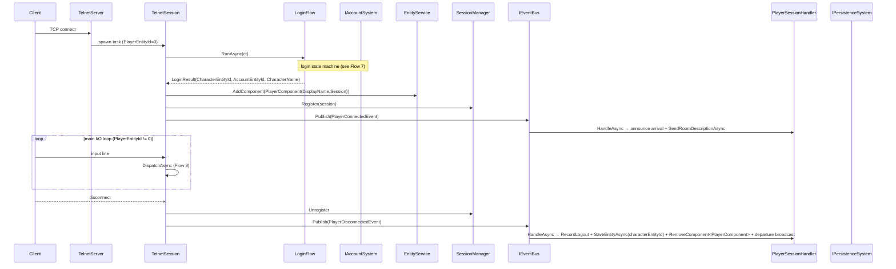
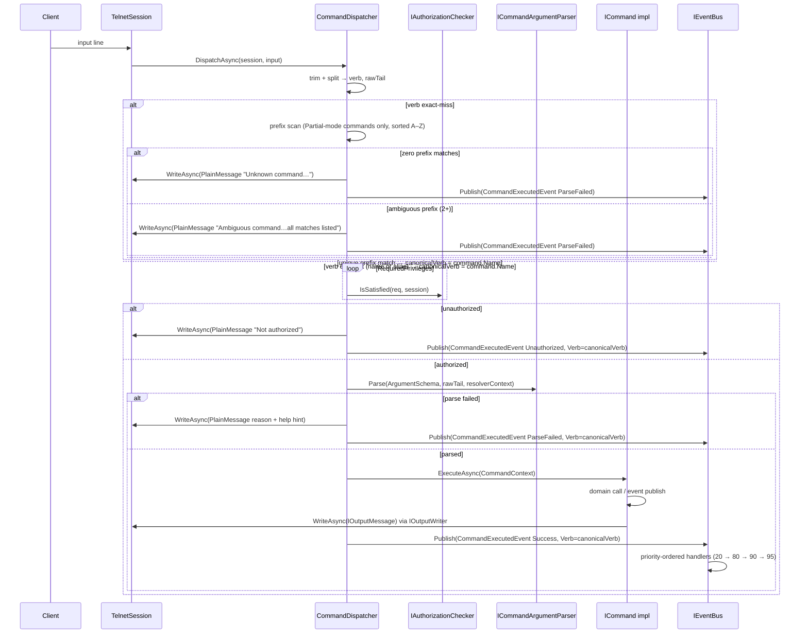
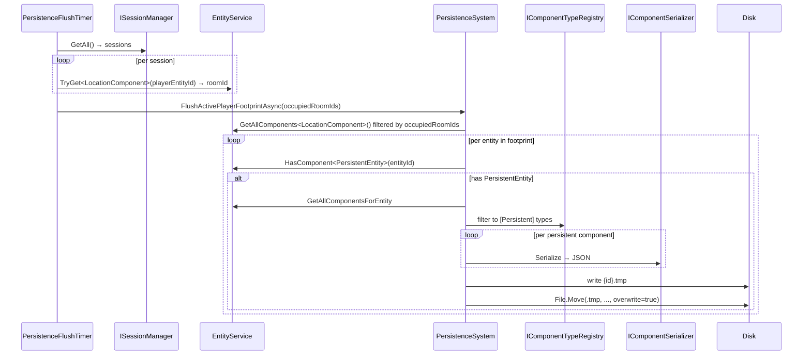
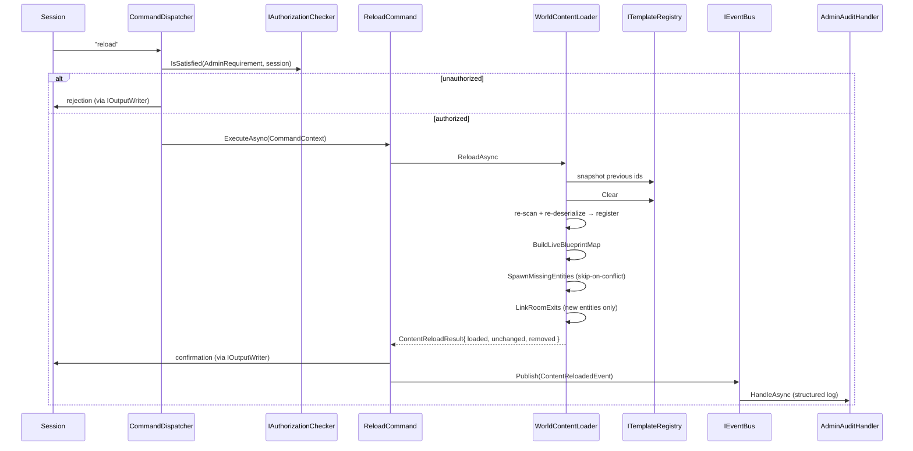
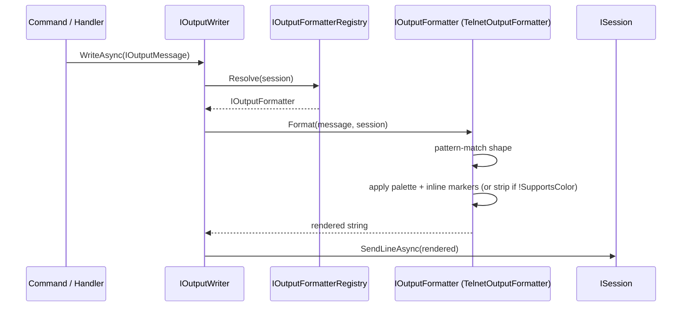
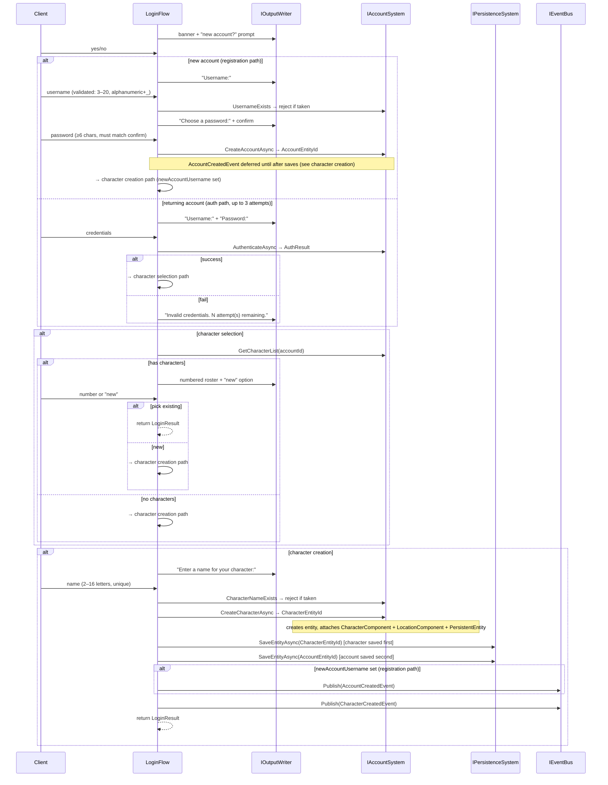
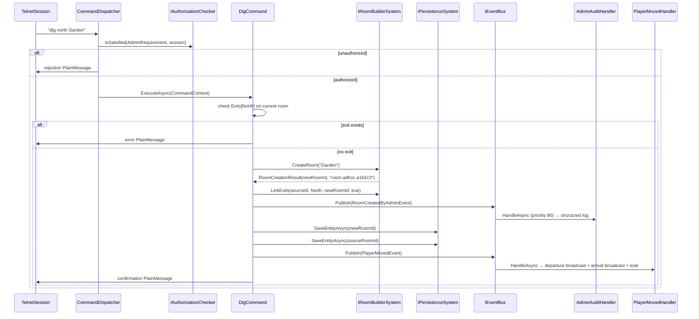
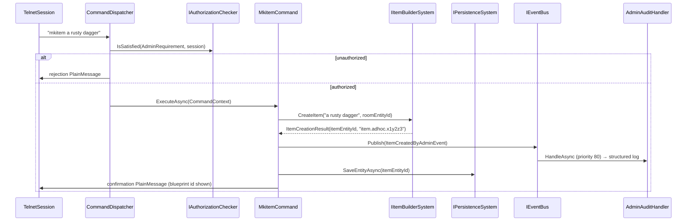

# Canonical Flows

> Living catalog of end-to-end runtime flows in Hedron. The static architecture lives in [00-overview.md](../00-overview.md) through [05-configuration.md](../05-configuration.md); the inventory of components/systems/handlers lives under [`../reference/`](../../reference/). **This file traces what actually happens at runtime** — the dynamic call chains a developer or designer needs to understand "if I do X, what executes, and in what order?"
>
> **Update rule.** Every slice's PR must update this file to reflect the as-built code for any flow it introduces, modifies, or extends. CLAUDE.md ground rule 9 makes this a merge gate; the architecture-reviewer agent verifies the doc matches the diff.

---

## Index

| # | Flow | Trigger | Slice introduced |
|---|---|---|---|
| 1 | [Server startup](#flow-1--server-startup) | `dotnet run --project Server` | Phase 2 (extended in slice 2) |
| 2 | [Player connection](#flow-2--player-connection) | TCP client connects on the configured port | Phase 2 |
| 3 | [Player command lifecycle](#flow-3--player-command-lifecycle) | Player sends a line of input | Phase 2 (replaced by slice 3 command framework; output leg updated in slice 4; prefix resolution added in slice 3a) |
| 4 | [Persistence flush cycle](#flow-4--persistence-flush-cycle) | `PersistenceFlushTimer` ticks, or shutdown | Phase 3 slice 1 |
| 5 | [Content reload](#flow-5--content-reload-reload) | Privileged session sends `reload` | Phase 3 slice 2 (gate moved to dispatcher in slice 3) |
| 6 | [Output rendering](#flow-6--output-rendering) | A command/system writes a typed `IOutputMessage` | Phase 3 slice 4 |
| 7 | [Login / character flow](#flow-7--login--character-flow) | TCP client connects, new or returning player | Phase 3 slice 5 |
| 8 | [Admin room creation (`dig`)](#flow-8--admin-room-creation-dig) | Privileged session sends `dig <direction> [name]` | Phase 3 slice 5a |
| 12 | [Admin item creation (`mkitem`)](#flow-12--admin-item-creation-mkitem) | Privileged session sends `mkitem [name]` | Phase 3 slice 6 |

Flows that don't yet exist (combat round, player death, item pickup, mob wander tick, etc.) get added by the slice that introduces them.

---

## Flow 1 — Server startup

**Summary.** From `dotnet run --project Server` to "telnet listener accepting connections," the host runs DI registration, then drives hosted services in registration order. Persistence hydrates first; world content loads second; flush timer arms third; the listener opens last so a connection cannot land in a half-built world.

**Trigger.** Process start.

```mermaid
sequenceDiagram
    participant Process
    participant Program as Program.Main
    participant Host as Generic Host
    participant PB as PersistenceBootstrap
    participant PSys as PersistenceSystem
    participant Bus as IEventBus
    participant WCB as WorldContentBootstrap
    participant WCL as WorldContentLoader
    participant Reg as TemplateRegistry
    participant FT as PersistenceFlushTimer
    participant TS as TelnetServer

    Process->>Program: Main(args)
    Program->>Host: ConfigureServices (DI registration)
    Program->>Host: Build → handler subscriptions wired
    Program->>Host: RunAsync()
    Host->>PB: StartAsync
    PB->>PSys: LoadAllAsync
    PSys-->>PB: hydrated entity ids
    loop per hydrated id
        PB->>Bus: Publish(EntityHydratedEvent)
    end
    PB->>Bus: Publish(WorldLoadedEvent)
    Host->>WCB: StartAsync
    WCB->>WCL: LoadAndSpawnAsync
    WCL->>Reg: register area templates
    WCL->>Reg: register room templates
    WCL->>Reg: register item templates (kind: item)
    WCL->>WCL: SpawnMissingEntities (skip-on-conflict; returns newlySpawned set)
    loop per newly-spawned entity
        WCL->>PSys: SaveEntityAsync (make ID durable immediately)
    end
    WCL->>WCL: LinkRoomExits
    WCL->>WCL: PlaceItemsInRooms (newlySpawned only — attach LocationComponent from spawnRoomId)
    WCL->>WCL: ResolveStartingRoom (or void fallback)
    WCB->>Bus: Publish(WorldContentReadyEvent)
    Bus->>Bus: CharacterHydrationHandler (validate character locations)
    Host->>FT: StartAsync (timer armed)
    Host->>TS: StartAsync (listener opens)
```

**Steps.**

1. `Program.Main` builds the generic host and registers DI singletons (`EntityService`, `IEventBus`, `ICommandDispatcher`, `ISessionManager`, broadcast, movement, world config) plus the persistence, world, and admin modules.
2. Hosted services are queued in this order: `PersistenceBootstrap`, `WorldContentBootstrap`, `PersistenceFlushTimer`, `TelnetServer`. The .NET host runs each `StartAsync` to completion before the next one starts.
3. Handler subscriptions to `IEventBus` are wired *after* `Build` and *before* `RunAsync` ([`Server/Program.cs`](../../../Server/Program.cs)).
4. `PersistenceBootstrap.StartAsync` calls `PersistenceSystem.LoadAllAsync`, which scans `Persistence:DataDirectory` for `entity-*.json` files and silently re-attaches every component on each entity (no events fired during hydration). It returns the restored entity ids.
5. For each restored id, `PersistenceBootstrap` publishes `EntityHydratedEvent`. **Constraint:** handlers must not query other entities at this point — the world is partially loaded.
6. After the loop, `PersistenceBootstrap` publishes `WorldLoadedEvent`. Cross-entity startup work belongs on this event, not on per-entity hydration.
7. `WorldContentBootstrap.StartAsync` calls `WorldContentLoader.LoadAndSpawnAsync`. This: (a) reads YAML files under `World:ContentDirectory` for kinds `area`, `room`, and `item` and registers them with `TemplateRegistry` via per-kind `ITemplateDeserializer`s (`AreaTemplateDeserializer`, `RoomTemplateDeserializer`, `ItemTemplateDeserializer`); (b) builds a live blueprint→entity map from existing `BlueprintComponent`s; (c) spawns any template that has no live counterpart, adds `PersistentEntity` to each, and returns the set of newly-spawned entity IDs; (d) **immediately calls `SaveEntityAsync` for every newly-spawned entity** — this makes entity IDs durable regardless of whether the server shuts down gracefully; without this step, room entity IDs would change on each restart and items' `LocationComponent.RoomEntityId` references would go stale; (e) populates `RoomComponent.Exits` by resolving each room template's blueprint-id exits to live entity ids; (f) attaches `LocationComponent { RoomEntityId }` to **newly-spawned item entities only** (those in the `newlySpawned` set), resolving `ItemTemplate.SpawnRoomBlueprintId` to a live entity id — entities restored from persistence keep their saved `LocationComponent` (room or inventory slot) unchanged; if the spawn room is missing a warning is logged and the item is created without a location; (g) sets `WorldConfiguration.StartingRoomEntityId` from `World:StartingRoomBlueprintId`. If the content directory is missing or empty, a single hardcoded `room.void` is seeded (also gets `PersistentEntity` and is saved immediately) and a warning is logged. After `LoadAndSpawnAsync` completes, `WorldContentBootstrap` publishes `WorldContentReadyEvent`. `CharacterHydrationHandler` (priority `HandlerPriority.Domain`) validates every hydrated character entity's `LocationComponent.RoomEntityId` at this point, resetting stale references to `StartingRoomEntityId`.
8. `PersistenceFlushTimer.StartAsync` arms a `PeriodicTimer` reading `Persistence:FlushIntervalSeconds` (default 60). See [Flow 4](#flow-4--persistence-flush-cycle) for the full flush-cycle trace.
9. `TelnetServer.StartAsync` opens the TCP listener on `Server:Port`. Connections accepted from this point forward see a fully assembled world.
10. **Shutdown path.** When the host shuts down, `PersistenceBootstrap.StopAsync` calls `PersistenceSystem.FlushAllPersistentAsync`, which iterates every entity carrying `PersistentEntity` and writes it to disk — a complete sweep regardless of which rooms are occupied. This replaced the old `FlushAsync` (dirty-set sweep) when the two-level persistence model was introduced.

**Cross-references.**
- [`docs/architecture/05-configuration.md`](../05-configuration.md) — startup-relevant config keys
- [`docs/reference/systems.md`](../../reference/systems.md) — `PersistenceSystem`, `WorldContentLoader`, `TemplateRegistry`
- [`docs/use-cases/persistence-substrate.md`](../../use-cases/persistence-substrate.md), [`docs/use-cases/world-content-loading-and-admin-substrate.md`](../../use-cases/world-content-loading-and-admin-substrate.md) — slice specs

---

## Flow 2 — Player connection

**Summary.** A new TCP connection produces a per-session task that runs the `LoginFlow` state machine (banner → register/authenticate → character select/create), binds the resulting character entity to the session, then enters the main I/O loop. Disconnect records logout, removes the transient `PlayerComponent`, and broadcasts departure. The character entity is **not** destroyed. See [Flow 7](#flow-7--login--character-flow) for the full login state machine detail.

**Trigger.** Inbound TCP connection on `Server:Port` (default 4000).



**Steps.**

1. `TelnetServer` (a `BackgroundService`) accepts the TCP client and spawns a fire-and-forget per-session `TelnetSession` task. `PlayerEntityId` is 0 until login completes — the `CommandDispatcher` guard `if (session.PlayerEntityId == 0) return;` prevents commands from being dispatched during login.
2. `TelnetSession` delegates immediately to `LoginFlow.RunAsync`. The login flow drives the full interactive state machine (banner, registration or authentication, character selection or creation) and returns a `LoginResult` — or `null` if the client disconnects or exceeds the login attempt limit. See [Flow 7](#flow-7--login--character-flow) for detail.
3. On a valid `LoginResult`: `TelnetSession` sets `PlayerEntityId = result.CharacterEntityId`, attaches the transient `PlayerComponent { DisplayName, Session }`, calls `SessionManager.Register(session)`, and publishes `PlayerConnectedEvent(PlayerEntityId, CharacterName, AccountEntityId)`.
4. `PlayerSessionHandler` (priority `HandlerPriority.Domain`) handles `PlayerConnectedEvent`: broadcasts the arrival message to the room and calls `BroadcastSystem.SendRoomDescriptionAsync` for the connecting player.
5. The session enters its main I/O loop. Each input line is forwarded to `CommandDispatcher.DispatchAsync` (see Flow 3).
6. On disconnect, `SessionManager.Unregister` removes the session, then `PlayerDisconnectedEvent` is published. `PlayerSessionHandler` calls `IAccountSystem.RecordLogout` (updates `CharacterComponent.LastLoginUtc`), then immediately calls `IPersistenceSystem.SaveEntityAsync(characterEntityId)` so the logout timestamp is durable without waiting for the next flush cycle, removes `PlayerComponent` via `EntityService.RemoveComponent<PlayerComponent>`, and broadcasts the departure.

**Cross-references.**
- [`Server/Sessions/TelnetServer.cs`](../../../Server/Sessions/TelnetServer.cs), [`Server/Sessions/TelnetSession.cs`](../../../Server/Sessions/TelnetSession.cs), [`Server/Sessions/LoginFlow.cs`](../../../Server/Sessions/LoginFlow.cs)
- [`docs/reference/handlers.md`](../../reference/handlers.md) — `PlayerSessionHandler`
- [Flow 7](#flow-7--login--character-flow) — full login state machine
- [`docs/use-cases/account-character-creation.md`](../../use-cases/account-character-creation.md) — slice 5 spec

---

## Flow 3 — Player command lifecycle

**Summary.** Input bytes become a verb + raw tail; the dispatcher performs a two-phase verb lookup (exact first, prefix second), checks authorization via `IAuthorizationChecker`, parses arguments via `ICommandArgumentParser`, constructs a `CommandContext`, calls `ICommand.ExecuteAsync(context)`, and publishes `CommandExecutedEvent` for every outcome. The `Verb` field in `CommandExecutedEvent` always carries the **resolved canonical name** (e.g. `look`), never the raw typed prefix (`lo`). Output goes through the formatter-backed `IOutputWriter` (see Flow 6 for the rendering trace).

**Trigger.** A line of input arrives on a session's read stream.



**Steps.**

1. `TelnetSession` reads a line and calls `CommandDispatcher.DispatchAsync(session, input)`.
2. **Two-phase verb lookup.**
   - **Phase 1 (exact):** `_byVerb.TryGetValue(verb)` — checks primary names and all declared aliases. If found, `canonicalVerb = command.Name` and skip to step 3. Static aliases like `d` → `down` resolve here; prefix resolution is never reached.
   - **Phase 2 (prefix):** Collect all commands where `MatchingMode == Partial` and `command.Name.StartsWith(verb, OrdinalIgnoreCase)`. Sort alphabetically. Zero matches → write `PlainMessage("Unknown command: <verb>. Type 'help' for a list.")`, publish `CommandExecutedEvent(ParseFailed)`, return. Two or more matches → write `PlainMessage("Ambiguous command '<verb>'. Did you mean: <all names, comma-separated>?")`, publish `CommandExecutedEvent(ParseFailed)`, return. Exactly one match → `canonicalVerb = command.Name`.
3. **Privilege gate.** The dispatcher iterates `command.RequiredPrivileges` and calls `IAuthorizationChecker.IsSatisfied(req, session)` for each. Any unsatisfied requirement writes a rejection `PlainMessage` via `IOutputWriter` and publishes `CommandExecutedEvent(Unauthorized, Verb=canonicalVerb)`.
4. **Argument parse.** `ICommandArgumentParser.Parse(command.ArgumentSchema, rawTail, resolverContext)` does single-pass tokenization (whitespace + double-quoted groups), walks the declarative argument list, and coerces each token to its CLR type (`string`, `int`, `uint`, `Direction`). Enum-prefix matching works from day one (`n`/`no`/`nor` → `North`). String `Token` arguments that declare a non-null `IArgumentResolver` have prefix matching applied against the candidate list (no concrete resolver ships until slice 6). On failure: the reason + `"Type 'help <canonicalVerb>' for usage."` is written; `CommandExecutedEvent(ParseFailed, Verb=canonicalVerb)` is published.
5. **Execute.** The dispatcher constructs `CommandContext(Session, InvokerEntityId, ParsedArguments, IOutputWriter, IServiceProvider)` and calls `command.ExecuteAsync(context)`. The body reads typed args via `context.Args.Get<T>(name)`, calls domain systems or publishes events via injected `IEventBus`, and writes all output via `context.Output.WriteAsync(IOutputMessage)`. No `session.SendLineAsync` in command bodies.
6. **Formatter-backed output.** `IOutputWriter.WriteAsync` resolves the session's formatter from `IOutputFormatterRegistry`, calls `formatter.Format(message, session)` (transport-correct ANSI or stripped plain text based on `session.SupportsColor`), and awaits `session.SendLineAsync(rendered)`. See [Flow 6](#flow-6--output-rendering) for the full rendering trace.
7. **Exception trap.** Any uncaught exception is caught, logged at `Error` with a full stack trace, a `PlainMessage("Something went wrong. The error has been logged.")` is written, and `CommandExecutedEvent(Threw)` is published. No stack trace reaches the session.
8. **`CommandExecutedEvent`.** Published on every dispatch path — success, parse-fail, unauthorized, threw. The `Verb` field carries the **resolved canonical command name** (e.g. `look` when the player typed `lo`), not the raw typed prefix. This makes log lines stable regardless of what the player typed. `CommandLoggingHandler` (priority 80) writes one structured-log line per command via `ILogger`. `AdminAuditHandler` keeps subscribing to the four richer slice-2 admin events and does **not** subscribe to `CommandExecutedEvent`.

**Cross-references.**
- [`Core/Commands/CommandDispatcher.cs`](../../../Core/Commands/CommandDispatcher.cs), [`Core/Commands/ICommand.cs`](../../../Core/Commands/ICommand.cs)
- [`Core/Commands/Authorization/IAuthorizationChecker.cs`](../../../Core/Commands/Authorization/IAuthorizationChecker.cs), [`Core/Commands/CommandArgumentParser.cs`](../../../Core/Commands/CommandArgumentParser.cs)
- [`Core/Output/OutputWriter.cs`](../../../Core/Output/OutputWriter.cs), [`Core/Handlers/CommandLoggingHandler.cs`](../../../Core/Handlers/CommandLoggingHandler.cs)
- [`subsystems/commands.md`](../subsystems/commands.md) — command framework design
- [`subsystems/output.md`](../subsystems/output.md) — output framework design
- [`docs/use-cases/command-framework.md`](../../use-cases/command-framework.md) — slice 3 spec; [`docs/use-cases/output-framework.md`](../../use-cases/output-framework.md) — slice 4 spec
- [`docs/reference/handlers.md`](../../reference/handlers.md) — handler priority tiers

---

## Flow 4 — Persistence flush cycle

**Summary.** The flush timer resolves the active player footprint (rooms occupied by at least one connected player) and writes all `PersistentEntity`-carrying entities in those rooms. On shutdown `PersistenceBootstrap.StopAsync` runs a full sweep of every `PersistentEntity` entity. Authored content and lifecycle transitions use save-on-change (`SaveEntityAsync`) called directly by the command or handler that made the mutation; they do not depend on this cycle.

**Trigger.** `PersistenceFlushTimer` periodic tick (`Persistence:FlushIntervalSeconds`, default 60) or `PersistenceBootstrap.StopAsync` (shutdown).



**Steps.**

1. `PersistenceFlushTimer.ExecuteAsync` ticks. It calls `ISessionManager.GetAll()` to collect all connected sessions; for each, reads `LocationComponent.RoomEntityId` to build the set of occupied room ids. If no sessions are connected the flush is skipped.
2. Calls `PersistenceSystem.FlushActivePlayerFootprintAsync(occupiedRoomIds, ct)`.
3. `FlushActivePlayerFootprintAsync` queries `EntityService.GetAllComponents<LocationComponent>()` and filters to entities whose `RoomEntityId` is in the occupied set. This naturally includes both player entities (whose location is one of the occupied rooms) and any other `LocationComponent`-bearing entities in those rooms.
4. For each entity in the footprint, the system checks `HasComponent<PersistentEntity>(entityId)`. Entities without the marker are silently skipped — the two-level model guard.
5. For entities that pass the guard: `EntityService.GetAllComponentsForEntity` returns all attached components; the set is filtered through `IComponentTypeRegistry.IsPersistent`; each surviving component is serialized via `IComponentSerializer` (System.Text.Json, camelCase). The envelope `{ entityId, components: [{ typeName, data }, …] }` is written atomically via `.tmp`→rename.
6. `PersistenceSystem` publishes no events.
7. **Shutdown path.** `PersistenceBootstrap.StopAsync` calls `PersistenceSystem.FlushAllPersistentAsync(ct)`, which iterates `GetAllComponents<PersistentEntity>()` and writes every entity — not just those in occupied rooms — guaranteeing a complete snapshot regardless of player positions.

**Two-level model.** An entity is written only if it carries `PersistentEntity` (level 1). Among its components, only those tagged `[Persistent]` are included in the snapshot (level 2). `PlayerComponent` (transient session ref) and `TransientEffectsComponent` (session-only) are untagged and are never written.

**Cross-references.**
- [`Core/Systems/PersistenceSystem.cs`](../../../Core/Systems/PersistenceSystem.cs), [`Server/PersistenceFlushTimer.cs`](../../../Server/PersistenceFlushTimer.cs), [`Server/PersistenceBootstrap.cs`](../../../Server/PersistenceBootstrap.cs)
- [`docs/use-cases/persistence-substrate.md`](../../use-cases/persistence-substrate.md), [`docs/use-cases/persistence-two-level-model.md`](../../use-cases/persistence-two-level-model.md)

---

## Flow 5 — Content reload (`reload`)

**Summary.** A privileged session re-scans the content directory and refreshes the template registry. Templates with no live counterpart are seeded; **existing live entities are not mutated**. The pass is additive only.

**Trigger.** Privileged session sends `reload`.



**Steps.**

1. `CommandDispatcher` routes `reload` to `ReloadCommand`.
2. **Authorization gate.** The dispatcher calls `IAuthorizationChecker.IsSatisfied(AdminRequirement, session)` **before** invoking `ReloadCommand`. Non-privileged sessions receive a rejection `PlainMessage` via `IOutputWriter` and `CommandExecutedEvent(Unauthorized)`; `ReloadCommand.ExecuteAsync` never runs. This is the slice-3 structural replacement for slice-2's per-command `IsPrivileged` convention.
3. The command calls `IWorldContentLoader.ReloadAsync(ct)`.
4. The loader snapshots the previous template ids, clears the registry, and re-scans `World:ContentDirectory`. Each YAML file is re-deserialized via the cross-cutting `IContentSerializer` → kind-specific `ITemplateDeserializer` and re-registered.
5. Loaded / unchanged / removed counts are computed by set difference against the previous snapshot.
6. `BuildLiveBlueprintMap` enumerates every entity that has a `BlueprintComponent`. For each registered template that has no entry in the map, `SpawnMissingEntities` calls `TemplateRegistry.Spawn(blueprintId)` (which allocates an entity, attaches `BlueprintComponent`, and runs `IEntityTemplate.Apply`).
7. `LinkRoomExits` populates `RoomComponent.Exits` for the newly spawned entities only — existing live rooms are not touched.
8. `ReloadAsync` returns `ContentReloadResult { loaded, unchanged, removed }`.
9. The command writes a confirmation `PlainMessage` via `CommandContext.Output` (`IOutputWriter`) and publishes `ContentReloadedEvent` (thin payload — the three counts).
10. `AdminAuditHandler` (priority `HandlerPriority.Notification` = 80) writes one structured-log entry with stable event name `AdminCommandExecuted`.

**Constraint.** Live entities are never mutated by reload. To pick up edits to a live room's description or components, restart the host; or use `dig` for exit changes that should apply immediately.

**Cross-references.**
- [`Core/Modules/Admin/Commands/ReloadCommand.cs`](../../../Core/Modules/Admin/Commands/ReloadCommand.cs), [`Core/Modules/World/Systems/WorldContentLoader.cs`](../../../Core/Modules/World/Systems/WorldContentLoader.cs)
- [`docs/use-cases/world-content-loading-and-admin-substrate.md`](../../use-cases/world-content-loading-and-admin-substrate.md)

---

## Flow 6 — Output rendering

**Summary.** Any command body or handler that calls `IOutputWriter.WriteAsync(IOutputMessage)` or `IBroadcastSystem.SendToRoomAsync`/`SendToAllAsync` triggers this chain. A typed message is resolved to the session's transport formatter, rendered into an ANSI (or plain-text) string, and transmitted. Every future gameplay slice's output plugs into this chain without touching transport code.

**Trigger.** Any call to `IOutputWriter.WriteAsync`, `IBroadcastSystem.SendToRoomAsync`, `IBroadcastSystem.SendToAllAsync`, or `IBroadcastSystem.SendRoomDescriptionAsync`.



**Steps.**

1. A command calls `context.Output.WriteAsync(message)` or a handler calls `_broadcast.SendToRoomAsync(roomId, message, filter?)`. For broadcast, `BroadcastSystem` enumerates eligible recipients and calls `_writerFactory.Create(session).WriteAsync(message)` for each.
2. `OutputWriter.WriteAsync` calls `IOutputFormatterRegistry.Resolve(session)` to obtain the formatter whose `TransportKey` matches `session.TransportKey` (e.g. `"telnet"`). Falls back to the first registered formatter if no exact match (safe while only telnet exists).
3. `IOutputFormatter.Format(message, session)` pattern-matches the message shape:
   - `PlainMessage` — wraps text in a severity-appropriate color marker (`<error>`, `<system>`, or plain).
   - `RoomDescriptionMessage` — room name in `<room-name>`, exit keys in `<direction>`, description and occupants plain; if `Items` is non-empty, appends an `"Items: X, Y, Z"` line. `BroadcastSystem.SendRoomDescriptionAsync` populates `Items` by iterating all `ItemDataComponent` entities whose `LocationComponent.RoomEntityId` matches the room.
   - `MovementMessage(Blocked)` — "You cannot go that way." in `<system>`.
   - `HelpIndexMessage` — section headers in `<system>`, verb names in `<room-name>` (padded before colorizing).
   - `HelpEntryMessage` — verb/alias header in `<room-name>`.
4. **Color application.** If `session.SupportsColor` is `true`, inline markers (`<role>text</role>`) are replaced with ANSI escape codes + reset. If `false`, markers are stripped and only the inner text remains. See [`subsystems/output.md`](../subsystems/output.md) for the palette table.
5. The rendered string is passed to `session.SendLineAsync(rendered)`. The session acquires its write lock and writes the UTF-8 bytes to the TCP stream.

**Broadcast fan-out.** For `SendToRoomAsync`, step 1 iterates `LocationComponent` entities in the room, applies the optional `Func<uint,bool>? audienceFilter` predicate (e.g. `id => id != movingPlayer`), and runs steps 2–5 for each surviving recipient. Each recipient gets their own formatter resolution so a future mixed-transport world renders correctly per client.

**Cross-references.**
- [`Core/Output/OutputWriter.cs`](../../../Core/Output/OutputWriter.cs), [`Core/Output/TelnetOutputFormatter.cs`](../../../Core/Output/TelnetOutputFormatter.cs), [`Core/Output/OutputFormatterRegistry.cs`](../../../Core/Output/OutputFormatterRegistry.cs)
- [`Core/Systems/BroadcastSystem.cs`](../../../Core/Systems/BroadcastSystem.cs)
- [`subsystems/output.md`](../subsystems/output.md) — full output framework design
- [`docs/use-cases/output-framework.md`](../../use-cases/output-framework.md) — slice 4 spec

---

## Flow 7 — Login / character flow

**Summary.** The `LoginFlow` Initiator (session-layer, `Server/Sessions/LoginFlow.cs`) drives the multi-step interactive wizard that runs between TCP accept and the main I/O loop. It handles account registration or authentication, then character selection or creation. Domain work (entity allocation, hashing, persistence marking) is delegated to `IAccountSystem`. Events are published by the flow itself (Initiator tier) after each successful state transition.

**Trigger.** `TelnetSession.RunAsync` after TCP accept (see [Flow 2](#flow-2--player-connection) step 2).



**Steps.**

1. `LoginFlow` is constructed by `TelnetSession` with the raw `StreamReader` (so it can read lines before the session is registered) and `IOutputWriterFactory` (so prompts are rendered through the formatter pipeline).
2. **Banner.** The flow writes `"Welcome to Hedron.\nDo you have an existing account? (yes/no)"` via `IOutputWriter`. Any yes/y/login answer → auth path; anything else → registration.
3. **Registration path.** Prompts for username; validates 3–20 chars, alphanumeric + underscore; calls `UsernameExists` and rejects if taken. Prompts for password (≥6 chars) with confirmation. Calls `IAccountSystem.CreateAccountAsync` → allocates an entity, attaches `AccountComponent` and `PersistentEntity`, returns `AccountEntityId`. `AccountCreatedEvent` is **not** published yet — it is deferred until after both entities are saved (see step 6). Falls through to character creation.
4. **Auth path.** Up to `MaxLoginAttempts` (3) rounds of username + password. Calls `IAccountSystem.AuthenticateAsync` (PBKDF2-SHA256 verify via `IPasswordHasher`). On success → character selection. On exhaustion → writes rejection and returns `null` (session task exits).
5. **Character selection.** Calls `GetCharacterList(accountId)`. If the list is empty, falls through to character creation. Otherwise renders a numbered roster + "new" option. Validates input; enforces `Account:MaxCharactersPerAccount` (default 5). Picking a number returns `LoginResult(CharacterEntityId, AccountEntityId, CharacterName)` immediately.
6. **Character creation.** Prompts for a name; validates 2–16 letters only, globally unique via `CharacterNameExists`. Calls `IAccountSystem.CreateCharacterAsync` → allocates an entity, attaches `CharacterComponent { AccountEntityId, CharacterName, CreatedAtUtc }`, `LocationComponent { RoomEntityId = WorldConfiguration.StartingRoomEntityId }`, and `PersistentEntity`; appends id to `AccountComponent.CharacterEntityIds`. Returns `CharacterEntityId`. `LoginFlow` then calls `IPersistenceSystem.SaveEntityAsync(characterEntityId)` first (character written before account — if the server crashes between the two writes, an orphaned character file is recoverable but a dangling account pointer to a missing character is not), then `SaveEntityAsync(accountEntityId)`. After both saves complete, if this is a new account `AccountCreatedEvent` is published, then `CharacterCreatedEvent`. Returns `LoginResult`.
7. A `null` return from `LoginFlow.RunAsync` (disconnect, exceeded attempts) causes `TelnetSession` to exit without entering the I/O loop. `HandleDisconnectAsync` is still called but skips publishing because `PlayerEntityId == 0`.

**Cross-references.**
- [`Server/Sessions/LoginFlow.cs`](../../../Server/Sessions/LoginFlow.cs), [`Server/Sessions/TelnetSession.cs`](../../../Server/Sessions/TelnetSession.cs)
- [`Core/Modules/Account/Systems/AccountSystem.cs`](../../../Core/Modules/Account/Systems/AccountSystem.cs)
- [`Core/Modules/Account/Systems/IAccountSystem.cs`](../../../Core/Modules/Account/Systems/IAccountSystem.cs)
- [`docs/reference/systems.md`](../../reference/systems.md) — `AccountSystem`, `PasswordHasher`
- [`docs/use-cases/account-character-creation.md`](../../use-cases/account-character-creation.md) — slice 5 spec

---

## Flow 8 — Admin room creation (`dig`)

**Summary.** A privileged session sends `dig <direction> [name]`. `DigCommand` checks for an existing exit, delegates entity creation and exit wiring to `IRoomBuilderSystem`, publishes `RoomCreatedByAdminEvent` (caught by `AdminAuditHandler`), calls `IPersistenceSystem.SaveEntityAsync` directly on both rooms (save-on-change), then publishes `PlayerMovedEvent` to auto-move the admin into the new room via the existing `PlayerMovedHandler`.

**Trigger.** Privileged session sends `dig <direction> [name]`.



**Steps.**

1. `CommandDispatcher` routes `dig` to `DigCommand` after the privilege gate (`AdminRequirement` via `IAuthorizationChecker`).
2. `DigCommand.ExecuteAsync` reads `LocationComponent.RoomEntityId` and checks `RoomComponent.Exits` for the requested direction. If an exit already exists, writes a `PlainMessage` error and returns.
3. Calls `IRoomBuilderSystem.CreateRoom(name)` — allocates an entity, attaches `RoomComponent` + `BlueprintComponent` + `PersistentEntity`, registers a minimal `RoomTemplate`, returns `RoomCreationResult(newRoomId, blueprintId)`.
4. Calls `IRoomBuilderSystem.LinkExits(sourceId, direction, newRoomId, bidirectional: true)` — sets `Exits` on both room entities and mirrors to both in-memory `RoomTemplate` exit maps.
5. Publishes `RoomCreatedByAdminEvent`. `AdminAuditHandler` (priority 80) logs one structured entry. `DigCommand` then calls `IPersistenceSystem.SaveEntityAsync(newRoomId)` and `SaveEntityAsync(sourceRoomId)` directly — save-on-change means both rooms are durable before the admin sees confirmation. No `PersistenceHandler` subscription.
6. Publishes `PlayerMovedEvent(adminId, sourceId, newRoomId, direction)`. `PlayerMovedHandler` fires: departure broadcast to the source room (excluding the admin), arrival broadcast to the new room, `look` sent to the admin.
7. Writes a confirmation `PlainMessage` (e.g. `"Room 'Garden' (room.adhoc.a1b2c3) created to the north."`).

**Cross-references.**
- [`Core/Modules/Admin/Commands/DigCommand.cs`](../../../Core/Modules/Admin/Commands/DigCommand.cs), [`Core/Modules/Admin/Systems/RoomBuilderSystem.cs`](../../../Core/Modules/Admin/Systems/RoomBuilderSystem.cs)
- [`Core/Modules/Admin/Events/RoomCreatedByAdminEvent.cs`](../../../Core/Modules/Admin/Events/RoomCreatedByAdminEvent.cs)
- [`Core/Modules/Admin/Handlers/AdminAuditHandler.cs`](../../../Core/Modules/Admin/Handlers/AdminAuditHandler.cs)
- [`docs/use-cases/bare-bones-content-spawning.md`](../../use-cases/bare-bones-content-spawning.md)

---

## Flow 12 — Admin item creation (`mkitem`)

**Summary.** A privileged session sends `mkitem [name]`. `MkitemCommand` delegates entity creation to `IItemBuilderSystem`, publishes `ItemCreatedByAdminEvent` (caught by `AdminAuditHandler`), calls `IPersistenceSystem.SaveEntityAsync` on the new item, and writes a confirmation showing the blueprint id.

**Trigger.** Privileged session sends `mkitem [name]`.



**Steps.**

1. `CommandDispatcher` routes `mkitem` to `MkitemCommand` after the privilege gate (`AdminRequirement` via `IAuthorizationChecker`).
2. `MkitemCommand.ExecuteAsync` reads `LocationComponent.RoomEntityId` from the invoker. If absent (no location), writes a `PlainMessage` error and returns.
3. Calls `IItemBuilderSystem.CreateItem(name, roomEntityId)` — allocates an entity, attaches `ItemDataComponent { Name }` + `BlueprintComponent` + `PersistentEntity` + `LocationComponent { RoomEntityId }`, registers a minimal `ItemTemplate`, returns `ItemCreationResult(itemEntityId, blueprintId)`. Blueprint id format: `item.adhoc.<8-char-base36>`.
4. Publishes `ItemCreatedByAdminEvent(adminId, itemEntityId, blueprintId, roomEntityId)`. `AdminAuditHandler` (priority 80) logs one structured entry.
5. Calls `IPersistenceSystem.SaveEntityAsync(itemEntityId)` directly — save-on-change; the item is durable before the admin sees confirmation.
6. Writes a confirmation `PlainMessage` (e.g. `"Item 'a rusty dagger' created. Blueprint id: item.adhoc.x1y2z3"`).

**Cross-references.**
- [`Core/Modules/Items/Commands/MkitemCommand.cs`](../../../Core/Modules/Items/Commands/MkitemCommand.cs), [`Core/Modules/Items/Systems/ItemBuilderSystem.cs`](../../../Core/Modules/Items/Systems/ItemBuilderSystem.cs)
- [`Core/Modules/Items/Events/ItemCreatedByAdminEvent.cs`](../../../Core/Modules/Items/Events/ItemCreatedByAdminEvent.cs)
- [`Core/Modules/Admin/Handlers/AdminAuditHandler.cs`](../../../Core/Modules/Admin/Handlers/AdminAuditHandler.cs)
- [`docs/use-cases/items-and-inventory.md`](../../use-cases/items-and-inventory.md) — slice 6 spec

---

## Adding a new flow

When a slice introduces a recurring runtime call chain (combat round, player death, item pickup, mob wander tick, save-on-mutation pulse, etc.), add a new section here following the format above:

1. **Summary** (1–3 sentences)
2. **Trigger**
3. **Mermaid sequence diagram** — keep participants to ≤ 7 boxes; if the flow is too wide for that, you're describing two flows
4. **Steps** — numbered prose with file references
5. **Cross-references** — links to the relevant systems, handlers, and use cases
6. **Update the index** at the top of this file

The use-case-planner agent surfaces flow additions as part of its workflow; the architecture-reviewer agent verifies the doc matches the diff. Drift between code and this file is a merge gate.

---

## When to split this file

This single file is the flows catalog today. It is **pre-wired to split**: when it crosses **~12 flows or ~900 lines**, promote each flow to its own `flows/flow-<n>-<name>.md` and keep this `README.md` as the index (the table above). Inbound references already point at `flows/README.md` (the index) and cite flows by number, so the split is mechanical — only this index gains the per-flow links; no external reference changes.
