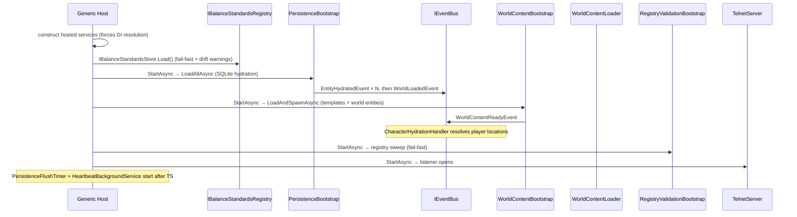

# Flow 1 — Server startup

> [Back to flows index](README.md). **Trigger:** process start (`dotnet run --project Server`).

## Summary

The generic host registers DI singletons, builds the container (wiring handler subscriptions), then drives hosted services to completion in registration order so a connection cannot land in a half-built world. Constructing the hosted-service set forces eager resolution of `IBalanceStandardsRegistry` (via `RegistryValidationBootstrap`'s constructor): the store loads the balance-standards file (or compiled defaults if absent), fails boot fast on structural violations, and logs one warning per mirror-drifted field — before any hosted service's `StartAsync` runs. `PersistenceBootstrap` hydrates player/account entities from SQLite and publishes `EntityHydratedEvent` per entity, then `WorldLoadedEvent`. `WorldContentBootstrap` re-scans the content directory, registers templates, spawns missing world entities, links exits, places mobs and items, and publishes `WorldContentReadyEvent`; `CharacterHydrationHandler` uses that event to resolve player locations to live room ids. `RegistryValidationBootstrap` sweeps ability/effect/aspect refs and throws on any error (fail-fast, INV-10). Finally, `PersistenceFlushTimer`, `TelnetServer`, and `HeartbeatBackgroundService` start in that order.

## Steps

1. **DI registration & build.** `Program.Main` configures all singletons and hosted services; handler subscriptions are wired after `Build()` and before `RunAsync()`.
2. **Balance standards composition.** The generic host constructs every registered `IHostedService` before calling any of their `StartAsync` methods; `RegistryValidationBootstrap`'s constructor depends on `IBalanceStandardsRegistry`, so this is the point that forces its singleton factory to run: `IBalanceStandardsStore.Load()` reads `Balance:StandardsPath` (default `data/balance/standards.yaml`), falls back to compiled defaults if absent, throws on structural violation (fail-fast), and returns one warning per mirror-drifted field or unknown ability-kit id — logged here, never silently absorbed. `PowerBudgetTunables` and `IPowerBudgetSystem` are then composed from the loaded registry. Applies to both hosts (`Server` and `Hedron.Web`), since `RegistryValidationBootstrap` is registered by both `AddGameplayHostedServices` and `AddContentBootstrapHostedServices`.
3. **Hydration.** `PersistenceBootstrap` calls `PersistenceSystem.LoadAllAsync` — reads SQLite, restores `[Persistent]` components on each entity (no events during hydration), then publishes `EntityHydratedEvent` per entity and `WorldLoadedEvent` when complete. Handlers on `EntityHydratedEvent` must not query other entities; cross-entity startup work belongs on `WorldLoadedEvent`.
4. **World content.** `WorldContentBootstrap` calls `WorldContentLoader.LoadAndSpawnAsync`: registers area/room/item/mob templates from YAML, spawns any template with no live counterpart, links room exits, places newly-spawned items and mobs, resolves `StartingRoomEntityId`, then publishes `WorldContentReadyEvent`. World entities carry no `PersistentEntity` — they are never written to SQLite.
5. **Character location resolution.** `CharacterHydrationHandler` (on `WorldContentReadyEvent`) resolves each persistent character's `RoomBlueprintId` to a live `RoomEntityId`, falling back to `StartingRoomEntityId` for unknowns, and attaches missing migration components.
6. **Registry validation.** `RegistryValidationBootstrap` asserts ability→effect/aspect refs and `AspectComposition` sums; throws with a full error report on any failure.
7. **Listener + heartbeat open.** `PersistenceFlushTimer` arms, then `TelnetServer` opens the TCP listener, then `HeartbeatBackgroundService` arms — this ordering guarantees the world is fully assembled before any connection or tick can land.
8. **Shutdown.** `PersistenceBootstrap.StopAsync` calls `PersistenceSystem.FlushAllAsync` — a full sweep of all persistent entities — before the process exits.

## Where to look

- [`Server/Program.cs`](../../../Server/Program.cs) — DI registration and hosted-service ordering
- [`Server/PersistenceBootstrap.cs`](../../../Server/PersistenceBootstrap.cs) — hydration and shutdown flush
- [`Server/Sessions/TelnetServer.cs`](../../../Server/Sessions/TelnetServer.cs) — TCP listener
- [`Core/Modules/BalanceInspection/Standards/BalanceStandardsStore.cs`](../../../Core/Modules/BalanceInspection/Standards/BalanceStandardsStore.cs) — standards load/validate; [`BalanceInspectionModule.cs`](../../../Core/Modules/BalanceInspection/BalanceInspectionModule.cs) — the load-once factory + warning logging
- [`docs/architecture/05-configuration.md`](../05-configuration.md) — startup-relevant config keys
- [`docs/architecture/06-persistence.md`](../06-persistence.md) — persistence model
- [`docs/features/world/world.md`](../../features/world/world.md) — world content loading
- [Flow 4](flow-04-persistence-flush-cycle.md) — periodic flush detail · [Flow 16](flow-16-heartbeat-tick.md) — heartbeat detail
