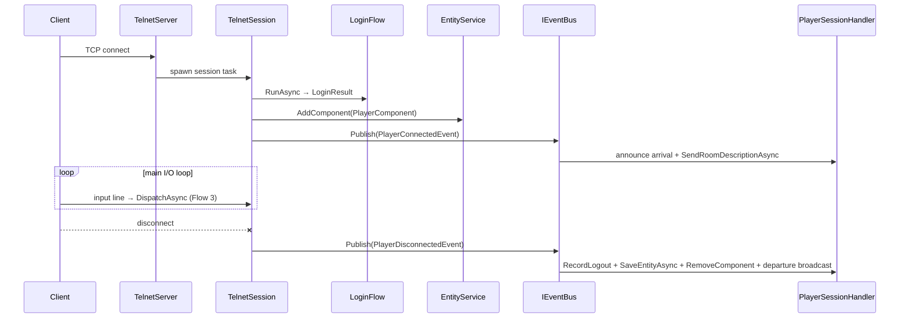

# Flow 2 — Player connection

> [Back to flows index](README.md). **Trigger:** inbound TCP connection on `Server:Port` (default 4000).

## Summary

`TelnetServer` accepts the connection and spawns a per-session task. The session delegates to `LoginFlow` (the interactive register/authenticate/character-select state machine — see [Flow 7](flow-07-login-character-flow.md)) and awaits a `LoginResult`. On success, it attaches `PlayerComponent`, registers the session, and publishes `PlayerConnectedEvent`; `PlayerSessionHandler` announces arrival and sends the room description. The session then enters its main I/O loop (see [Flow 3](flow-03-player-command-lifecycle.md)). On disconnect, `PlayerSessionHandler` records logout, saves the character entity immediately (without waiting for the flush cycle), removes `PlayerComponent`, and broadcasts departure. The character entity is not destroyed.

## Steps

1. **Accept.** `TelnetServer` spawns a fire-and-forget `TelnetSession` task. `PlayerEntityId` is 0 until login completes; the command dispatcher guard prevents premature dispatch.
2. **Login.** `LoginFlow.RunAsync` drives the full interactive state machine and returns a `LoginResult` (or `null` on disconnect/timeout). See [Flow 7](flow-07-login-character-flow.md).
3. **Session bind.** On a valid result, the session sets `PlayerEntityId`, attaches `PlayerComponent { DisplayName, Session }`, registers with `SessionManager`, and publishes `PlayerConnectedEvent`.
4. **Arrival.** `PlayerSessionHandler` (priority `Domain`) broadcasts the arrival message and sends the room description to the connecting player.
5. **I/O loop.** Each input line is forwarded to `CommandDispatcher.DispatchAsync`.
6. **Disconnect.** `PlayerSessionHandler` calls `IAccountSystem.RecordLogout`, immediately calls `IPersistenceSystem.SaveEntityAsync(characterEntityId)`, removes `PlayerComponent`, and broadcasts departure.

## Where to look

- [`Server/Sessions/TelnetServer.cs`](../../../Server/Sessions/TelnetServer.cs) · [`Server/Sessions/TelnetSession.cs`](../../../Server/Sessions/TelnetSession.cs) · [`Server/Sessions/LoginFlow.cs`](../../../Server/Sessions/LoginFlow.cs)
- [`docs/reference/handlers.md`](../../reference/handlers.md) — `PlayerSessionHandler`
- [Flow 7](flow-07-login-character-flow.md) — login state machine · [Flow 3](flow-03-player-command-lifecycle.md) — command dispatch
- [`docs/features/accounts/accounts.md`](../../features/accounts/accounts.md) — accounts feature
