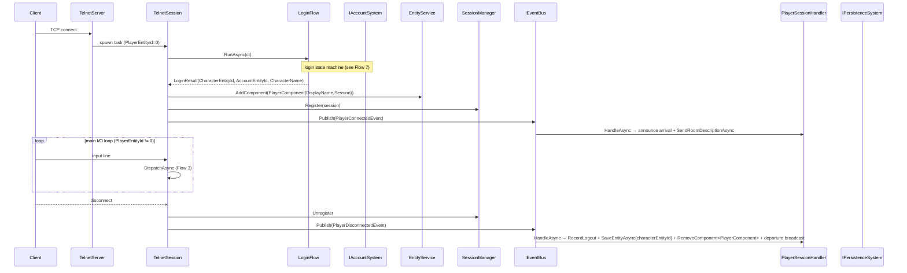

# Flow 2 — Player connection

> [Back to flows index](README.md)

**Summary.** A new TCP connection produces a per-session task that runs the `LoginFlow` state machine (banner → register/authenticate → character select/create), binds the resulting character entity to the session, then enters the main I/O loop. Disconnect records logout, removes the transient `PlayerComponent`, and broadcasts departure. The character entity is **not** destroyed. See [Flow 7](flow-07-login-character-flow.md) for the full login state machine detail.

**Trigger.** Inbound TCP connection on `Server:Port` (default 4000).

**Steps.**

1. `TelnetServer` (a `BackgroundService`) accepts the TCP client and spawns a fire-and-forget per-session `TelnetSession` task. `PlayerEntityId` is 0 until login completes — the `CommandDispatcher` guard `if (session.PlayerEntityId == 0) return;` prevents commands from being dispatched during login.
2. `TelnetSession` delegates immediately to `LoginFlow.RunAsync`. The login flow drives the full interactive state machine (banner, registration or authentication, character selection or creation) and returns a `LoginResult` — or `null` if the client disconnects or exceeds the login attempt limit. See [Flow 7](flow-07-login-character-flow.md) for detail.
3. On a valid `LoginResult`: `TelnetSession` sets `PlayerEntityId = result.CharacterEntityId`, attaches the transient `PlayerComponent { DisplayName, Session }`, calls `SessionManager.Register(session)`, and publishes `PlayerConnectedEvent(PlayerEntityId, CharacterName, AccountEntityId)`.
4. `PlayerSessionHandler` (priority `HandlerPriority.Domain`) handles `PlayerConnectedEvent`: broadcasts the arrival message to the room and calls `BroadcastSystem.SendRoomDescriptionAsync` for the connecting player.
5. The session enters its main I/O loop. Each input line is forwarded to `CommandDispatcher.DispatchAsync` (see [Flow 3](flow-03-player-command-lifecycle.md)).
6. On disconnect, `SessionManager.Unregister` removes the session, then `PlayerDisconnectedEvent` is published. `PlayerSessionHandler` calls `IAccountSystem.RecordLogout` (updates `CharacterComponent.LastLoginUtc`), then immediately calls `IPersistenceSystem.SaveEntityAsync(characterEntityId)` so the logout timestamp is durable without waiting for the next flush cycle, removes `PlayerComponent` via `EntityService.RemoveComponent<PlayerComponent>`, and broadcasts the departure.

**Cross-references.**
- [`Server/Sessions/TelnetServer.cs`](../../../Server/Sessions/TelnetServer.cs), [`Server/Sessions/TelnetSession.cs`](../../../Server/Sessions/TelnetSession.cs), [`Server/Sessions/LoginFlow.cs`](../../../Server/Sessions/LoginFlow.cs)
- [`docs/reference/handlers.md`](../../reference/handlers.md) — `PlayerSessionHandler`
- [Flow 7](flow-07-login-character-flow.md) — full login state machine
- [`docs/implementation-plans/account-character-creation.md`](../../implementation-plans/account-character-creation.md) — slice 5 spec
