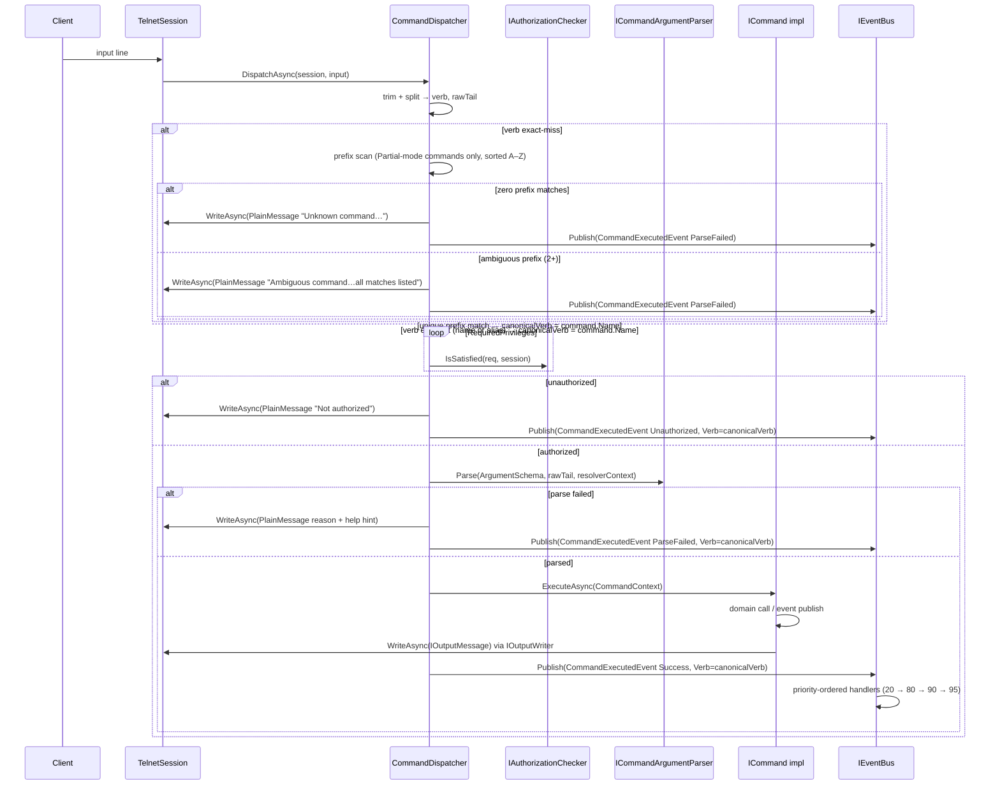

# Flow 3 — Player command lifecycle

> [Back to flows index](README.md)

**Summary.** Input bytes become a verb + raw tail; the dispatcher performs a two-phase verb lookup (exact first, prefix second), checks authorization via `IAuthorizationChecker`, parses arguments via `ICommandArgumentParser`, constructs a `CommandContext`, calls `ICommand.ExecuteAsync(context)`, and publishes `CommandExecutedEvent` for every outcome. The `Verb` field in `CommandExecutedEvent` always carries the **resolved canonical name** (e.g. `look`), never the raw typed prefix (`lo`). Output goes through the formatter-backed `IOutputWriter` (see [Flow 6](flow-06-output-rendering.md) for the rendering trace).

**Trigger.** A line of input arrives on a session's read stream.

**Steps.**

1. `TelnetSession` reads a line and calls `CommandDispatcher.DispatchAsync(session, input)`.
2. **Two-phase verb lookup.**
   - **Phase 1 (exact):** `_byVerb.TryGetValue(verb)` — checks primary names and all declared aliases. If found, `canonicalVerb = command.Name` and skip to step 3. Static aliases like `d` → `down` resolve here; prefix resolution is never reached.
   - **Phase 2 (prefix):** Collect all commands where `MatchingMode == Partial` and `command.Name.StartsWith(verb, OrdinalIgnoreCase)`. Sort alphabetically. Zero matches → write `PlainMessage("Unknown command: <verb>. Type 'help' for a list.")`, publish `CommandExecutedEvent(ParseFailed)`, return. Two or more matches → write `PlainMessage("Ambiguous command '<verb>'. Did you mean: <all names, comma-separated>?")`, publish `CommandExecutedEvent(ParseFailed)`, return. Exactly one match → `canonicalVerb = command.Name`.
3. **Privilege gate.** The dispatcher iterates `command.RequiredPrivileges` and calls `IAuthorizationChecker.IsSatisfied(req, session)` for each. Any unsatisfied requirement writes a rejection `PlainMessage` via `IOutputWriter` and publishes `CommandExecutedEvent(Unauthorized, Verb=canonicalVerb)`.
4. **Argument parse.** `ICommandArgumentParser.Parse(command.ArgumentSchema, rawTail, resolverContext)` does single-pass tokenization (whitespace + double-quoted groups), walks the declarative argument list, and coerces each token to its CLR type (`string`, `int`, `uint`, `Direction`). Enum-prefix matching works from day one (`n`/`no`/`nor` → `North`). String `Token` arguments that declare a non-null `IArgumentResolver` have prefix matching applied against the candidate list. The resolver returns `IReadOnlyList<ResolvedCandidate>?` where each `ResolvedCandidate(string MatchString, string CanonicalValue)` allows keyword aliases to map to a canonical item name; the parser deduplicates by `CanonicalValue` after prefix matching so multiple keyword aliases for the same item do not produce false ambiguity. Concrete resolvers (`ItemInRoomResolver`, `ItemInInventoryResolver`) ship in slice 6. On failure: the reason + `"Type 'help <canonicalVerb>' for usage."` is written; `CommandExecutedEvent(ParseFailed, Verb=canonicalVerb)` is published.
5. **Execute.** The dispatcher constructs `CommandContext(Session, InvokerEntityId, ParsedArguments, IOutputWriter, IServiceProvider)` and calls `command.ExecuteAsync(context)`. The body reads typed args via `context.Args.Get<T>(name)`, calls domain systems or publishes events via injected `IEventBus`, and writes all output via `context.Output.WriteAsync(IOutputMessage)`. No `session.SendLineAsync` in command bodies.
6. **Formatter-backed output.** `IOutputWriter.WriteAsync` resolves the session's formatter from `IOutputFormatterRegistry`, calls `formatter.Format(message, session)` (transport-correct ANSI or stripped plain text based on `session.SupportsColor`), and awaits `session.SendLineAsync(rendered)`. See [Flow 6](flow-06-output-rendering.md) for the full rendering trace.
7. **Exception trap.** Any uncaught exception is caught, logged at `Error` with a full stack trace, a `PlainMessage("Something went wrong. The error has been logged.")` is written, and `CommandExecutedEvent(Threw)` is published. No stack trace reaches the session.
8. **`CommandExecutedEvent`.** Published on every dispatch path — success, parse-fail, unauthorized, threw. The `Verb` field carries the **resolved canonical command name** (e.g. `look` when the player typed `lo`), not the raw typed prefix. This makes log lines stable regardless of what the player typed. `CommandLoggingHandler` (priority 80) writes one structured-log line per command via `ILogger`. `AdminAuditHandler` keeps subscribing to the four richer slice-2 admin events and does **not** subscribe to `CommandExecutedEvent`.

**Cross-references.**
- [`Core/Commands/CommandDispatcher.cs`](../../../Core/Commands/CommandDispatcher.cs), [`Core/Commands/ICommand.cs`](../../../Core/Commands/ICommand.cs)
- [`Core/Commands/Authorization/IAuthorizationChecker.cs`](../../../Core/Commands/Authorization/IAuthorizationChecker.cs), [`Core/Commands/CommandArgumentParser.cs`](../../../Core/Commands/CommandArgumentParser.cs)
- [`Core/Output/OutputWriter.cs`](../../../Core/Output/OutputWriter.cs), [`Core/Handlers/CommandLoggingHandler.cs`](../../../Core/Handlers/CommandLoggingHandler.cs)
- [`subsystems/commands.md`](../subsystems/commands.md) — command framework design
- [`subsystems/output.md`](../subsystems/output.md) — output framework design
- [`docs/use-cases/command-framework.md`](../../use-cases/command-framework.md) — slice 3 spec; [`docs/use-cases/output-framework.md`](../../use-cases/output-framework.md) — slice 4 spec
- [`docs/reference/handlers.md`](../../reference/handlers.md) — handler priority tiers
