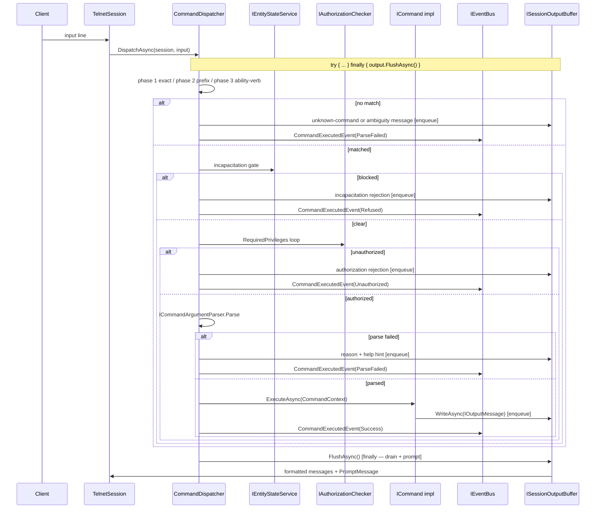

# Flow 3 — Command journey

> [Back to flows index](README.md)

**Summary.** A line of input arrives on a session's read stream; the dispatcher runs a three-phase verb lookup (exact → prefix → ability-verb fallback), checks the incapacitation gate, checks authorization, parses arguments, invokes `ICommand.ExecuteAsync`, publishes `CommandExecutedEvent`, and flushes the session buffer — all inside a `try/finally` so output always reaches the client.

**Trigger.** A line of input arrives on a session's read stream.

**Source:** [`../../features/commands/commands.md`](../../features/commands/commands.md)

**Steps.**

1. `TelnetSession` reads a line and calls `CommandDispatcher.DispatchAsync(session, input)`.
2. The dispatcher obtains an `IOutputWriter` via `IOutputWriterFactory.Create(session)`. The entire dispatch body runs inside `try { ... } finally { await output.FlushAsync() }`.
3. **Three-phase verb lookup.** Phase 1: exact match (name + aliases). Phase 2 on miss: prefix resolution across `Partial`-mode commands sorted A–Z. Phase 3 on miss: `IAbilityVerbResolver.TryResolve` for bare skill verbs. Unknown or ambiguous → enqueue error, publish `CommandExecutedEvent(ParseFailed)`, return.
4. **Incapacitation gate.** `IEntityStateService.IsInState(Incapacitated)`. Blocked + `!UsableWhileIncapacitated` → rejection, `CommandExecutedEvent(Refused)`, return.
5. **Privilege gate.** `IAuthorizationChecker.IsSatisfied` per `RequiredPrivileges` entry. Any failure → rejection, `CommandExecutedEvent(Unauthorized)`, return.
6. **Argument parse.** `ICommandArgumentParser.Parse(schema, rawTail, resolverContext)`. Failure → reason + `"Type 'help <verb>'"`, `CommandExecutedEvent(ParseFailed)`, return.
7. **Execute.** `command.ExecuteAsync(CommandContext)`. Output enqueues in the session buffer. Uncaught exceptions are caught, logged with stack trace, a generic `PlainMessage` is enqueued, and `CommandExecutedEvent(Threw)` is published.
8. **Publish.** `CommandExecutedEvent(Success, canonicalVerb)` after `ExecuteAsync` returns.
9. **Flush (`finally`).** `output.FlushAsync()` drains the buffer, formats and sends each message via `session.SendLineAsync`, then appends one `PromptMessage` from `IPromptSource`.

**Cross-references.**
- [`Core/Commands/CommandDispatcher.cs`](../../../Core/Commands/CommandDispatcher.cs) · [`Core/Commands/ICommand.cs`](../../../Core/Commands/ICommand.cs)
- [`Core/Commands/Authorization/IAuthorizationChecker.cs`](../../../Core/Commands/Authorization/IAuthorizationChecker.cs) · [`Core/Commands/CommandArgumentParser.cs`](../../../Core/Commands/CommandArgumentParser.cs)
- [`Core/Commands/Events/CommandExecutedEvent.cs`](../../../Core/Commands/Events/CommandExecutedEvent.cs) · [`Core/Commands/CommandOutcome.cs`](../../../Core/Commands/CommandOutcome.cs)
- [`features/commands/command-framework.md`](../../features/commands/command-framework.md) — full command framework design
- [`features/output/output-framework.md`](../../features/output/output-framework.md) — output framework and buffer model
- [`../reference/handlers.md`](../../reference/handlers.md) — handler priority tiers
