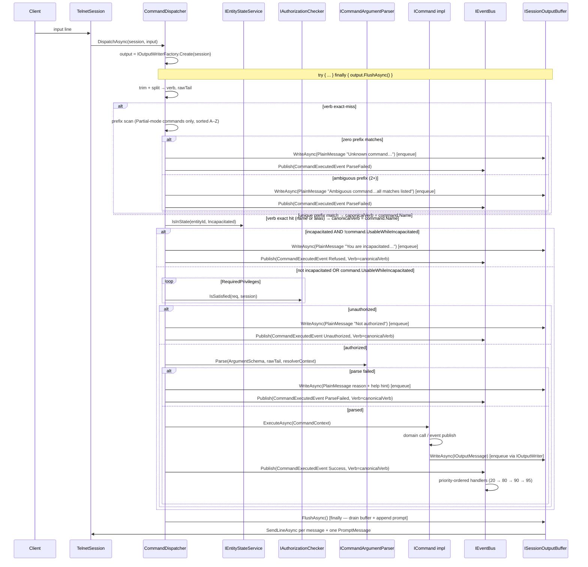

# Flow 3 — Player command lifecycle

> [Back to flows index](README.md)

**Summary.** Input bytes become a verb + raw tail; the dispatcher performs a two-phase verb lookup (exact first, prefix second), checks the incapacitation gate, checks authorization via `IAuthorizationChecker`, parses arguments via `ICommandArgumentParser`, constructs a `CommandContext`, calls `ICommand.ExecuteAsync(context)`, and publishes `CommandExecutedEvent` for every outcome. After every dispatch path (success, parse-fail, unauthorized, refused, threw) the dispatcher calls `output.FlushAsync()` in a `finally` block — this drains the session buffer and appends **one** trailing prompt. The `Verb` field in `CommandExecutedEvent` always carries the **resolved canonical name** (e.g. `look`), never the raw typed prefix (`lo`). Output enqueues in the session buffer via `SessionBufferedOutputWriter` (see [Flow 6](flow-06-output-rendering.md) for the full rendering trace).

**Trigger.** A line of input arrives on a session's read stream.

**Steps.**

1. `TelnetSession` reads a line and calls `CommandDispatcher.DispatchAsync(session, input)`.
2. The dispatcher calls `IOutputWriterFactory.Create(session)` to obtain an `IOutputWriter` (a `SessionBufferedOutputWriter` backed by the session's `ISessionOutputBuffer`). The entire dispatch body runs inside a `try { ... } finally { await output.FlushAsync() }` block — flush runs on every exit path.
3. **Two-phase verb lookup.**
   - **Phase 1 (exact):** `_byVerb.TryGetValue(verb)` — checks primary names and all declared aliases. If found, `canonicalVerb = command.Name` and skip to step 4. Static aliases like `d` → `down` resolve here; prefix resolution is never reached.
   - **Phase 2 (prefix):** Collect all commands where `MatchingMode == Partial` and `command.Name.StartsWith(verb, OrdinalIgnoreCase)`. Sort alphabetically. Zero matches → enqueue `PlainMessage("Unknown command: <verb>. Type 'help' for a list.")`, publish `CommandExecutedEvent(ParseFailed)`, return. Two or more matches → enqueue `PlainMessage("Ambiguous command '<verb>'. Did you mean: <all names, comma-separated>?")`, publish `CommandExecutedEvent(ParseFailed)`, return. Exactly one match → `canonicalVerb = command.Name`.
4. **Incapacitation gate.** The dispatcher calls `IEntityStateService.IsInState(session.PlayerEntityId, Incapacitated)`. If the player is incapacitated and `command.UsableWhileIncapacitated` is `false` (the default), it enqueues `"You are incapacitated and cannot do that."` and publishes `CommandExecutedEvent(Refused, Verb=canonicalVerb)`. Commands explicitly opting in (`help`, `commands`, `score`) bypass this gate. Incapacitation is a transient entity state, not a privilege — this gate lives in the dispatcher, not in `IAuthorizationChecker`.
5. **Privilege gate.** The dispatcher iterates `command.RequiredPrivileges` and calls `IAuthorizationChecker.IsSatisfied(req, session)` for each. Any unsatisfied requirement enqueues a rejection `PlainMessage` and publishes `CommandExecutedEvent(Unauthorized, Verb=canonicalVerb)`.
6. **Argument parse.** `ICommandArgumentParser.Parse(command.ArgumentSchema, rawTail, resolverContext)` does single-pass tokenization (whitespace + double-quoted groups), walks the declarative argument list, and coerces each token to its CLR type (`string`, `int`, `uint`, `Direction`). Enum-prefix matching works from day one (`n`/`no`/`nor` → `North`). String `Token` arguments that declare a non-null `IArgumentResolver` have prefix matching applied against the candidate list. The resolver returns `IReadOnlyList<ResolvedCandidate>?` where each `ResolvedCandidate(string MatchString, string CanonicalValue)` allows keyword aliases to map to a canonical item name; the parser deduplicates by `CanonicalValue` after prefix matching so multiple keyword aliases for the same item do not produce false ambiguity. Concrete resolvers (`ItemInRoomResolver`, `ItemInInventoryResolver`) ship in slice 6. On failure: the reason + `"Type 'help <canonicalVerb>' for usage."` is enqueued; `CommandExecutedEvent(ParseFailed, Verb=canonicalVerb)` is published.
7. **Execute.** The dispatcher constructs `CommandContext(Session, InvokerEntityId, ParsedArguments, IOutputWriter, IServiceProvider)` and calls `command.ExecuteAsync(context)`. The body reads typed args via `context.Args.Get<T>(name)`, calls domain systems or publishes events via injected `IEventBus`, and writes all output via `context.Output.WriteAsync(IOutputMessage)`. No `session.SendLineAsync` in command bodies. Each `WriteAsync` enqueues the message in the session buffer; if the message's `OutputCategory` is `Chat`, an immediate `buffer.FlushAsync()` fires (so `say` output is never delayed to tick-end).
8. **Exception trap.** Any uncaught exception is caught, logged at `Error` with a full stack trace, a `PlainMessage("Something went wrong. The error has been logged.")` is enqueued, and `CommandExecutedEvent(Threw)` is published. No stack trace reaches the session.
9. **Buffer flush (`finally`).** After `ExecuteAsync` returns (or an exception is caught), the `finally` block calls `await output.FlushAsync()`. `FlushAsync` atomically drains all pending messages from the buffer, formats and sends each one via `session.SendLineAsync`, then calls `IPromptSource.GetPrompt(session.PlayerEntityId)` and appends one `PromptMessage`. The player sees all command output followed by a single `(StateLabel) HP: x/y ...` prompt line. If a `Chat`-category message triggered an intermediate immediate flush during execution, those messages were already sent; the `finally` flush picks up any remaining buffered output and always appends the trailing prompt.
10. **`CommandExecutedEvent`.** Published on every dispatch path — success, parse-fail, unauthorized, refused, threw. The `Verb` field carries the **resolved canonical command name** (e.g. `look` when the player typed `lo`), not the raw typed prefix. This makes log lines stable regardless of what the player typed. `CommandLoggingHandler` (priority 80) writes one structured-log line per command via `ILogger`. `AdminAuditHandler` keeps subscribing to the four richer slice-2 admin events and does **not** subscribe to `CommandExecutedEvent`.

**Cross-references.**
- [`Core/Commands/CommandDispatcher.cs`](../../../Core/Commands/CommandDispatcher.cs), [`Core/Commands/ICommand.cs`](../../../Core/Commands/ICommand.cs)
- [`Core/Commands/CommandOutcome.cs`](../../../Core/Commands/CommandOutcome.cs) — `Refused` outcome added in slice 10 (incapacitation gate)
- [`Core/Modules/EntityState/Systems/IEntityStateService.cs`](../../../Core/Modules/EntityState/Systems/IEntityStateService.cs) — incapacitation state query
- [`Core/Commands/Authorization/IAuthorizationChecker.cs`](../../../Core/Commands/Authorization/IAuthorizationChecker.cs), [`Core/Commands/CommandArgumentParser.cs`](../../../Core/Commands/CommandArgumentParser.cs)
- [`Core/Output/SessionBufferedOutputWriter.cs`](../../../Core/Output/SessionBufferedOutputWriter.cs) — per-request writer wrapping the session buffer (WP-A); replaces the former direct `OutputWriter`
- [`Core/Output/ISessionBufferRegistry.cs`](../../../Core/Output/ISessionBufferRegistry.cs) — singleton buffer map; `GetOrCreate` called by `OutputWriterFactory`
- [`Core/Handlers/CommandLoggingHandler.cs`](../../../Core/Handlers/CommandLoggingHandler.cs)
- [`subsystems/commands.md`](../subsystems/commands.md) — command framework design
- [`features/output/output-framework.md`](../../features/output/output-framework.md) — output framework design including buffer model
- [`docs/implementation-plans/command-framework.md`](../../implementation-plans/command-framework.md) — slice 3 spec; [`features/output/output.md`](../../features/output/output.md) — output feature (slice 4 + batching)
- [`docs/reference/handlers.md`](../../reference/handlers.md) — handler priority tiers
