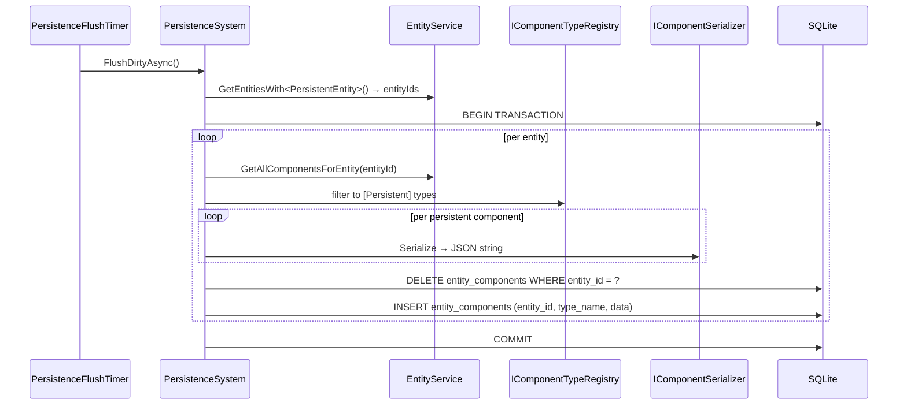

# Flow 4 — Persistence flush cycle

> [Back to flows index](README.md)

**Summary.** The flush timer performs a full sweep of all `PersistentEntity`-carrying entities and writes them to SQLite. No footprint calculation is performed; the flush pool is small enough that a full sweep is always cheap. On shutdown `PersistenceBootstrap.StopAsync` runs the same full sweep via `FlushAllAsync`. Authored content and entity construction use save-on-change (`SaveEntityAsync`) called directly by the command or handler that created the entity.

**Trigger.** `PersistenceFlushTimer` periodic tick (`Persistence:FlushIntervalSeconds`, default 60) or `PersistenceBootstrap.StopAsync` (shutdown).

**Steps.**

1. `PersistenceFlushTimer.ExecuteAsync` ticks. Calls `PersistenceSystem.FlushDirtyAsync(ct)` directly — no session manager lookup, no footprint calculation.
2. `FlushDirtyAsync` calls `EntityService.GetEntitiesWith<PersistentEntity>()` to collect all persistent entity IDs.
3. Opens a SQLite transaction for the entire flush.
4. For each entity: `GetAllComponentsForEntity` returns all attached components; the set is filtered through `IComponentTypeRegistry.IsPersistent`; each surviving component is serialized via `IComponentSerializer` (System.Text.Json, camelCase).
5. Within the transaction: DELETE existing rows for the entity, then INSERT fresh rows (one row per `[Persistent]` component).
6. Commits the transaction. Logs `{context} wrote {saved}/{total} entity/entities`.
7. **Shutdown path.** `PersistenceBootstrap.StopAsync` calls `PersistenceSystem.FlushAllAsync(ct)` — identical logic, different log context (`"shutdown flush"`).
8. **Auto-delete.** When `EntityService.DestroyEntity(id)` is called for a persistent entity, `PersistenceSystem.DeleteEntitySync` fires synchronously (via `EntityService.OnPersistentEntityDestroying`) and issues `DELETE FROM entity_components WHERE entity_id = ?` before ECS teardown. No handler or command is involved.

**Two-level model.** An entity is written only if it carries `PersistentEntity` (level 1). Among its components, only those tagged `[Persistent]` are included in the snapshot (level 2). `PlayerComponent` (transient session ref) and `TransientEffectsComponent` (session-only) are untagged and are never written.

**Cross-references.**
- [`Core/Systems/PersistenceSystem.cs`](../../../Core/Systems/PersistenceSystem.cs), [`Server/PersistenceFlushTimer.cs`](../../../Server/PersistenceFlushTimer.cs), [`Server/PersistenceBootstrap.cs`](../../../Server/PersistenceBootstrap.cs)
- [`docs/use-cases/persistence-reform.md`](../../use-cases/persistence-reform.md) Stage A
