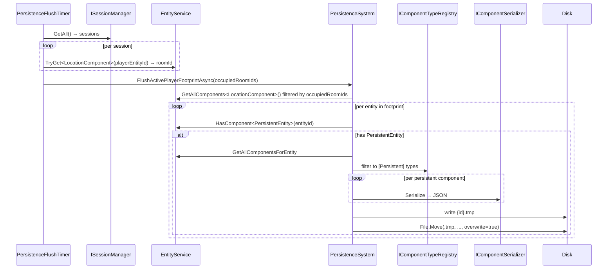

# Flow 4 — Persistence flush cycle

> [Back to flows index](README.md)

**Summary.** The flush timer resolves the active player footprint (rooms occupied by at least one connected player) and writes all `PersistentEntity`-carrying entities in those rooms. On shutdown `PersistenceBootstrap.StopAsync` runs a full sweep of every `PersistentEntity` entity. Authored content and lifecycle transitions use save-on-change (`SaveEntityAsync`) called directly by the command or handler that made the mutation; they do not depend on this cycle.

**Trigger.** `PersistenceFlushTimer` periodic tick (`Persistence:FlushIntervalSeconds`, default 60) or `PersistenceBootstrap.StopAsync` (shutdown).

**Steps.**

1. `PersistenceFlushTimer.ExecuteAsync` ticks. It calls `ISessionManager.GetAll()` to collect all connected sessions; for each, reads `LocationComponent.RoomEntityId` to build the set of occupied room ids. If no sessions are connected the flush is skipped.
2. Calls `PersistenceSystem.FlushActivePlayerFootprintAsync(occupiedRoomIds, ct)`.
3. `FlushActivePlayerFootprintAsync` queries `EntityService.GetAllComponents<LocationComponent>()` and filters to entities whose `RoomEntityId` is in the occupied set. This naturally includes both player entities (whose location is one of the occupied rooms) and any other `LocationComponent`-bearing entities in those rooms.
4. For each entity in the footprint, the system checks `HasComponent<PersistentEntity>(entityId)`. Entities without the marker are silently skipped — the two-level model guard.
5. For entities that pass the guard: `EntityService.GetAllComponentsForEntity` returns all attached components; the set is filtered through `IComponentTypeRegistry.IsPersistent`; each surviving component is serialized via `IComponentSerializer` (System.Text.Json, camelCase). The envelope `{ entityId, components: [{ typeName, data }, …] }` is written atomically via `.tmp`→rename.
6. `PersistenceSystem` publishes no events.
7. **Shutdown path.** `PersistenceBootstrap.StopAsync` calls `PersistenceSystem.FlushAllPersistentAsync(ct)`, which iterates `GetAllComponents<PersistentEntity>()` and writes every entity — not just those in occupied rooms — guaranteeing a complete snapshot regardless of player positions.

**Two-level model.** An entity is written only if it carries `PersistentEntity` (level 1). Among its components, only those tagged `[Persistent]` are included in the snapshot (level 2). `PlayerComponent` (transient session ref) and `TransientEffectsComponent` (session-only) are untagged and are never written.

**Cross-references.**
- [`Core/Systems/PersistenceSystem.cs`](../../../Core/Systems/PersistenceSystem.cs), [`Server/PersistenceFlushTimer.cs`](../../../Server/PersistenceFlushTimer.cs), [`Server/PersistenceBootstrap.cs`](../../../Server/PersistenceBootstrap.cs)
- [`docs/use-cases/persistence-substrate.md`](../../use-cases/persistence-substrate.md), [`docs/use-cases/persistence-two-level-model.md`](../../use-cases/persistence-two-level-model.md)
