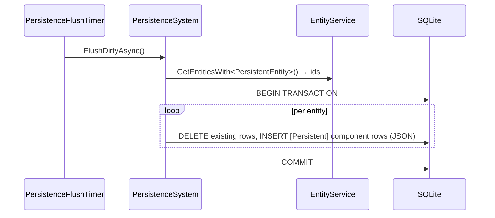

# Flow 4 — Persistence flush cycle

> [Back to flows index](README.md). **Trigger:** `PersistenceFlushTimer` periodic tick (`Persistence:FlushIntervalSeconds`, default 60) or `PersistenceBootstrap.StopAsync` (shutdown).

## Summary

`PersistenceSystem` collects all `PersistentEntity`-carrying entities, opens a SQLite transaction, and for each entity deletes its current rows then inserts fresh rows — one per `[Persistent]`-tagged component, serialized to JSON. The pool is always small (players, accounts, player-owned items only; world content carries no `PersistentEntity`), so a full sweep is always cheap. On entity destruction, `PersistenceSystem.DeleteEntitySync` fires synchronously (via `EntityService.OnPersistentEntityDestroying`) before ECS teardown. Save-on-change (`SaveEntityAsync`) is called directly by commands and handlers that create or modify persistent entities.

## Steps

1. **Collect.** `PersistenceSystem.FlushDirtyAsync` calls `EntityService.GetEntitiesWith<PersistentEntity>()`.
2. **Transaction.** Opens a single SQLite transaction covering the entire flush; DELETE then INSERT for each entity.
3. **Serialize.** For each entity, all components are retrieved; only those tagged `[Persistent]` are serialized (System.Text.Json, camelCase) and written. `PlayerComponent` is untagged and never written. `EffectsComponent` is tagged but its JSON converter filters to `UntilRemoved` effects only.
4. **Commit.** Transaction commits; logs `wrote {saved}/{total}` entities.
5. **Shutdown.** `PersistenceBootstrap.StopAsync` calls `FlushAllAsync` — identical logic, `"shutdown flush"` log context.
6. **Auto-delete.** `EntityService.DestroyEntity` for a persistent entity triggers `DeleteEntitySync` synchronously, issuing `DELETE FROM entity_components WHERE entity_id = ?` before ECS teardown.

**Two-level opt-in.** `PersistentEntity` on the entity (level 1) + `[Persistent]` on a component type (level 2). `LocationComponent.RoomEntityId` is `[JsonIgnore]`; only `RoomBlueprintId` is stored and resolved at startup.

## Where to look

- [`Core/Systems/PersistenceSystem.cs`](../../../Core/Systems/PersistenceSystem.cs) · [`Server/PersistenceFlushTimer.cs`](../../../Server/PersistenceFlushTimer.cs) · [`Server/PersistenceBootstrap.cs`](../../../Server/PersistenceBootstrap.cs)
- [`docs/architecture/06-persistence.md`](../06-persistence.md) — persistence model
- [`docs/implementation-plans/persistence-reform.md`](../../implementation-plans/persistence-reform.md) — Stages A and B
