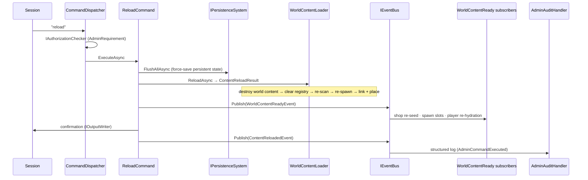

# Flow 5 — Content reload (`reload`)

> [Back to flows index](README.md). **Trigger:** privileged session sends `reload`.

## Summary

`reload` rebuilds the live world instance from YAML the same way a restart does — without dropping connected players. `ReloadCommand` (an Initiator) force-saves all persistent state, then `WorldContentLoader.ReloadAsync` **tears down every world-content entity** (anything with a `BlueprintComponent` and no `PersistentEntity`), re-reads the content directory, and re-spawns the world fresh via the same spawn/place/link path the startup load uses. The command then re-publishes `WorldContentReadyEvent`, so the identical post-load fan-out re-runs: `ShopkeeperSpawnHandler` re-seeds shop tills + base stock, `SpawnSystem` rebuilds spawn slots, and `CharacterHydrationHandler` re-resolves each player's `RoomBlueprintId → RoomEntityId` (resetting to the starting room if their room was removed from YAML). Persistent entities (players and player-owned items/containers) are preserved. The result is that runtime instance state is reset — edits take effect, picked-up world items respawn, depleted shops refill, the buy-back shelf clears. Finally `ContentReloadedEvent` is published and `AdminAuditHandler` logs the event.

## Steps

1. **Authorization.** `CommandDispatcher` evaluates `IAuthorizationChecker.IsSatisfied(AdminRequirement, session)` before invoking `ReloadCommand`; unauthorized sessions receive a rejection and the command never runs.
2. **Force-save.** `ReloadCommand` calls `IPersistenceSystem.FlushAllAsync` so all persistent (player + player-owned) state is durable before the world instance is torn down.
3. **Tear down world content.** `WorldContentLoader.ReloadAsync` destroys every entity carrying a `BlueprintComponent` but not `PersistentEntity` (`DestroyWorldContent`) — rooms, areas, mobs, world/dropped items, shop base stock and buy-back items. Persistent entities are left intact.
4. **Registry refresh.** Snapshots previous template ids, clears the registry, re-scans `World:ContentDirectory`, and re-registers all templates.
5. **Re-spawn the world.** `SpawnAndPlaceWorld` spawns every template fresh, links room exits, places items/mobs in their rooms, and links rooms to areas — the same path startup uses. (The world blueprint map excludes persistent entities, so a player-owned copy never suppresses an authored re-spawn.)
6. **Post-load fan-out.** `ReloadCommand` publishes `WorldContentReadyEvent`. `ShopkeeperSpawnHandler` seeds tills + base stock on the fresh shops; `SpawnSystem` clears and rebuilds its slot tracker; `CharacterHydrationHandler` re-resolves each persistent entity's room from its durable `RoomBlueprintId`, moving characters whose room no longer exists to the starting room.
7. **Result + audit.** `ReloadAsync` returns `ContentReloadResult { loaded, unchanged, removed }` (template-file diff); the command writes a confirmation and publishes `ContentReloadedEvent`; `AdminAuditHandler` (p=80) logs the event.

**Note.** Reload is a full rebuild, so edits to existing rooms/mobs/items now take effect immediately — no restart required. Because world entities are destroyed and re-created, transient combat/effect references to a destroyed mob are dropped (acceptable for an admin maintenance operation). Concurrency with the heartbeat thread is the known deferred [thread-safety review](../../roadmap/backlog.md) concern.

## Where to look

- [`Core/Modules/Admin/Commands/ReloadCommand.cs`](../../../Core/Modules/Admin/Commands/ReloadCommand.cs) · [`Core/Modules/World/Systems/WorldContentLoader.cs`](../../../Core/Modules/World/Systems/WorldContentLoader.cs)
- [`docs/features/world/world.md`](../../features/world/world.md) — world content loading and admin substrate
