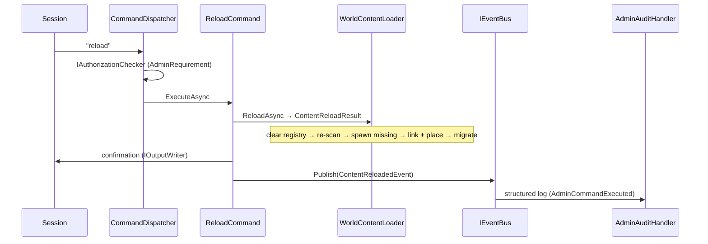

# Flow 5 — Content reload (`reload`)

> [Back to flows index](README.md). **Trigger:** privileged session sends `reload`.

## Summary

`ReloadCommand` calls `WorldContentLoader.ReloadAsync`, which clears the template registry, re-scans the content directory, registers the refreshed templates, spawns any template with no live counterpart, links exits and places mobs/items for newly-spawned entities, and runs a migration pass to add any missing required components to existing live entities. Live entities are never mutated by reload — only new entities are affected. On completion, `ContentReloadedEvent` is published and `AdminAuditHandler` writes a structured log entry.

## Steps

1. **Authorization.** `CommandDispatcher` evaluates `IAuthorizationChecker.IsSatisfied(AdminRequirement, session)` before invoking `ReloadCommand`; unauthorized sessions receive a rejection and the command never runs.
2. **Registry refresh.** `WorldContentLoader.ReloadAsync` snapshots previous template ids, clears the registry, re-scans `World:ContentDirectory`, and re-registers all templates.
3. **Spawn missing.** Builds a live blueprint→entity map from existing `BlueprintComponent`s, then spawns any template with no live counterpart (`SpawnMissingEntities`).
4. **Link and place.** Links room exits, attaches `LocationComponent` to newly-spawned items and mobs. Existing live entities are not touched; a changed `spawnRoomBlueprintId` on an existing entity logs a warning only.
5. **Migration.** `MigrateEntityComponentsAsync` adds any missing required components (per `IArchetypeRegistry.MissingRequired`) and calls `SaveEntityAsync` for each modified entity.
6. **Result.** Returns `ContentReloadResult { loaded, unchanged, removed }`; command writes a confirmation and publishes `ContentReloadedEvent`; `AdminAuditHandler` (p=80) logs the event.

**Constraint.** To pick up edits to a live entity's components or description, restart the host; or use `dig` for exit changes that should apply immediately.

## Where to look

- [`Core/Modules/Admin/Commands/ReloadCommand.cs`](../../../Core/Modules/Admin/Commands/ReloadCommand.cs) · [`Core/Modules/World/Systems/WorldContentLoader.cs`](../../../Core/Modules/World/Systems/WorldContentLoader.cs)
- [`docs/features/world/world.md`](../../features/world/world.md) — world content loading and admin substrate
