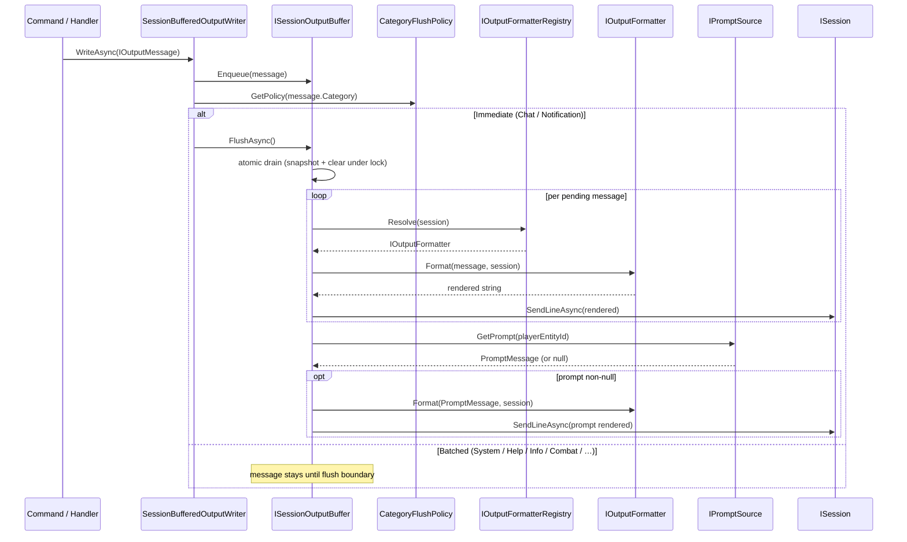

# Output journey

> [Back to flows index](README.md)

**Summary.** A typed `IOutputMessage` is written by a command or handler, enqueued in the session's `ISessionOutputBuffer` by `SessionBufferedOutputWriter`, and either flushed immediately (Chat category) or held until the next flush boundary (command-end `finally` block or `OutputFlushTickHandler` at tick priority 85). At flush the buffer drains atomically, each message is formatted by `IOutputFormatterRegistry` → `IOutputFormatter`, sent via `ISession.SendLineAsync`, and one `PromptMessage` from `IPromptSource` is appended. Source: [`../../features/output/output.md`](../../features/output/output.md).

**Trigger.** Any call to `IOutputWriter.WriteAsync`, `IBroadcastSystem.SendToRoomAsync`, `IBroadcastSystem.SendToAllAsync`, or `IBroadcastSystem.SendRoomDescriptionAsync`.

**Steps.**

1. A command calls `context.Output.WriteAsync(message)` or a handler calls `_broadcast.SendToRoomAsync(roomId, message, filter?)`. For broadcast, `BroadcastSystem` enumerates eligible recipients (applying any `audienceFilter` predicate) and calls `_writerFactory.Create(session).WriteAsync(message)` for each — each recipient gets their own `SessionBufferedOutputWriter` wrapping the session's shared `ISessionOutputBuffer`.
2. `SessionBufferedOutputWriter.WriteAsync` enqueues the message and checks `CategoryFlushPolicy.GetPolicy(message.Category)`:
   - **`FlushPolicy.Immediate`** — `Chat` and `Notification`. An immediate `buffer.FlushAsync()` runs (see step 3).
   - **`FlushPolicy.Batched`** — all other categories. The message stays until the next explicit flush boundary: the command dispatcher's `finally` block or `OutputFlushTickHandler` at tick-end.
3. **Buffer flush.** `ISessionOutputBuffer.FlushAsync()` acquires the lock, snapshots and clears the pending list, releases the lock, then for each message calls `IOutputFormatterRegistry.Resolve(session)` → `formatter.Format(message, session)` → `session.SendLineAsync(rendered)`. Finally calls `IPromptSource.GetPrompt(session.PlayerEntityId)`; if non-null, formats and sends the prompt.
4. **Formatter.** `TelnetOutputFormatter.Format` pattern-matches the message shape and applies the four-role ANSI palette (`<system>` / `<error>` / `<room-name>` / `<direction>`) as inline markers. Strips all markers when `session.SupportsColor == false`. See the [palette table](../../features/output/output-framework.md#ansi-palette-four-semantic-roles).
5. The rendered string reaches `session.SendLineAsync` which writes UTF-8 bytes to the TCP stream.

**Flush boundaries.** Command-end (`CommandDispatcher` `finally`); Chat/Notification immediate; `OutputFlushTickHandler` (priority 85 on `HeartbeatTickEvent`).

**Broadcast fan-out.** `SendToRoomAsync` enumerates `LocationComponent` entities in the room, applies the optional predicate, and runs steps 2–5 for each surviving recipient independently — each gets their own formatter resolution and independent buffer.

**Thread safety.** Atomic drain (snapshot-and-clear under lock, I/O outside lock) prevents corruption from concurrent enqueues (player read loop, peer broadcasts, heartbeat). Two concurrent flushes produce at most one extra prompt — accepted consequence. See [output-framework thread safety](../../features/output/output-framework.md#thread-safety).

**Cross-references.**
- [`Core/Output/SessionBufferedOutputWriter.cs`](../../../Core/Output/SessionBufferedOutputWriter.cs) · [`Core/Output/ISessionOutputBuffer.cs`](../../../Core/Output/ISessionOutputBuffer.cs) · [`Core/Output/ISessionBufferRegistry.cs`](../../../Core/Output/ISessionBufferRegistry.cs)
- [`Core/Output/CategoryFlushPolicy.cs`](../../../Core/Output/CategoryFlushPolicy.cs) · [`Core/Output/IPromptSource.cs`](../../../Core/Output/IPromptSource.cs)
- [`Core/Output/TelnetOutputFormatter.cs`](../../../Core/Output/TelnetOutputFormatter.cs) · [`Core/Output/OutputFormatterRegistry.cs`](../../../Core/Output/OutputFormatterRegistry.cs)
- [`Core/Systems/BroadcastSystem.cs`](../../../Core/Systems/BroadcastSystem.cs)
- [`Core/Handlers/OutputFlushTickHandler.cs`](../../../Core/Handlers/OutputFlushTickHandler.cs) — tick-end flush trigger
- [`../../features/output/output-framework.md`](../../features/output/output-framework.md) — full output framework design
