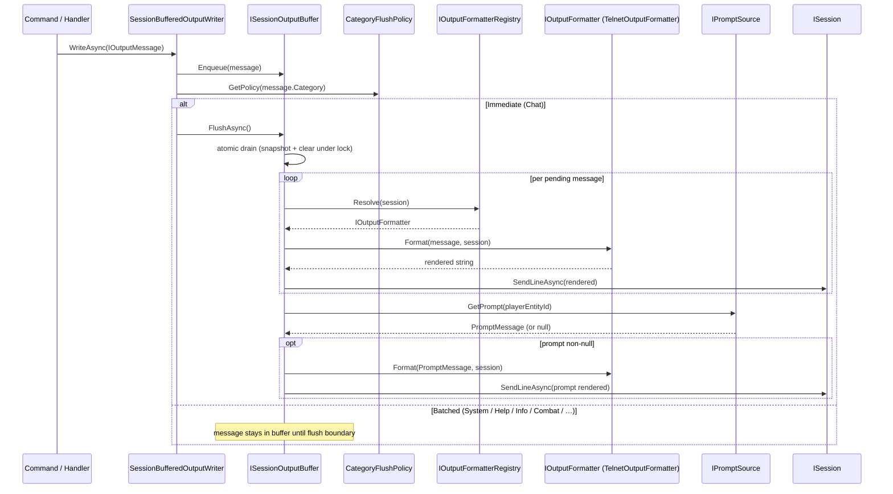

# Flow 6 — Output rendering

> [Back to flows index](README.md)

**Summary.** Any command body or handler that calls `IOutputWriter.WriteAsync(IOutputMessage)` or `IBroadcastSystem.SendToRoomAsync`/`SendToAllAsync` triggers this chain. Messages are **enqueued** in the session's `ISessionOutputBuffer` by `SessionBufferedOutputWriter`. The `CategoryFlushPolicy` determines whether the message triggers an **immediate** flush (`Chat` category only) or waits for the next explicit flush boundary (command-end `finally` block or `OutputFlushTickHandler` at tick-end). At flush time the buffer drains atomically, each message is formatted by `TelnetOutputFormatter` and sent, then one `PromptMessage` is appended. Every future gameplay slice's output plugs into this chain without touching transport code.

**Trigger.** Any call to `IOutputWriter.WriteAsync`, `IBroadcastSystem.SendToRoomAsync`, `IBroadcastSystem.SendToAllAsync`, or `IBroadcastSystem.SendRoomDescriptionAsync`.

**Steps.**

1. A command calls `context.Output.WriteAsync(message)` or a handler calls `_broadcast.SendToRoomAsync(roomId, message, filter?)`. For broadcast, `BroadcastSystem` enumerates eligible recipients and calls `_writerFactory.Create(session).WriteAsync(message)` for each recipient — each gets their own `SessionBufferedOutputWriter` wrapping the session's shared `ISessionOutputBuffer`.
2. `SessionBufferedOutputWriter.WriteAsync` calls `buffer.Enqueue(message)` to add the message to the session's pending list, then checks `CategoryFlushPolicy.GetPolicy(message.Category)`:
   - **`FlushPolicy.Immediate`** — only `OutputCategory.Chat`. An immediate `buffer.FlushAsync()` is triggered (see step 3). Used for `say`/`tell`/broadcast chat so recipients see messages without waiting for the next tick or command boundary.
   - **`FlushPolicy.Batched`** — all other categories (`System`, `Help`, `Info`, `Combat`, …). The message stays in the buffer until the next explicit flush boundary: either the command dispatcher's `finally` block ([Flow 3](flow-03-player-command-lifecycle.md)) or `OutputFlushTickHandler` at tick-end ([Flow 16](flow-16-heartbeat-tick.md)).
3. **Buffer flush.** `ISessionOutputBuffer.FlushAsync()`:
   a. Acquires the buffer lock; takes a snapshot of all pending messages; clears the pending list; releases the lock (atomic drain — avoids holding the lock across async I/O).
   b. For each message in the snapshot: calls `IOutputFormatterRegistry.Resolve(session)` to obtain the formatter, calls `formatter.Format(message, session)`, and awaits `session.SendLineAsync(rendered)`.
   c. Calls `IPromptSource.GetPrompt(session.PlayerEntityId)` to obtain a fresh `PromptMessage` (computed on read from current entity state + pools). If non-null: formats and sends it. Buffer is now empty.
4. **Formatter.** `IOutputFormatter.Format(message, session)` pattern-matches the message shape:
   - `PlainMessage` — wraps text in a severity-appropriate color marker (`<error>`, `<system>`, or plain).
   - `RoomDescriptionMessage` — room name in `<room-name>`, exit keys in `<direction>`, description and occupants plain; if `Items` is non-empty, appends an `"Items: X, Y, Z"` line; if `Mobs` is non-empty, appends a `"<Name> is here."` line per mob. `BroadcastSystem.SendRoomDescriptionAsync` populates `Items` by iterating all `ItemDataComponent` entities whose `LocationComponent.RoomEntityId` matches the room, and populates `Mobs` by iterating all `MobDataComponent` entities in the same room.
   - `MovementMessage(Blocked)` — "You cannot go that way." in `<system>`.
   - `InventoryListMessage` — `"You are carrying:"` header in `<system>` followed by a plain-text item list (one per line, two-space indent). Only sent when inventory is non-empty; empty case is a `PlainMessage("You are carrying nothing.")` from the command body.
   - `EquipmentDisplayMessage` — `"You are wearing:"` header in `<system>` followed by slot label (left-padded to 14 chars) + item name rows, ordered by `WornSlot` enum ordinal. Only sent when at least one slot is occupied; empty case is a `PlainMessage("You are not wearing anything.")` from the command body. (slice 7)
   - `HelpIndexMessage` — section headers in `<system>`, verb names in `<room-name>` (padded before colorizing).
   - `HelpEntryMessage` — verb/alias header in `<room-name>`.
   - `PromptMessage` — optional `(StateLabel)` in `<system>` color (omitted when no abnormal flags), followed by `HP: x/y Mana: a/b ...` pool pairs in plain text. Pools with `max = 0` are omitted. (WP-B)
5. **Color application.** If `session.SupportsColor` is `true`, inline markers (`<role>text</role>`) are replaced with ANSI escape codes + reset. If `false`, markers are stripped and only the inner text remains. See [`subsystems/output.md`](../subsystems/output.md) for the palette table.
6. The rendered string is passed to `session.SendLineAsync(rendered)`. The session acquires its write lock and writes the UTF-8 bytes to the TCP stream.

**Flush boundaries.** There are three:
- **Command-end** (`CommandDispatcher.DispatchAsync` `finally` block) — fires after every command path, including failures and exceptions. See [Flow 3](flow-03-player-command-lifecycle.md).
- **Chat immediate** — any `Chat`-category message triggers an inline `buffer.FlushAsync()` before returning from `WriteAsync`.
- **Tick-end** (`OutputFlushTickHandler`, priority 85 on `HeartbeatTickEvent`) — flushes every session with pending output at the end of each heartbeat tick. See [Flow 16](flow-16-heartbeat-tick.md).

**Thread safety.** The atomic drain (snapshot-and-clear under lock, I/O outside lock) guarantees that concurrent enqueues from the player's read loop (their command), other players' read loops (chat broadcasts), and the heartbeat thread (combat/tick output) never corrupt the buffer. Two concurrent flushes produce at most one extra prompt — the second drain finds an empty list and appends only the prompt. Accepted consequence; see output-batching design notes for the rationale.

**Broadcast fan-out.** For `SendToRoomAsync`, step 1 iterates `LocationComponent` entities in the room, applies the optional `Func<uint,bool>? audienceFilter` predicate (e.g. `id => id != movingPlayer`), and runs steps 2–5 for each surviving recipient. Each recipient gets their own formatter resolution so a future mixed-transport world renders correctly per client. Each recipient's buffer is independent — a `Chat`-category broadcast flushes each recipient's buffer individually.

**Cross-references.**
- [`Core/Output/SessionBufferedOutputWriter.cs`](../../../Core/Output/SessionBufferedOutputWriter.cs) — per-request writer wrapping the session buffer (WP-A; replaces former `OutputWriter`)
- [`Core/Output/ISessionOutputBuffer.cs`](../../../Core/Output/ISessionOutputBuffer.cs) · [`Core/Output/ISessionBufferRegistry.cs`](../../../Core/Output/ISessionBufferRegistry.cs) — buffer + registry interfaces (WP-A)
- [`Core/Output/CategoryFlushPolicy.cs`](../../../Core/Output/CategoryFlushPolicy.cs) — flush-policy map (WP-A)
- [`Core/Output/IPromptSource.cs`](../../../Core/Output/IPromptSource.cs) — core-owned port for prompt composition (WP-A); implemented by `PromptComposerSystem` (WP-B)
- [`Core/Output/TelnetOutputFormatter.cs`](../../../Core/Output/TelnetOutputFormatter.cs), [`Core/Output/OutputFormatterRegistry.cs`](../../../Core/Output/OutputFormatterRegistry.cs)
- [`Core/Systems/BroadcastSystem.cs`](../../../Core/Systems/BroadcastSystem.cs)
- [`Core/Handlers/OutputFlushTickHandler.cs`](../../../Core/Handlers/OutputFlushTickHandler.cs) — tick-end flush trigger (WP-C)
- [`subsystems/output.md`](../subsystems/output.md) — full output framework design including buffer model and flush policy
- [`docs/implementation-plans/output-framework.md`](../../implementation-plans/output-framework.md) — slice 4 spec; [`docs/implementation-plans/prompt-and-output-batching.md`](../../implementation-plans/prompt-and-output-batching.md) — output batching spec
