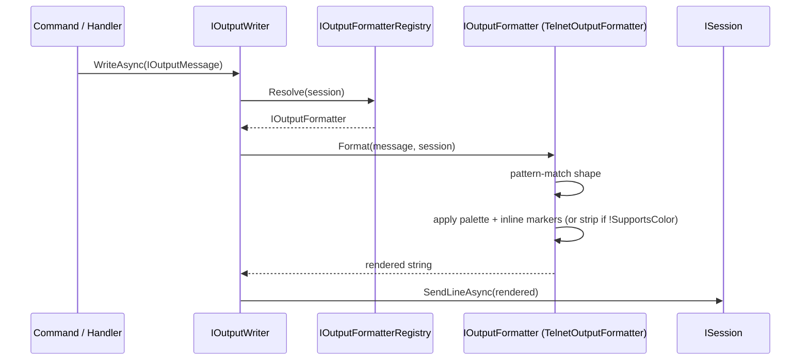

# Flow 6 — Output rendering

> [Back to flows index](README.md)

**Summary.** Any command body or handler that calls `IOutputWriter.WriteAsync(IOutputMessage)` or `IBroadcastSystem.SendToRoomAsync`/`SendToAllAsync` triggers this chain. A typed message is resolved to the session's transport formatter, rendered into an ANSI (or plain-text) string, and transmitted. Every future gameplay slice's output plugs into this chain without touching transport code.

**Trigger.** Any call to `IOutputWriter.WriteAsync`, `IBroadcastSystem.SendToRoomAsync`, `IBroadcastSystem.SendToAllAsync`, or `IBroadcastSystem.SendRoomDescriptionAsync`.

**Steps.**

1. A command calls `context.Output.WriteAsync(message)` or a handler calls `_broadcast.SendToRoomAsync(roomId, message, filter?)`. For broadcast, `BroadcastSystem` enumerates eligible recipients and calls `_writerFactory.Create(session).WriteAsync(message)` for each.
2. `OutputWriter.WriteAsync` calls `IOutputFormatterRegistry.Resolve(session)` to obtain the formatter whose `TransportKey` matches `session.TransportKey` (e.g. `"telnet"`). Falls back to the first registered formatter if no exact match (safe while only telnet exists).
3. `IOutputFormatter.Format(message, session)` pattern-matches the message shape:
   - `PlainMessage` — wraps text in a severity-appropriate color marker (`<error>`, `<system>`, or plain).
   - `RoomDescriptionMessage` — room name in `<room-name>`, exit keys in `<direction>`, description and occupants plain; if `Items` is non-empty, appends an `"Items: X, Y, Z"` line; if `Mobs` is non-empty, appends a `"<Name> is here."` line per mob. `BroadcastSystem.SendRoomDescriptionAsync` populates `Items` by iterating all `ItemDataComponent` entities whose `LocationComponent.RoomEntityId` matches the room, and populates `Mobs` by iterating all `MobDataComponent` entities in the same room.
   - `MovementMessage(Blocked)` — "You cannot go that way." in `<system>`.
   - `InventoryListMessage` — `"You are carrying:"` header in `<system>` followed by a plain-text item list (one per line, two-space indent). Only sent when inventory is non-empty; empty case is a `PlainMessage("You are carrying nothing.")` from the command body.
   - `EquipmentDisplayMessage` — `"You are wearing:"` header in `<system>` followed by slot label (left-padded to 14 chars) + item name rows, ordered by `WornSlot` enum ordinal. Only sent when at least one slot is occupied; empty case is a `PlainMessage("You are not wearing anything.")` from the command body. (slice 7)
   - `HelpIndexMessage` — section headers in `<system>`, verb names in `<room-name>` (padded before colorizing).
   - `HelpEntryMessage` — verb/alias header in `<room-name>`.
4. **Color application.** If `session.SupportsColor` is `true`, inline markers (`<role>text</role>`) are replaced with ANSI escape codes + reset. If `false`, markers are stripped and only the inner text remains. See [`subsystems/output.md`](../subsystems/output.md) for the palette table.
5. The rendered string is passed to `session.SendLineAsync(rendered)`. The session acquires its write lock and writes the UTF-8 bytes to the TCP stream.

**Broadcast fan-out.** For `SendToRoomAsync`, step 1 iterates `LocationComponent` entities in the room, applies the optional `Func<uint,bool>? audienceFilter` predicate (e.g. `id => id != movingPlayer`), and runs steps 2–5 for each surviving recipient. Each recipient gets their own formatter resolution so a future mixed-transport world renders correctly per client.

**Cross-references.**
- [`Core/Output/OutputWriter.cs`](../../../Core/Output/OutputWriter.cs), [`Core/Output/TelnetOutputFormatter.cs`](../../../Core/Output/TelnetOutputFormatter.cs), [`Core/Output/OutputFormatterRegistry.cs`](../../../Core/Output/OutputFormatterRegistry.cs)
- [`Core/Systems/BroadcastSystem.cs`](../../../Core/Systems/BroadcastSystem.cs)
- [`subsystems/output.md`](../subsystems/output.md) — full output framework design
- [`docs/use-cases/output-framework.md`](../../use-cases/output-framework.md) — slice 4 spec
