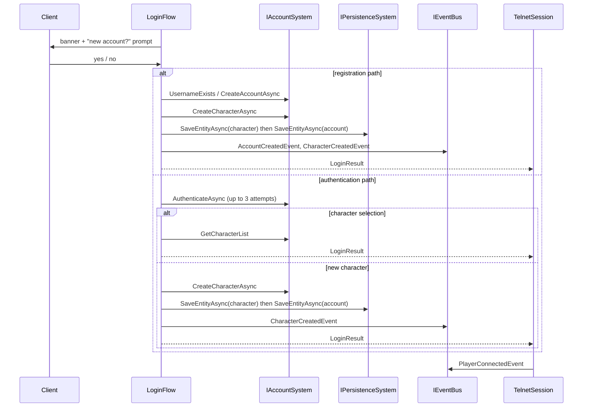

# Flow 7 — Login journey

> [Back to flows index](README.md)

**Summary.** The `LoginFlow` Initiator (`Server/Sessions/LoginFlow.cs`) drives the interactive wizard that runs between TCP accept and the main I/O loop. It covers account registration or authentication, then character selection or creation, and ends with the character entering the world. Source: [`../../../docs/features/accounts/accounts.md`](../../features/accounts/accounts.md).

**Trigger.** `TelnetSession.RunAsync` after TCP accept (see [Flow 2](flow-02-player-connection.md) step 2).

**Steps.**

1. **Banner.** `LoginFlow` writes the welcome banner via `IOutputWriter` and prompts for account status. Yes/y/login → authentication path; anything else → registration.
2. **Registration.** Validates username (3–20 chars, alphanumeric + underscore, case-insensitive uniqueness) and password (≥6 chars, not echoed, confirmed). Calls `IAccountSystem.CreateAccountAsync` → `AccountEntityId`. Falls through to character creation.
3. **Authentication.** Up to 3 rounds of username + password. `IAccountSystem.AuthenticateAsync` verifies via `IPasswordHasher` (PBKDF2-SHA256, constant-time). On success → character selection. On exhaustion → `null` return; session exits.
4. **Character selection.** `GetCharacterList(accountId)` returns the roster. Player picks a number (or `new`) subject to `Account:MaxCharactersPerAccount` (default 5). Picking an existing character returns `LoginResult` immediately.
5. **Character creation.** Validates name (2–16 letters, globally unique). `IAccountSystem.CreateCharacterAsync` allocates the entity and attaches `CharacterComponent`, `LocationComponent`, `AttributesComponent`, `PoolsComponent`, `RespawnComponent`, `AbilitiesComponent`, `AspectAffinitiesComponent`, and `PersistentEntity`. `LoginFlow` saves character-first, then account (crash-safety ordering), then publishes `AccountCreatedEvent` (registration only) and `CharacterCreatedEvent`. Returns `LoginResult`.
6. **World entry.** `TelnetSession` sets `PlayerEntityId = characterEntityId`, attaches transient `PlayerComponent`, calls `SessionManager.Register`, publishes `PlayerConnectedEvent`. `PlayerSessionHandler` broadcasts arrival and sends the room description. Main I/O loop starts.

**Cross-references.**
- [`Server/Sessions/LoginFlow.cs`](../../../Server/Sessions/LoginFlow.cs) · [`Server/Sessions/TelnetSession.cs`](../../../Server/Sessions/TelnetSession.cs)
- [`Core/Modules/Account/Systems/IAccountSystem.cs`](../../../Core/Modules/Account/Systems/IAccountSystem.cs) · [`Core/Sessions/ISessionManager.cs`](../../../Core/Sessions/ISessionManager.cs)
- [`../../features/accounts/accounts.md`](../../features/accounts/accounts.md) — holistic feature view and session lifecycle
- [`../../features/accounts/login-flow.md`](../../features/accounts/login-flow.md) — `LoginFlow` design doc
