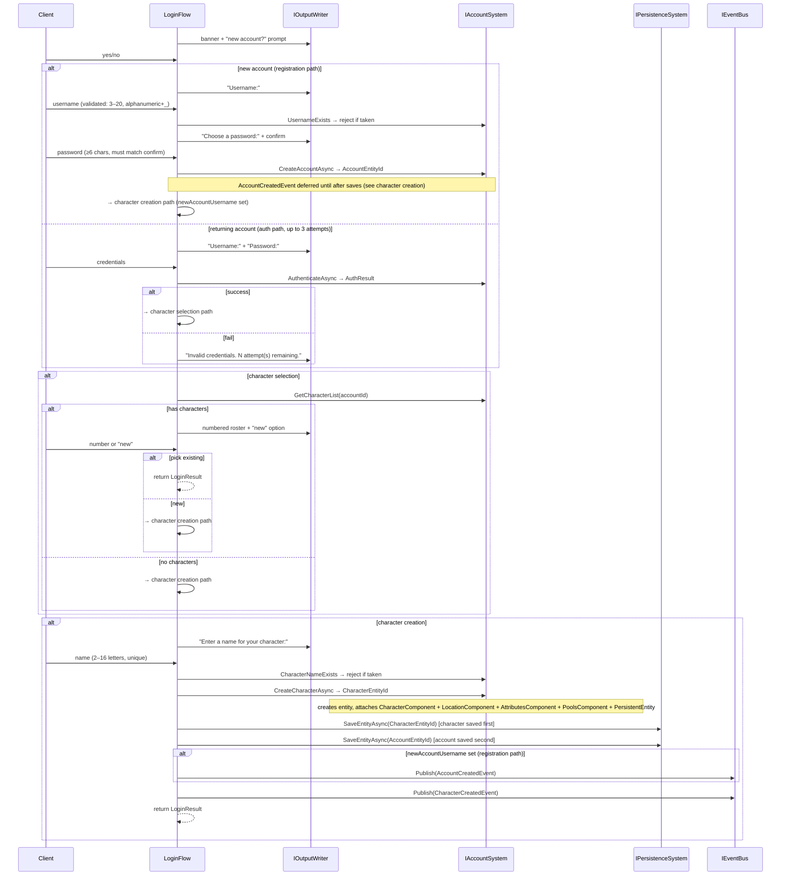

# Flow 7 — Login / character flow

> [Back to flows index](README.md)

**Summary.** The `LoginFlow` Initiator (session-layer, `Server/Sessions/LoginFlow.cs`) drives the multi-step interactive wizard that runs between TCP accept and the main I/O loop. It handles account registration or authentication, then character selection or creation. Domain work (entity allocation, hashing, persistence marking) is delegated to `IAccountSystem`. Events are published by the flow itself (Initiator tier) after each successful state transition.

**Trigger.** `TelnetSession.RunAsync` after TCP accept (see [Flow 2](flow-02-player-connection.md) step 2).

**Steps.**

1. `LoginFlow` is constructed by `TelnetSession` with the raw `StreamReader` (so it can read lines before the session is registered) and `IOutputWriterFactory` (so prompts are rendered through the formatter pipeline).
2. **Banner.** The flow writes `"Welcome to Hedron.\nDo you have an existing account? (yes/no)"` via `IOutputWriter`. Any yes/y/login answer → auth path; anything else → registration.
3. **Registration path.** Prompts for username; validates 3–20 chars, alphanumeric + underscore; calls `UsernameExists` and rejects if taken. Prompts for password (≥6 chars) with confirmation. Calls `IAccountSystem.CreateAccountAsync` → allocates an entity, attaches `AccountComponent` and `PersistentEntity`, returns `AccountEntityId`. `AccountCreatedEvent` is **not** published yet — it is deferred until after both entities are saved (see step 6). Falls through to character creation.
4. **Auth path.** Up to `MaxLoginAttempts` (3) rounds of username + password. Calls `IAccountSystem.AuthenticateAsync` (PBKDF2-SHA256 verify via `IPasswordHasher`). On success → character selection. On exhaustion → writes rejection and returns `null` (session task exits).
5. **Character selection.** Calls `GetCharacterList(accountId)`. If the list is empty, falls through to character creation. Otherwise renders a numbered roster + "new" option. Validates input; enforces `Account:MaxCharactersPerAccount` (default 5). Picking a number returns `LoginResult(CharacterEntityId, AccountEntityId, CharacterName)` immediately.
6. **Character creation.** Prompts for a name; validates 2–16 letters only, globally unique via `CharacterNameExists`. Calls `IAccountSystem.CreateCharacterAsync` → allocates an entity, attaches `CharacterComponent { AccountEntityId, CharacterName, CreatedAtUtc }`, `LocationComponent { RoomEntityId = WorldConfiguration.StartingRoomEntityId }`, `AttributesComponent { Level=1, Strength=10, Dexterity=10, Constitution=10 }`, `PoolsComponent { MaxHp=100, CurrentHp=100 }` (extended in slice 8a), and `PersistentEntity`; appends id to `AccountComponent.CharacterEntityIds`. Returns `CharacterEntityId`. `LoginFlow` then calls `IPersistenceSystem.SaveEntityAsync(characterEntityId)` first (character written before account — if the server crashes between the two writes, an orphaned character file is recoverable but a dangling account pointer to a missing character is not), then `SaveEntityAsync(accountEntityId)`. After both saves complete, if this is a new account `AccountCreatedEvent` is published, then `CharacterCreatedEvent`. Returns `LoginResult`.
7. A `null` return from `LoginFlow.RunAsync` (disconnect, exceeded attempts) causes `TelnetSession` to exit without entering the I/O loop. `HandleDisconnectAsync` is still called but skips publishing because `PlayerEntityId == 0`.

**Cross-references.**
- [`Server/Sessions/LoginFlow.cs`](../../../Server/Sessions/LoginFlow.cs), [`Server/Sessions/TelnetSession.cs`](../../../Server/Sessions/TelnetSession.cs)
- [`Core/Modules/Account/Systems/AccountSystem.cs`](../../../Core/Modules/Account/Systems/AccountSystem.cs)
- [`Core/Modules/Account/Systems/IAccountSystem.cs`](../../../Core/Modules/Account/Systems/IAccountSystem.cs)
- [`docs/reference/systems.md`](../../reference/systems.md) — `AccountSystem`, `PasswordHasher`
- [`docs/use-cases/account-character-creation.md`](../../use-cases/account-character-creation.md) — slice 5 spec
