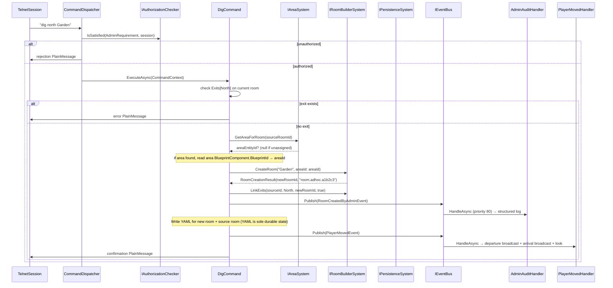

# Flow 8 — Admin room creation (`dig`)

> [Back to flows index](README.md)

**Summary.** A privileged session sends `dig <direction> [name]`. `DigCommand` checks for an existing exit, delegates entity creation and exit wiring to `IRoomBuilderSystem`, publishes `RoomCreatedByAdminEvent` (caught by `AdminAuditHandler`), writes YAML files for both rooms (the YAML is the room's sole durable state — no `SaveEntityAsync`), then publishes `PlayerMovedEvent` to auto-move the admin into the new room via the existing `PlayerMovedHandler`. Room entities carry no `PersistentEntity`; they are fresh-spawned from YAML on each restart.

**Trigger.** Privileged session sends `dig <direction> [name]`.

**Steps.**

1. `CommandDispatcher` routes `dig` to `DigCommand` after the privilege gate (`AdminRequirement` via `IAuthorizationChecker`).
2. `DigCommand.ExecuteAsync` reads `LocationComponent.RoomEntityId` and checks `RoomComponent.Exits` for the requested direction. If an exit already exists, writes a `PlainMessage` error and returns.
3. `DigCommand` resolves the source room's area: calls `IAreaSystem.GetAreaForRoom(sourceRoomId)` and, if the room belongs to an area, reads the area's `BlueprintComponent.BlueprintId`. Calls `IRoomBuilderSystem.CreateRoom(name, areaId: areaId)` — allocates an entity, attaches `RoomComponent` + `BlueprintComponent` (no `PersistentEntity`), registers a `RoomTemplate` (with `AreaId` set when the source room has one), and calls `IAreaSystem.AssignRoomToArea` to set `RoomComponent.AreaEntityId` immediately. If the source room had no area, `areaId` is empty and the new room is unassigned. Returns `RoomCreationResult(newRoomId, blueprintId)`.
4. Calls `IRoomBuilderSystem.LinkExits(sourceId, direction, newRoomId, bidirectional: true)` — sets `Exits` on both room entities and mirrors to both in-memory `RoomTemplate` exit maps.
5. Sets admin's `LocationComponent.RoomEntityId = newRoomId` and `RoomBlueprintId = result.BlueprintId`. Publishes `RoomCreatedByAdminEvent`. `AdminAuditHandler` (priority 80) logs one structured entry. `DigCommand` writes YAML for both rooms — the YAML file is the room's sole durable state. When the source room belonged to an area, the written YAML for the new room includes `areaId` so the assignment survives `@reload`. No `SaveEntityAsync` is called; rooms have no `PersistentEntity`.
6. Publishes `PlayerMovedEvent(adminId, sourceId, newRoomId, direction)`. `PlayerMovedHandler` fires: departure broadcast to the source room (excluding the admin), arrival broadcast to the new room, `look` sent to the admin.
7. Writes a confirmation `PlainMessage` (e.g. `"Room 'Garden' (room.adhoc.a1b2c3) created to the north."`).

**Cross-references.**
- [`Core/Modules/Admin/Commands/DigCommand.cs`](../../../Core/Modules/Admin/Commands/DigCommand.cs), [`Core/Modules/Admin/Systems/RoomBuilderSystem.cs`](../../../Core/Modules/Admin/Systems/RoomBuilderSystem.cs)
- [`Core/Modules/Admin/Events/RoomCreatedByAdminEvent.cs`](../../../Core/Modules/Admin/Events/RoomCreatedByAdminEvent.cs)
- [`Core/Modules/Admin/Handlers/AdminAuditHandler.cs`](../../../Core/Modules/Admin/Handlers/AdminAuditHandler.cs)
- [`docs/implementation-plans/bare-bones-content-spawning.md`](../../features/world/world.md)
