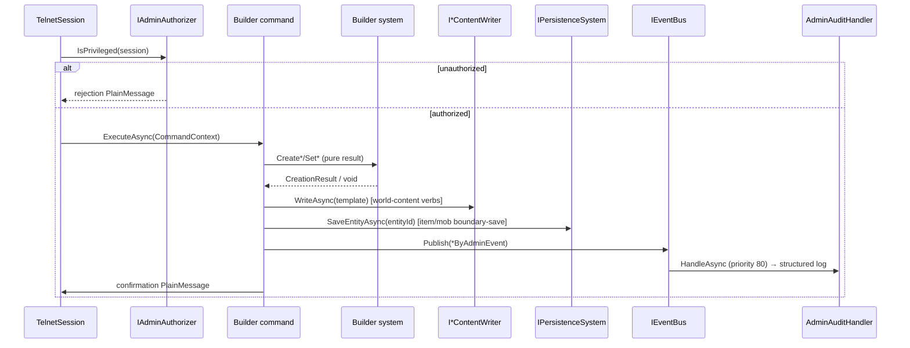

# Admin Authoring Journey (dig · mkitem · mkmob · mkarea · list)

> [Back to flows index](README.md)

**Source:** [`../../features/admin-authoring/admin-authoring.md`](../../features/admin-authoring/admin-authoring.md)

**Summary.** A privileged session issues a builder verb. `CommandDispatcher` routes through the privilege gate (`IAdminAuthorizer.IsPrivileged`); the command calls the appropriate builder system (pure result), writes YAML via an `I*ContentWriter`, publishes a past-tense `*ByAdminEvent`, and in some cases calls `IPersistenceSystem.SaveEntityAsync` (admin boundary-save for persistent entities such as items and mobs). `AdminAuditHandler` (priority 80) logs every `*ByAdminEvent`. `dig` additionally publishes `PlayerMovedEvent` to auto-move the admin into the new room. `setmob`'s authored mob-property set includes `band` (the Ascension tier-band tag, slice prog-2, dual-written to `MobDataComponent` and `MobTemplate`) alongside `protection` and the rest — no structural change to this flow.

**Trigger.** Privileged session sends a builder verb: `dig <direction> [name]`, `mkitem [name]`, `mkmob [name]`, `mkarea [name]`, `set <property> <value>`, `setitem`/`setmob`/`setarea`, `listents <area|room>`, or `reload`.

**Steps.**

1. `CommandDispatcher` routes the verb; each admin command calls `IAdminAuthorizer.IsPrivileged(session)` as its first line. Non-privileged sessions receive a rejection and return immediately.
2. The command calls the appropriate builder system (`IRoomBuilderSystem`, `IAreaBuilderSystem`, `IItemBuilderSystem`, or `IMobBuilderSystem`). Builder systems return results and never publish events or call persistence (INV-5).
3. For world-content entities (rooms, areas): the command writes YAML via the matching `I*ContentWriter` (atomic tmp → rename). YAML is the sole durable state — no `PersistentEntity`, no `SaveEntityAsync` (INV-23).
4. For persistent entities (items, mobs): the command calls `IPersistenceSystem.SaveEntityAsync` immediately after the builder system returns — the admin boundary-save pattern (INV-22). No YAML writer is called for items (item durability is via persistence, not YAML).
5. The command publishes a past-tense `*ByAdminEvent`. `AdminAuditHandler` (priority 80) logs one structured entry.
6. `dig` additionally publishes `PlayerMovedEvent(adminId, sourceId, newRoomId, direction)`. `PlayerMovedHandler` fires departure broadcast + arrival broadcast + look.
7. The command writes a confirmation `PlainMessage` showing the blueprint id.

**`listents` is read-only.** `ListEntitiesCommand` scans `EntityService.GetAllComponents<T>()` directly, publishes no events, and calls no builder system (INV-10).

**`reload` is a full rebuild.** `ReloadCommand` force-saves persistent state, then `IWorldContentLoader.ReloadAsync` tears down all world content and re-spawns it fresh from YAML; the command re-publishes `WorldContentReadyEvent` (shop re-seed, spawn slots, player re-placement) and `ContentReloadedEvent`. Persistent (player) entities survive. See [Flow 5](flow-05-content-reload.md).

**Cross-references.**
- [`Core/Modules/Admin/`](../../../Core/Modules/Admin/) — `DigCommand`, `SetCommand`, `SetAreaCommand`, `MkareaCommand`, `ListEntitiesCommand`, `ReloadCommand`, `RoomBuilderSystem`, `AreaBuilderSystem`, `AdminAuthorizer`, `AdminAuditHandler`.
- [`Core/Modules/Items/Commands/MkitemCommand.cs`](../../../Core/Modules/Items/Commands/MkitemCommand.cs) · [`Core/Modules/Mobs/Commands/MkMobCommand.cs`](../../../Core/Modules/Mobs/Commands/MkMobCommand.cs)
- [`../../features/admin-authoring/admin-commands.md`](../../features/admin-authoring/admin-commands.md) — full builder verb table and privilege gate design.
