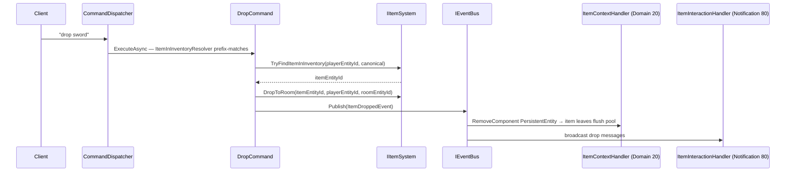
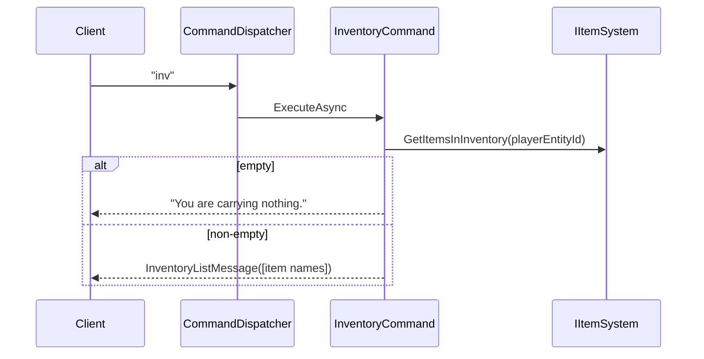

# Items journey (pickup · drop · inventory)

> Source: [../../features/items/items.md](../../features/items/items.md)

[Back to flows index](README.md)

## Pickup (`get <item>`)

**Trigger.** Player sends `get <item>`.

```mermaid
sequenceDiagram
    participant Client
    participant CD as CommandDispatcher
    participant Cmd as GetCommand
    participant IS as IItemSystem
    participant Bus as IEventBus
    participant ICH as ItemContextHandler (Domain 20)
    participant SS as SpawnSystem (Domain 20)
    participant IIH as ItemInteractionHandler (Notification 80)

    Client->>CD: "get sword"
    CD->>Cmd: ExecuteAsync — ItemInRoomResolver prefix-matches
    Cmd->>IS: TryFindItemInRoom(roomId, canonical)
    IS-->>Cmd: itemEntityId
    Cmd->>IS: MoveToInventory(itemEntityId, playerEntityId)
    Cmd->>Bus: Publish(ItemPickedUpEvent)
    Bus->>ICH: AddComponent PersistentEntity → item enters flush pool
    Bus->>SS: mark spawn slot vacant; schedule respawn
    Bus->>IIH: broadcast pickup messages
```

**Steps.**

1. `CommandDispatcher` routes `get` to `GetCommand` (no privilege requirement).
2. `ItemInRoomResolver` builds `ResolvedCandidate(MatchString, CanonicalValue)` pairs for items in the room; the parser prefix-matches and deduplicates by `CanonicalValue`.
3. `IItemSystem.TryFindItemInRoom` performs final entity lookup. Race condition (item already taken) → "You don't see that here."
4. `IItemSystem.MoveToInventory` — removes `LocationComponent`, clears `BlueprintComponent` (INV-21), appends to `InventoryComponent.ItemEntityIds`.
5. Publishes `ItemPickedUpEvent`.
6. `ItemContextHandler` (priority 20) adds `PersistentEntity` to the item — it enters the flush pool and survives restarts.
7. `SpawnSystem` (priority 20) marks the spawn slot vacant and schedules respawn if the item was world-content.
8. `ItemInteractionHandler` (priority 80) broadcasts pickup messages to the room.

---

## Drop (`drop <item>`)

**Trigger.** Player sends `drop <item>`.



**Steps.**

1. `ItemInInventoryResolver` builds candidates from the holder's `InventoryComponent`; parser prefix-matches.
2. `IItemSystem.TryFindItemInInventory`. Not found → "You aren't carrying that."
3. `IItemSystem.DropToRoom` — removes item id from `InventoryComponent`, attaches `LocationComponent { RoomEntityId }`.
4. Publishes `ItemDroppedEvent`. Saves player entity only — item is *not* saved (drop-and-vanish policy).
5. `ItemContextHandler` (priority 20) removes `PersistentEntity` — item leaves flush pool and vanishes on restart.
6. `ItemInteractionHandler` (priority 80) broadcasts drop messages.

> **Also drives shop trade.** `ItemContextHandler` additionally subscribes to `ItemBoughtEvent` / `ItemSoldEvent` (slice 12c) and applies the same persistence-pool transition for buying/selling: buy → add `PersistentEntity` (**keep** `BlueprintComponent` per INV-21) + clear `ShopStockComponent`; sell → remove `PersistentEntity`. See the [Shopping journey (flow-30)](flow-30-shopping.md). Reusing this one handler (rather than overloading pickup/drop, whose payload carries a *room*, not a shop) keeps the pool-transition logic in a single home (INV-19).

---

## Inventory display (`inventory`)

**Trigger.** Player sends `inventory`, `inv`, or `i`.



**Steps.**

1. `IItemSystem.GetItemsInInventory` returns entity ids from `InventoryComponent.ItemEntityIds`.
2. Empty → "You are carrying nothing." Otherwise resolves each id to `ItemDataComponent.Name` (silently skips missing components) and writes `InventoryListMessage`. No events fired.

---

**Cross-references.**
- [`Core/Modules/Items/Commands/GetCommand.cs`](../../../Core/Modules/Items/Commands/GetCommand.cs) · [`Core/Modules/Items/Commands/DropCommand.cs`](../../../Core/Modules/Items/Commands/DropCommand.cs) · [`Core/Modules/Items/Commands/InventoryCommand.cs`](../../../Core/Modules/Items/Commands/InventoryCommand.cs)
- [`Core/Modules/Items/Systems/ItemSystem.cs`](../../../Core/Modules/Items/Systems/ItemSystem.cs)
- [`Core/Modules/Spawn/Handlers/ItemContextHandler.cs`](../../../Core/Modules/Spawn/Handlers/ItemContextHandler.cs)
- [`Core/Modules/Items/Handlers/ItemInteractionHandler.cs`](../../../Core/Modules/Items/Handlers/ItemInteractionHandler.cs)
- [`../../features/items/item-inventory-system.md`](../../features/items/item-inventory-system.md) — system design + persistence lifecycle.
