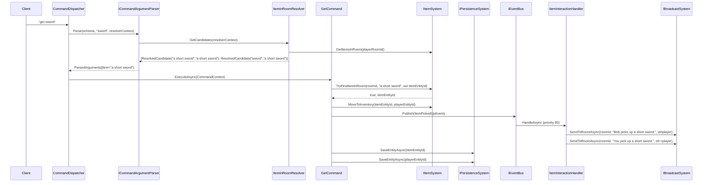

# Flow 9 — Item pickup (`get`)

> [Back to flows index](README.md)

**Summary.** Player sends `get <item>`. `GetCommand` uses `ItemInRoomResolver` to prefix-match the token against items in the player's room, calls `IItemSystem.MoveToInventory` to transfer the item from ground to inventory, publishes `ItemPickedUpEvent`, and saves both item and player. `ItemInteractionHandler` broadcasts the pickup messages.

**Trigger.** Player sends `get <item>`.

**Steps.**

1. `CommandDispatcher` routes `get` to `GetCommand`. No privilege requirement.
2. **Argument resolution.** `ICommandArgumentParser` calls `ItemInRoomResolver.GetCandidates(resolverContext)`, which reads the invoker's `LocationComponent.RoomEntityId`, calls `IItemSystem.GetItemsInRoom`, and emits `ResolvedCandidate(MatchString, CanonicalValue)` pairs — one for each item name and each keyword. The parser prefix-matches the token against all `MatchString` values, deduplicates by `CanonicalValue`, and substitutes the canonical item name into `ParsedArguments.item` (unique match) or fails with an ambiguity error (two+ distinct canonical values).
3. **Entity resolve.** `IItemSystem.TryFindItemInRoom(roomId, canonicalName, out itemEntityId)` performs a final entity lookup. If not found (race condition: item taken between resolve and pickup), writes "You don't see that here." and returns.
4. **Pickup mutation.** `IItemSystem.MoveToInventory(itemEntityId, playerEntityId)` — removes `LocationComponent` from the item (no-op if already absent), appends item id to `InventoryComponent.ItemEntityIds`.
5. **Event.** Publishes `ItemPickedUpEvent(PlayerEntityId, ItemEntityId, RoomEntityId)`.
6. **Handler.** `ItemInteractionHandler` (priority 80) broadcasts `"<name> picks up <item>."` to the room excluding the picker, then `"You pick up <item>."` to the picker via `SendToRoomAsync` with opposite filters.
7. **Save.** `SaveEntityAsync(itemEntityId)` then `SaveEntityAsync(playerEntityId)` — both are durable immediately (save-on-change pattern).

**Cross-references.**
- [`Core/Modules/Items/Commands/GetCommand.cs`](../../../Core/Modules/Items/Commands/GetCommand.cs), [`Core/Modules/Items/Systems/ItemSystem.cs`](../../../Core/Modules/Items/Systems/ItemSystem.cs)
- [`Core/Modules/Items/Resolvers/ItemInRoomResolver.cs`](../../../Core/Modules/Items/Resolvers/ItemInRoomResolver.cs)
- [`Core/Modules/Items/Handlers/ItemInteractionHandler.cs`](../../../Core/Modules/Items/Handlers/ItemInteractionHandler.cs)
- [`docs/use-cases/items-and-inventory.md`](../../use-cases/items-and-inventory.md) — slice 6 spec, flow B-1
