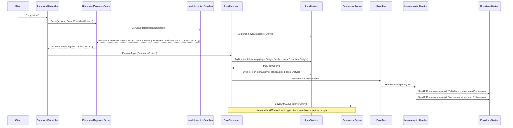

# Flow 10 — Item drop (`drop`)

> [Back to flows index](README.md)

**Summary.** Player sends `drop <item>`. `DropCommand` uses `ItemInInventoryResolver` to prefix-match against carried items, calls `IItemSystem.DropToRoom` to move the item from inventory to the ground, publishes `ItemDroppedEvent`, and saves only the player entity (item intentionally not saved — dropped items vanish on restart by design). `ItemInteractionHandler` broadcasts the drop messages.

**Trigger.** Player sends `drop <item>`.

**Steps.**

1. `CommandDispatcher` routes `drop` to `DropCommand`. No privilege requirement.
2. **Argument resolution.** `ItemInInventoryResolver.GetCandidates` reads the invoker's `InventoryComponent.ItemEntityIds` and builds `ResolvedCandidate` pairs for each carried item's name and keywords. Deduplication and substitution are the same as in [Flow 9](flow-09-item-pickup.md).
3. **Entity resolve.** `IItemSystem.TryFindItemInInventory(playerEntityId, canonicalName, out itemEntityId)`. Not found → "You aren't carrying that."
4. **Drop mutation.** `IItemSystem.DropToRoom(itemEntityId, playerEntityId, roomEntityId)` — removes item id from `InventoryComponent.ItemEntityIds`, attaches `LocationComponent { RoomEntityId }` to the item.
5. **Event.** Publishes `ItemDroppedEvent(PlayerEntityId, ItemEntityId, RoomEntityId)`.
6. **Handler.** `ItemInteractionHandler` broadcasts drop messages (same filter pattern as pickup, reversed flavour text).
7. **Save.** Only `SaveEntityAsync(playerEntityId)`. The item entity is intentionally not saved — its last-persisted state has no `LocationComponent` (saved during pickup), so it reverts to that state on restart. Template items are re-placed in their `spawnRoomId` by `PlaceItemsInRooms` on next startup; `mkitem` items simply vanish. See the persistence design note in [`docs/use-cases/items-and-inventory.md`](../../use-cases/items-and-inventory.md).

**Cross-references.**
- [`Core/Modules/Items/Commands/DropCommand.cs`](../../../Core/Modules/Items/Commands/DropCommand.cs), [`Core/Modules/Items/Systems/ItemSystem.cs`](../../../Core/Modules/Items/Systems/ItemSystem.cs)
- [`Core/Modules/Items/Resolvers/ItemInInventoryResolver.cs`](../../../Core/Modules/Items/Resolvers/ItemInInventoryResolver.cs)
- [`Core/Modules/Items/Handlers/ItemInteractionHandler.cs`](../../../Core/Modules/Items/Handlers/ItemInteractionHandler.cs)
- [`docs/use-cases/items-and-inventory.md`](../../use-cases/items-and-inventory.md) — slice 6 spec, flow B-2
