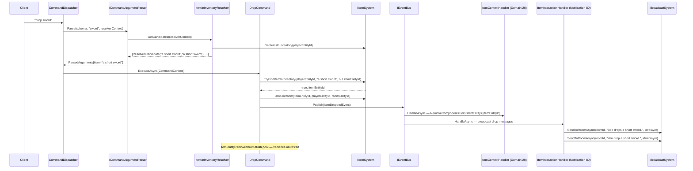

# Flow 10 — Item drop (`drop`)

> [Back to flows index](README.md)

**Summary.** Player sends `drop <item>`. `DropCommand` uses `ItemInInventoryResolver` to prefix-match against carried items, calls `IItemSystem.DropToRoom` to move the item from inventory to the ground, publishes `ItemDroppedEvent`. `ItemContextHandler` removes `PersistentEntity` from the item (it will vanish on restart); `ItemInteractionHandler` broadcasts the drop messages. No immediate save — the player entity is persisted in the next flush cycle.

**Trigger.** Player sends `drop <item>`.

**Steps.**

1. `CommandDispatcher` routes `drop` to `DropCommand`. No privilege requirement.
2. **Argument resolution.** `ItemInInventoryResolver.GetCandidates` reads the invoker's `InventoryComponent.ItemEntityIds` and builds `ResolvedCandidate` pairs for each carried item's name and keywords. Deduplication and substitution are the same as in [Flow 9](flow-09-item-pickup.md).
3. **Entity resolve.** `IItemSystem.TryFindItemInInventory(playerEntityId, canonicalName, out itemEntityId)`. Not found → "You aren't carrying that."
4. **Drop mutation.** `IItemSystem.DropToRoom(itemEntityId, playerEntityId, roomEntityId)` — removes item id from `InventoryComponent.ItemEntityIds`, attaches `LocationComponent { RoomEntityId, RoomBlueprintId }` to the item.
5. **Event.** Publishes `ItemDroppedEvent(PlayerEntityId, ItemEntityId, RoomEntityId)`.
6. **Context demotion.** `ItemContextHandler` (priority 20) calls `EntityService.RemoveComponent<PersistentEntity>(itemEntityId)`. The item entity leaves the flush pool and will not be written on the next flush or on shutdown. If the server restarts before the player picks the item back up, the entity is gone — the template's spawn system will eventually respawn a fresh instance at the original spawn location.
7. **Broadcast.** `ItemInteractionHandler` (priority 80) broadcasts drop messages (same filter pattern as pickup, reversed flavour text).

**Cross-references.**
- [`Core/Modules/Items/Commands/DropCommand.cs`](../../../Core/Modules/Items/Commands/DropCommand.cs), [`Core/Modules/Items/Systems/ItemSystem.cs`](../../../Core/Modules/Items/Systems/ItemSystem.cs)
- [`Core/Modules/Items/Resolvers/ItemInInventoryResolver.cs`](../../../Core/Modules/Items/Resolvers/ItemInInventoryResolver.cs)
- [`Core/Modules/Spawn/Handlers/ItemContextHandler.cs`](../../../Core/Modules/Spawn/Handlers/ItemContextHandler.cs)
- [`Core/Modules/Items/Handlers/ItemInteractionHandler.cs`](../../../Core/Modules/Items/Handlers/ItemInteractionHandler.cs)
- [`docs/use-cases/persistence-reform.md`](../../use-cases/persistence-reform.md) — Stage C, item drop flow
