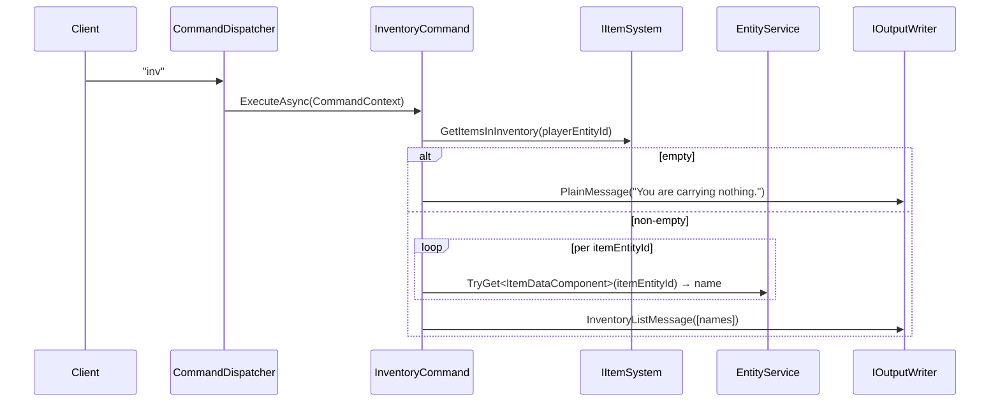

# Flow 11 — Inventory display (`inventory`)

> [Back to flows index](README.md)

**Summary.** Player sends `inventory` (or `inv` / `i`). `InventoryCommand` reads `InventoryComponent.ItemEntityIds`, resolves each to a display name via `ItemDataComponent`, and writes either a `PlainMessage("You are carrying nothing.")` or an `InventoryListMessage`. No events fired; no persistence.

**Trigger.** Player sends `inventory`, `inv`, or `i`.

**Steps.**

1. `CommandDispatcher` routes `inventory`/`inv`/`i` to `InventoryCommand`. No privilege requirement.
2. `IItemSystem.GetItemsInInventory(playerEntityId)` returns entity ids from `InventoryComponent.ItemEntityIds` (empty list if the component is absent).
3. If the list is empty, writes `PlainMessage("You are carrying nothing.", System)` and returns.
4. For each item id, `EntityService.TryGet<ItemDataComponent>` resolves the display name. Items whose component is missing are silently skipped.
5. Writes `InventoryListMessage(names)`. `TelnetOutputFormatter` renders it as `"You are carrying:\n  item1\n  item2"`.

**Cross-references.**
- [`Core/Modules/Items/Commands/InventoryCommand.cs`](../../../Core/Modules/Items/Commands/InventoryCommand.cs)
- [`Core/Output/InventoryListMessage.cs`](../../../Core/Output/InventoryListMessage.cs), [`Core/Output/TelnetOutputFormatter.cs`](../../../Core/Output/TelnetOutputFormatter.cs)
- [`docs/implementation-plans/items-and-inventory.md`](../../implementation-plans/items-and-inventory.md) — slice 6 spec, flow B-3
