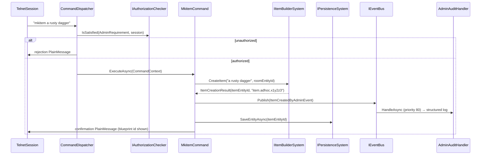

# Flow 12 — Admin item creation (`mkitem`)

> [Back to flows index](README.md)

**Summary.** A privileged session sends `mkitem [name]`. `MkitemCommand` delegates entity creation to `IItemBuilderSystem`, publishes `ItemCreatedByAdminEvent` (caught by `AdminAuditHandler`), calls `IPersistenceSystem.SaveEntityAsync` on the new item, and writes a confirmation showing the blueprint id.

**Trigger.** Privileged session sends `mkitem [name]`.

**Steps.**

1. `CommandDispatcher` routes `mkitem` to `MkitemCommand` after the privilege gate (`AdminRequirement` via `IAuthorizationChecker`).
2. `MkitemCommand.ExecuteAsync` reads `LocationComponent.RoomEntityId` from the invoker. If absent (no location), writes a `PlainMessage` error and returns.
3. Calls `IItemBuilderSystem.CreateItem(name, roomEntityId)` — allocates an entity, attaches `ItemDataComponent { Name, DamageBonus: 0 }` + `BlueprintComponent` + `PersistentEntity` + `LocationComponent { RoomEntityId }`, registers a minimal `ItemTemplate`, returns `ItemCreationResult(itemEntityId, blueprintId)`. Blueprint id format: `item.adhoc.<8-char-base36>`.
4. Publishes `ItemCreatedByAdminEvent(adminId, itemEntityId, blueprintId, roomEntityId)`. `AdminAuditHandler` (priority 80) logs one structured entry.
5. Calls `IPersistenceSystem.SaveEntityAsync(itemEntityId)` directly — save-on-change; the item is durable before the admin sees confirmation.
6. Writes a confirmation `PlainMessage` (e.g. `"Item 'a rusty dagger' created. Blueprint id: item.adhoc.x1y2z3"`).

**Cross-references.**
- [`Core/Modules/Items/Commands/MkitemCommand.cs`](../../../Core/Modules/Items/Commands/MkitemCommand.cs), [`Core/Modules/Items/Systems/ItemBuilderSystem.cs`](../../../Core/Modules/Items/Systems/ItemBuilderSystem.cs)
- [`Core/Modules/Items/Events/ItemCreatedByAdminEvent.cs`](../../../Core/Modules/Items/Events/ItemCreatedByAdminEvent.cs)
- [`Core/Modules/Admin/Handlers/AdminAuditHandler.cs`](../../../Core/Modules/Admin/Handlers/AdminAuditHandler.cs)
- [`docs/implementation-plans/items-and-inventory.md`](../../implementation-plans/items-and-inventory.md) — slice 6 spec
