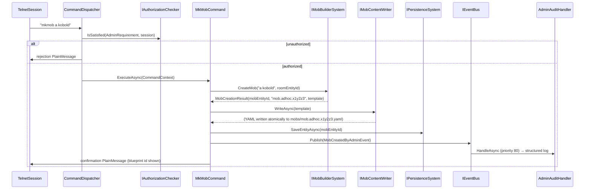

# Flow 15 — Admin mob creation (`mkmob`)

> [Back to flows index](README.md)

**Summary.** A privileged session sends `mkmob [name]`. `MkMobCommand` delegates entity creation to `IMobBuilderSystem`, writes the YAML blueprint file via `IMobContentWriter` (YAML first — the template is durable before the entity id is persisted), calls `IPersistenceSystem.SaveEntityAsync` on the new mob entity, publishes `MobCreatedByAdminEvent` (caught by `AdminAuditHandler`), and writes a confirmation showing the blueprint id.

**Trigger.** Privileged session sends `mkmob [name]`.

**Steps.**

1. `CommandDispatcher` routes `mkmob` to `MkMobCommand` after the privilege gate (`AdminRequirement` via `IAuthorizationChecker`).
2. `MkMobCommand.ExecuteAsync` reads `LocationComponent.RoomEntityId` from the invoker. If absent (no location), writes a `PlainMessage` error and returns.
3. Calls `IMobBuilderSystem.CreateMob(name, roomEntityId)` — allocates an entity, attaches `MobDataComponent { Name }` + `BlueprintComponent` + `PersistentEntity` + `LocationComponent { RoomEntityId }`, registers a minimal `MobTemplate`, returns `MobCreationResult(mobEntityId, blueprintId, template)`. Blueprint id format: `mob.adhoc.<8-char-base36>`.
4. Calls `IMobContentWriter.WriteAsync(template)` — serializes the template to YAML and writes it atomically (tmp→rename) to `{contentDir}/mobs/{blueprintId}.yaml`. YAML is written before the entity is persisted so the blueprint definition is durable first; if the server crashes between step 4 and step 5, the YAML file is orphaned (discoverable on next `reload`) rather than an entity existing with no blueprint.
5. Calls `IPersistenceSystem.SaveEntityAsync(mobEntityId)` directly — save-on-change; the mob entity is durable before the admin sees confirmation.
6. Publishes `MobCreatedByAdminEvent(adminId, mobEntityId, blueprintId, roomEntityId)`. `AdminAuditHandler` (priority 80) logs one structured entry.
7. Writes a confirmation `PlainMessage` (e.g. `"Mob 'a kobold' created. Blueprint id: mob.adhoc.x1y2z3"`).

**Cross-references.**
- [`Core/Modules/Mobs/Commands/MkMobCommand.cs`](../../../Core/Modules/Mobs/Commands/MkMobCommand.cs), [`Core/Modules/Mobs/Systems/MobBuilderSystem.cs`](../../../Core/Modules/Mobs/Systems/MobBuilderSystem.cs)
- [`Core/Modules/Mobs/Events/MobCreatedByAdminEvent.cs`](../../../Core/Modules/Mobs/Events/MobCreatedByAdminEvent.cs)
- [`Core/Modules/Admin/Handlers/AdminAuditHandler.cs`](../../../Core/Modules/Admin/Handlers/AdminAuditHandler.cs)
- [`docs/use-cases/mobs.md`](../../use-cases/mobs.md) — slice 8 spec
