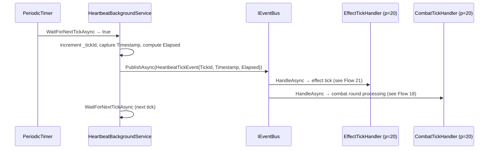

# Flow 16 — Heartbeat tick

> [Back to flows index](README.md)

**Summary.** `HeartbeatBackgroundService` fires a `PeriodicTimer` at `Heartbeat:IntervalMs` (default 2000 ms), increments a monotonic counter, and publishes `HeartbeatTickEvent` to `IEventBus`. No game logic lives here; handlers subscribe independently. `EffectTickHandler` (slice 9-e, p=20) and `CombatTickHandler` (slice 9, p=20) are the first registered subscribers; future handlers (mob AI, etc.) slot in at their own priorities.

**Trigger.** `PeriodicTimer.WaitForNextTickAsync` returns in `HeartbeatBackgroundService.ExecuteAsync`.

**Steps.**

1. `PeriodicTimer.WaitForNextTickAsync(stoppingToken)` returns `true` (or throws `OperationCanceledException` on host shutdown → service exits).
2. `HeartbeatBackgroundService` increments `_tickId` (starts at 1 on first tick), captures `DateTimeOffset.UtcNow` as `now`, computes `Elapsed = now - _lastTimestamp`, and updates `_lastTimestamp = now`. `_lastTimestamp` is initialized to `DateTimeOffset.UtcNow` before the loop so the first tick's `Elapsed` reflects the actual interval.
3. Publishes `HeartbeatTickEvent { TickId, Timestamp, Elapsed }` via `IEventBus.PublishAsync`. Any uncaught exception from handlers is caught and logged at `Error`; the loop continues.
4. Event bus dispatches to all subscribed handlers in priority order. `EffectTickHandler` (priority 20) runs effect periodic application and expiry (see [Flow 21](flow-21-effect-tick.md)). `CombatTickHandler` (priority 20) runs combat round processing (see [Flow 18](flow-18-combat-round-pulse.md)). Future subscribers (mob AI, etc.) slot in at their own priorities.
5. Control returns to `WaitForNextTickAsync`. `PeriodicTimer` schedules the next tick relative to its period, not relative to when handler execution completed — overruns cause the next tick to fire immediately after the current one completes.

**Overrun.** If handler execution takes longer than `IntervalMs`, `PeriodicTimer` fires the next tick immediately after the current completes (no drift accumulation, but no backpressure either). Acknowledged for Phase 4 hardening.

**Thread safety.** `ExecuteAsync` runs on a background thread. `IEventBus.PublishAsync` is called from that thread — the same cross-thread pattern used by `PersistenceFlushTimer` and `WorldContentBootstrap`. Single `PeriodicTimer` means no concurrent self-publish. Phase 4 thread-safety review covers the event bus under concurrent background-service access.

**Cross-references.**
- [`Core/Modules/Time/Events/HeartbeatTickEvent.cs`](../../../Core/Modules/Time/Events/HeartbeatTickEvent.cs)
- [`Server/HeartbeatBackgroundService.cs`](../../../Server/HeartbeatBackgroundService.cs)
- [`docs/use-cases/time-system.md`](../../use-cases/time-system.md) — slice 9-b spec
