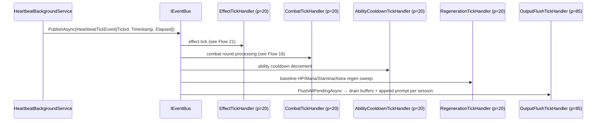

# Flow 16 — Heartbeat tick

> [Back to flows index](README.md). **Trigger:** `PeriodicTimer.WaitForNextTickAsync` in `HeartbeatBackgroundService` (`Heartbeat:IntervalMs`, default 2000 ms).

## Summary

`HeartbeatBackgroundService` increments a monotonic tick counter, captures the timestamp and elapsed duration, and publishes `HeartbeatTickEvent` to `IEventBus`. No game logic lives in the service itself — all processing is in subscribed handlers. Priority-20 handlers run effect ticks, combat rounds, ability cooldown decrements, and baseline regeneration. `OutputFlushTickHandler` (p=85) runs last among output-producing subscribers, drains all session buffers accumulated during the tick, and appends one prompt per session.

## Steps

1. **Tick.** `HeartbeatBackgroundService` increments `_tickId`, captures `DateTimeOffset.UtcNow`, computes `Elapsed`, and publishes `HeartbeatTickEvent`. Uncaught handler exceptions are caught and logged; the loop continues.
2. **Effect tick.** `EffectTickHandler` (p=20) advances `Timed`/`Periodic` effects and publishes `EffectExpiredEvent` per expiry. See [Flow 21](flow-21-effect-tick.md).
3. **Combat tick.** `CombatTickHandler` (p=20) runs combat round processing. See [Flow 18](flow-17-kill-mob-combat-initiation.md).
4. **Cooldowns.** `AbilityCooldownTickHandler` (p=20) decrements per-ability cooldown timers via `IAbilitySystem.AdvanceCooldowns`.
5. **Regeneration.** `RegenerationTickHandler` (p=20) applies baseline resource regen to all out-of-combat entities via `IRegenerationSystem.ApplyTickRegen`.
6. **Output flush.** `OutputFlushTickHandler` (p=85) calls `ISessionBufferRegistry.FlushAllPendingAsync`: for each session with pending output, drains the buffer, formats and sends messages, then appends one prompt reflecting post-tick state.

**Overrun.** If handler execution exceeds `IntervalMs`, `PeriodicTimer` fires the next tick immediately after completion — no drift accumulation, but no backpressure. Acknowledged for Phase 4 hardening.

## Where to look

- [`Server/HeartbeatBackgroundService.cs`](../../../Server/HeartbeatBackgroundService.cs) — tick loop
- [`Core/Modules/Time/Events/HeartbeatTickEvent.cs`](../../../Core/Modules/Time/Events/HeartbeatTickEvent.cs) — event payload
- [`Core/Handlers/OutputFlushTickHandler.cs`](../../../Core/Handlers/OutputFlushTickHandler.cs) — tick-end flush
- [`Core/Output/ISessionBufferRegistry.cs`](../../../Core/Output/ISessionBufferRegistry.cs) — session buffer registry
- [`Core/Modules/Abilities/Handlers/AbilityCooldownTickHandler.cs`](../../../Core/Modules/Abilities/Handlers/AbilityCooldownTickHandler.cs) — cooldown decrement
- [`Core/Modules/Regeneration/Handlers/RegenerationTickHandler.cs`](../../../Core/Modules/Regeneration/Handlers/RegenerationTickHandler.cs) — regen sweep
- [`docs/features/world/world.md`](../../features/world/world.md) — time system · [`docs/features/output/output.md`](../../features/output/output.md) — output batching
