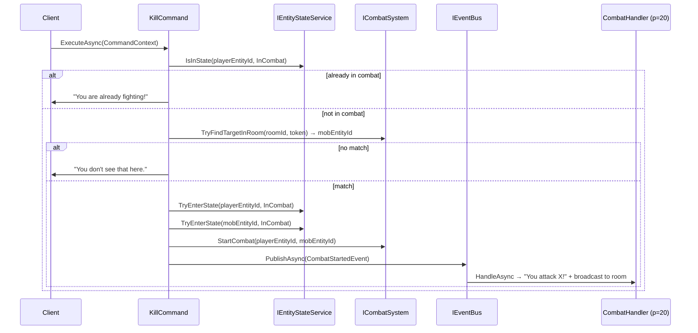

# Flow 17 — `kill <mob>` — combat initiation

> [Back to flows index](README.md)

**Summary.** Player sends `kill <mob>`. `KillCommand` guards against already-in-combat, prefix-matches the token against mobs in the current room via `ICombatSystem.TryFindTargetInRoom`, transitions both entities to `InCombat` via `IEntityStateService`, attaches `CombatStateComponent` on both via `ICombatSystem.StartCombat`, and publishes `CombatStartedEvent`. `CombatHandler` broadcasts the attack announcement to the room.

**Trigger.** Player sends `kill <target>` (or alias `k`).

**Steps.**

1. `CommandDispatcher` routes `kill` (or prefix `k`) to `KillCommand`.
2. **In-combat guard.** Calls `IEntityStateService.IsInState(playerEntityId, EntityStateFlags.InCombat)`. If true, writes `"You are already fighting!"` and returns.
3. **Target resolution.** Reads `LocationComponent.RoomEntityId`. Calls `ICombatSystem.TryFindTargetInRoom(roomId, token)` — prefix-matches against `MobDataComponent.Name` and `MobDataComponent.Keywords` for entities in the room. On no match: `"You don't see that here."` and return.
4. **State transition — player.** Calls `IEntityStateService.TryEnterState(playerEntityId, InCombat, out failReason)`. On failure (blocked by transition rule, e.g. `Incapacitated`): writes `failReason` and returns.
5. **State transition — mob.** Calls `IEntityStateService.TryEnterState(mobEntityId, InCombat, out _)`. Failure is a warn-log and no-op (mobs have no session to write to).
6. **Combat metadata.** Calls `ICombatSystem.StartCombat(playerEntityId, mobEntityId)` — attaches `CombatStateComponent { OpponentEntityId }` to both entities.
7. Publishes `CombatStartedEvent(AttackerEntityId, DefenderEntityId, RoomEntityId)`.
8. `CombatHandler` (priority 20) handles `CombatStartedEvent`: writes `"You attack <mob>!"` to attacker; broadcasts `"<PlayerName> attacks <mob>!"` to other room occupants.

**Cross-references.**
- [`Core/Modules/Combat/Commands/KillCommand.cs`](../../../Core/Modules/Combat/Commands/KillCommand.cs)
- [`Core/Modules/Combat/Systems/CombatSystem.cs`](../../../Core/Modules/Combat/Systems/CombatSystem.cs)
- [`Core/Modules/Combat/Handlers/CombatHandler.cs`](../../../Core/Modules/Combat/Handlers/CombatHandler.cs)
- [`Core/Modules/Combat/Events/CombatStartedEvent.cs`](../../../Core/Modules/Combat/Events/CombatStartedEvent.cs)
- [`docs/implementation-plans/combat.md`](../../implementation-plans/combat.md) — slice 9 spec
