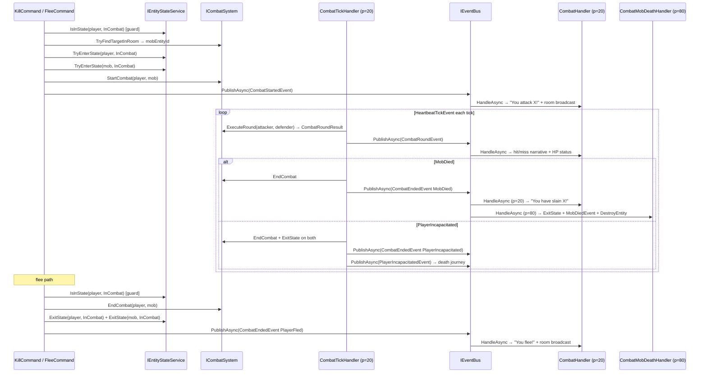

# Combat journey (initiation · round pulse · flee)

> [Back to flows index](README.md). **Trigger:** Player sends `kill <target>`, then `HeartbeatTickEvent` drives rounds; player sends `flee` to exit.

## Summary

`KillCommand` validates state, prefix-matches the target mob in the room via `ICombatSystem`, transitions both entities to `InCombat` via `IEntityStateService`, attaches `CombatStateComponent`, and publishes `CombatStartedEvent`. Each heartbeat tick, `CombatTickHandler` (priority 20) snapshots all `CombatStateComponent` entities, deduplicates into unique pairs (lower entity id = attacker), and calls `ICombatSystem.ExecuteRound` per pair. Results route to `CombatRoundEvent` for output; terminal outcomes (mob death, player incapacitation) publish `CombatEndedEvent` and branch to the [death & respawn journey](flow-20-mob-death-respawn.md). `flee` calls `ICombatSystem.EndCombat` + `IEntityStateService.ExitState` on both participants and publishes `CombatEndedEvent(PlayerFled)`.

## Steps

1. **Initiation.** `KillCommand` guards `IsInState(InCombat)`, prefix-matches the target via `ICombatSystem.TryFindTargetInRoom`, calls `TryEnterState(InCombat)` on both entities, calls `ICombatSystem.StartCombat` to attach `CombatStateComponent { OpponentEntityId }` on both, and publishes `CombatStartedEvent`.

2. **Round pulse.** On each `HeartbeatTickEvent`, `CombatTickHandler` snapshots all `CombatStateComponent` entities. For each pair with `entityId < opponentEntityId`: calls `ICombatSystem.ExecuteRound` (hit check + aspect-resolved damage) and publishes `CombatRoundEvent`. `CombatHandler` broadcasts the hit/miss narrative and the per-round HP status to the player.

3. **Mob death.** When `CombatRoundResult.Outcome == MobDied`: `CombatTickHandler` captures `MobDataComponent.Name` (before destruction), calls `EndCombat`, publishes `CombatEndedEvent(MobDied, DefenderName)`. `CombatHandler` (p=20) broadcasts the kill narrative. `CombatMobDeathHandler` (p=80) exits the attacker's `InCombat` state, publishes `MobDiedEvent` (with `KillerEntityId`), then calls `EntityService.DestroyEntity`. See also the [death & respawn journey](flow-20-mob-death-respawn.md) for the respawn side.

4. **Player incapacitation.** When `CombatRoundResult.Outcome == PlayerIncapacitated`: `CombatTickHandler` calls `EndCombat` + `ExitState(InCombat)` on both, publishes `CombatEndedEvent(PlayerIncapacitated)`, then calls `IDeathSystem.OnHpChanged` and publishes `PlayerIncapacitatedEvent` to open the bleed-out lifecycle. See the [death & respawn journey](flow-20-mob-death-respawn.md).

5. **Flee.** `FleeCommand` guards `IsInState(InCombat)`, reads `CombatStateComponent.OpponentEntityId`, calls `ICombatSystem.EndCombat` + `IEntityStateService.ExitState` on both, publishes `CombatEndedEvent(PlayerFled)`. `flee` always succeeds — no fail roll.

## Where to look

- [`Core/Modules/Combat/Commands/KillCommand.cs`](../../../Core/Modules/Combat/Commands/KillCommand.cs) · [`Core/Modules/Combat/Commands/FleeCommand.cs`](../../../Core/Modules/Combat/Commands/FleeCommand.cs)
- [`Core/Modules/Combat/Handlers/CombatTickHandler.cs`](../../../Core/Modules/Combat/Handlers/CombatTickHandler.cs) · [`Core/Modules/Combat/Handlers/CombatHandler.cs`](../../../Core/Modules/Combat/Handlers/CombatHandler.cs)
- [`Core/Modules/Combat/Systems/CombatSystem.cs`](../../../Core/Modules/Combat/Systems/CombatSystem.cs)
- [`../../features/combat/combat.md`](../../features/combat/combat.md) — the feature; [`../../features/combat/combat-system.md`](../../features/combat/combat-system.md) for round internals.
