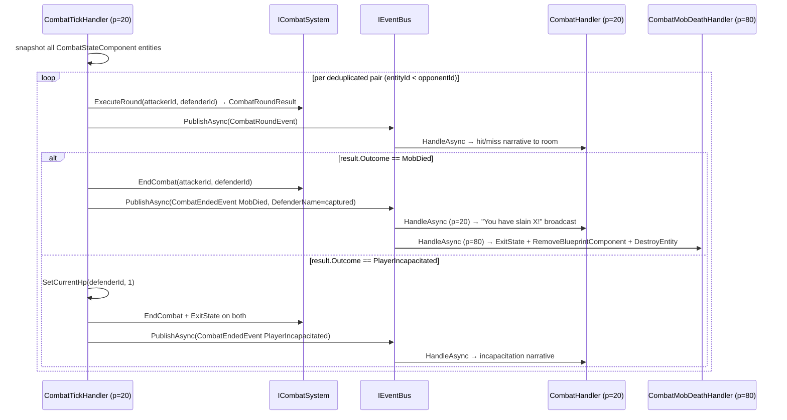

# Flow 18 — Combat round pulse (heartbeat-driven)

> [Back to flows index](README.md)

**Summary.** `CombatTickHandler` subscribes to `HeartbeatTickEvent`. On each tick it snapshots all entities with `CombatStateComponent`, deduplicates pairs (lower entity id = attacker), calls `ICombatSystem.ExecuteRound` for each pair, and publishes `CombatRoundEvent`. Terminal outcomes are handled inline: `MobDied` triggers cleanup + `CombatEndedEvent(MobDied)`, causing `CombatHandler` (p=20) to broadcast the kill narrative before `CombatMobDeathHandler` (p=80) destroys the entity.

**Trigger.** `HeartbeatTickEvent` dispatched by `HeartbeatBackgroundService` (see [Flow 16](flow-16-heartbeat-tick.md)).

**Steps.**

1. `HeartbeatBackgroundService` publishes `HeartbeatTickEvent`; `CombatTickHandler` (priority 20) handles it.
2. **Snapshot.** Calls `EntityService.GetAllComponents<CombatStateComponent>().ToList()` — snapshot before iteration to avoid mutation during enumeration.
3. **Deduplication.** For each `(entityId, state)` in the snapshot: skip if `entityId >= state.OpponentEntityId`. This ensures each pair is processed exactly once; the lower entity id is designated the "attacker" for this round.
4. **Round execution.** Calls `ICombatSystem.ExecuteRound(attackerEntityId, defenderEntityId)` → `CombatRoundResult`. The formula: hit check `roll = Random.Shared.Next(1,21) + body/2 >= 10 + defense`; if hit, damage `= Random.Shared.Next(1, attackPower+2)` applied via `IAttributeSystem.SetCurrentHp`. *(Stat source changed from `Dexterity` to `Body` in slice 9-d; `AttackPower` and `Defense` are both Body-governed — see [`docs/use-cases/stat-resource-substrate.md`](../../use-cases/stat-resource-substrate.md).)*
5. Publishes `CombatRoundEvent`. `CombatHandler` (priority 20) broadcasts hit/miss/damage narrative.
6. **`MobDied` path.** Captures `MobDataComponent.Name` from the mob entity (point-in-time capture, before destruction). Calls `ICombatSystem.EndCombat`. Publishes `CombatEndedEvent(MobDied, DefenderName=mobName)`. `CombatHandler` (priority 20) broadcasts `"You have slain <mob>!"` using `DefenderName` from the payload. `CombatMobDeathHandler` (priority 80) then calls `IEntityStateService.ExitState(attackerEntityId, InCombat)`, removes `BlueprintComponent` (INV-21), and calls `EntityService.DestroyEntity(mobEntityId)`.
7. **`PlayerIncapacitated` path.** Calls `IAttributeSystem.SetCurrentHp(defenderEntityId, 1)` (stub clamp, slice 10 will add full death mechanics). Calls `ICombatSystem.EndCombat` + `IEntityStateService.ExitState(InCombat)` on both entities. Publishes `CombatEndedEvent(PlayerIncapacitated)`. `CombatHandler` broadcasts incapacitation narrative.

**Cross-references.**
- [`Core/Modules/Combat/Handlers/CombatTickHandler.cs`](../../../Core/Modules/Combat/Handlers/CombatTickHandler.cs)
- [`Core/Modules/Combat/Handlers/CombatHandler.cs`](../../../Core/Modules/Combat/Handlers/CombatHandler.cs)
- [`Core/Modules/Combat/Handlers/CombatMobDeathHandler.cs`](../../../Core/Modules/Combat/Handlers/CombatMobDeathHandler.cs)
- [`Core/Modules/Combat/Systems/CombatSystem.cs`](../../../Core/Modules/Combat/Systems/CombatSystem.cs)
- [`Core/Modules/Combat/Events/CombatRoundEvent.cs`](../../../Core/Modules/Combat/Events/CombatRoundEvent.cs)
- [`Core/Modules/Combat/Events/CombatEndedEvent.cs`](../../../Core/Modules/Combat/Events/CombatEndedEvent.cs)
- [`docs/use-cases/combat.md`](../../use-cases/combat.md) — slice 9 spec; [Flow 16](flow-16-heartbeat-tick.md) — heartbeat trigger
