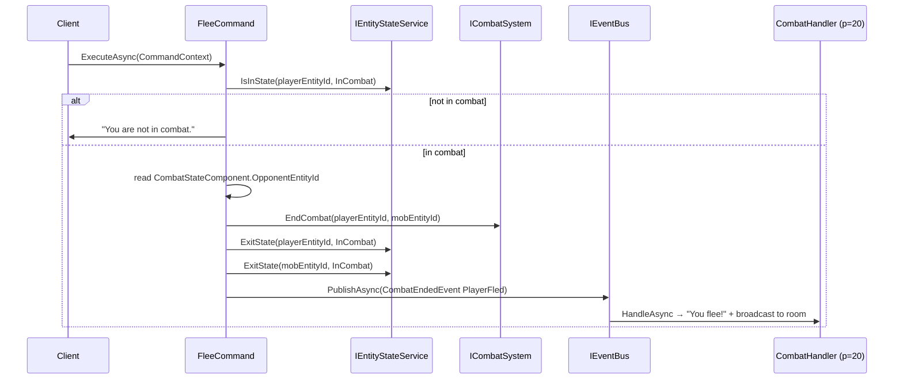

# Flow 19 — `flee` — combat exit

> [Back to flows index](README.md)

**Summary.** Player sends `flee`. `FleeCommand` verifies the player is in combat, reads the opponent id from `CombatStateComponent`, calls `ICombatSystem.EndCombat` + `IEntityStateService.ExitState` on both participants, and publishes `CombatEndedEvent(PlayerFled)`. `CombatHandler` broadcasts the flee narrative. `flee` always succeeds — no fail roll in Phase 3.

**Trigger.** Player sends `flee`.

**Steps.**

1. `CommandDispatcher` routes `flee` to `FleeCommand`.
2. **Combat guard.** Calls `IEntityStateService.IsInState(playerEntityId, EntityStateFlags.InCombat)`. If false, writes `"You are not in combat."` and returns.
3. Reads `CombatStateComponent.OpponentEntityId` from the player entity to identify the opponent.
4. Calls `ICombatSystem.EndCombat(playerEntityId, mobEntityId)` — removes `CombatStateComponent` from both entities.
5. Calls `IEntityStateService.ExitState(playerEntityId, InCombat)` and `IEntityStateService.ExitState(mobEntityId, InCombat)`.
6. Publishes `CombatEndedEvent(AttackerEntityId: playerEntityId, DefenderEntityId: mobEntityId, Outcome: PlayerFled, RoomEntityId)`.
7. `CombatHandler` (priority 20) handles `CombatEndedEvent(PlayerFled)`: writes `"You flee from combat!"` to the player; broadcasts `"<PlayerName> flees from combat!"` to other room occupants.

**Cross-references.**
- [`Core/Modules/Combat/Commands/FleeCommand.cs`](../../../Core/Modules/Combat/Commands/FleeCommand.cs)
- [`Core/Modules/Combat/Handlers/CombatHandler.cs`](../../../Core/Modules/Combat/Handlers/CombatHandler.cs)
- [`Core/Modules/Combat/Events/CombatEndedEvent.cs`](../../../Core/Modules/Combat/Events/CombatEndedEvent.cs)
- [`docs/implementation-plans/combat.md`](../../implementation-plans/combat.md) — slice 9 spec
