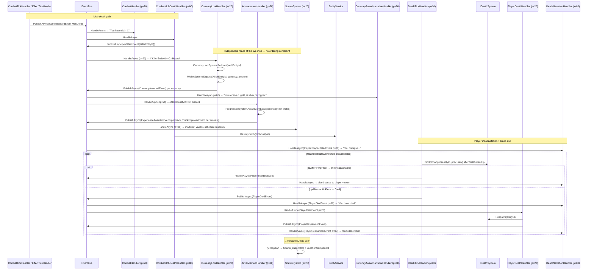

# Death & respawn journey (mob death · incapacitation · bleed-out · player death/respawn)

> [Back to flows index](README.md). **Trigger:** Mob HP reaches zero (combat round); or player HP crosses zero (combat round or DoT tick).

## Summary

Two terminal outcomes from the [combat journey](flow-17-kill-mob-combat-initiation.md) branch here. **Mob death:** `CombatMobDeathHandler` publishes `MobDiedEvent` (while the entity is still live), then destroys the entity; `SpawnSystem` observes `MobDiedEvent` to mark the slot vacant and schedules a respawn on a future heartbeat; `CurrencyLootHandler` rolls and deposits loot; `AdvancementHandler` resolves the combat XP award through the advancement-rule table (see [flow-31](flow-31-progression-award.md) for the progression internals) — all three are independent reads of the still-live mob with no ordering constraint. **Player incapacitation:** `PlayerIncapacitatedEvent` opens a bleed-out loop — `DeathTickHandler` bleeds the player by `Death:BleedPerTick` per heartbeat tick, narrated by `DeathNarrationHandler` (priority 80). When HP reaches `Death:HpFloor` (default −10), `PlayerDeathHandler` calls `IDeathSystem.Respawn`: exits Incapacitated state, relocates to the stored respawn room, strips impermanent effects, restores all four pools to 25% of max.

## Steps

**Mob death**

1. `CombatMobDeathHandler` (priority 80) receives `CombatEndedEvent(MobDied)`. Calls `IEntityStateService.ExitState(attacker, InCombat)`.
2. Publishes `MobDiedEvent { MobEntityId, BlueprintId, KillerEntityId }` while the entity is still live.
3. Three independent `MobDiedEvent` subscribers read the live mob — no inter-handler ordering constraint between them:
   - `CurrencyLootHandler` (priority 20): if `KillerEntityId == 0`, discards (no deposit, no event). Otherwise calls `ICurrencyLootSystem.RollLoot(mobEntityId)`, then for each non-zero `(currency, amount)` calls `IWalletSystem.Deposit(KillerEntityId, currency, amount)` and publishes `CurrencyAwardedEvent(KillerEntityId, currency, amount)`. `CurrencyAwardNarrationHandler` (priority 80) writes a "You receive …" line (formatted up the denomination ladder, e.g. "You receive 1 gold, 0 silver, 5 copper.") to the recipient.
   - `AdvancementHandler` (priority 20): calls `IProgressionSystem.AwardCombatExperience(killerEntityId, victimEntityId)` unconditionally, then publishes `ExperienceAwardedEvent` per positive-amount track and `TrackImprovedEvent` per threshold crossed. An unattributable killer (`KillerEntityId == 0`) awards nothing, but that discard is `AdvancementEligibility` data on the rule rather than a branch in the handler (INV-8). See [flow-31](flow-31-progression-award.md) for the progression internals (the rule table, the RNG draw contract, anti-grind scale, threshold math, the contribute-on-read fold).
   - `SpawnSystem` (priority 20): records slot vacancy and sets `RespawnAt = now + delay`.
4. Calls `EntityService.DestroyEntity(mobEntityId)`. On a later heartbeat tick, `SpawnSystem` spawns a fresh entity from the template and places it in the room.

**Player incapacitation**

4. `PlayerIncapacitatedEvent` fires (from `CombatTickHandler` or `EffectTickHandler`). `DeathNarrationHandler` writes the collapse message to the player and broadcasts to the room.
5. While incapacitated, `CommandDispatcher` blocks all commands except `help`, `commands`, and `score` (`UsableWhileIncapacitated` gate).

**Bleed-out**

6. On each `HeartbeatTickEvent`, `DeathTickHandler` (priority 20) subtracts `Death:BleedPerTick` HP via `IAttributeSystem.SetCurrentHp`, then calls `IDeathSystem.OnHpChanged`.
   - `None` returned: publishes `PlayerBleedingEvent`; `DeathNarrationHandler` sends per-tick status to the player and a third-person warning to the room.
   - `Died` returned (HP ≤ `Death:HpFloor`): publishes `PlayerDiedEvent(entityId, deathRoomEntityId)`.

**Respawn**

7. `PlayerDeathHandler` (priority 20) handles `PlayerDiedEvent`. Calls `IDeathSystem.Respawn(entityId)`: exits Incapacitated, resolves `RespawnComponent.RoomBlueprintId` to a live room (fallback: `WorldConfiguration.StartingRoomBlueprintId`), updates `LocationComponent`, calls `IEffectSystem.RemoveImpermanent` (strips non-`UntilRemoved` effects), restores all four pools to `floor(Max × Death:RespawnPoolPercent)`.
8. `PlayerDeathHandler` publishes `PlayerRespawnedEvent`. `DeathNarrationHandler` broadcasts the death message to the death room, writes the respawn confirmation to the player, broadcasts arrival to the respawn room.

No `SaveEntityAsync` in the respawn path — periodic flush covers pool/location/effect mutations (INV-22 runtime transition).

## Where to look

- [`Core/Modules/Combat/Handlers/CombatMobDeathHandler.cs`](../../../Core/Modules/Combat/Handlers/CombatMobDeathHandler.cs)
- [`Core/Modules/Death/Handlers/DeathTickHandler.cs`](../../../Core/Modules/Death/Handlers/DeathTickHandler.cs) · [`Core/Modules/Death/Handlers/PlayerDeathHandler.cs`](../../../Core/Modules/Death/Handlers/PlayerDeathHandler.cs) · [`Core/Modules/Death/Handlers/DeathNarrationHandler.cs`](../../../Core/Modules/Death/Handlers/DeathNarrationHandler.cs)
- [`Core/Modules/Death/Systems/IDeathSystem.cs`](../../../Core/Modules/Death/Systems/IDeathSystem.cs)
- [`Core/Modules/Spawn/Systems/SpawnSystem.cs`](../../../Core/Modules/Spawn/Systems/SpawnSystem.cs)
- [`../../features/combat/combat.md`](../../features/combat/combat.md) — the feature; [`../../features/combat/death-system.md`](../../features/combat/death-system.md) for death pipeline internals.
- [`Core/Modules/Economy/Handlers/CurrencyLootHandler.cs`](../../../Core/Modules/Economy/Handlers/CurrencyLootHandler.cs) · [`Core/Modules/Economy/Handlers/CurrencyAwardNarrationHandler.cs`](../../../Core/Modules/Economy/Handlers/CurrencyAwardNarrationHandler.cs)
- [`Core/Modules/Economy/Systems/ICurrencyLootSystem.cs`](../../../Core/Modules/Economy/Systems/ICurrencyLootSystem.cs) · [`Core/Modules/Economy/Components/CurrencyLootComponent.cs`](../../../Core/Modules/Economy/Components/CurrencyLootComponent.cs)
- [`Core/Modules/Progression/Handlers/AdvancementHandler.cs`](../../../Core/Modules/Progression/Handlers/AdvancementHandler.cs) · [`../../features/progression/progression.md`](../../features/progression/progression.md) — the progression feature; [flow-31](flow-31-progression-award.md) for the award internals.
