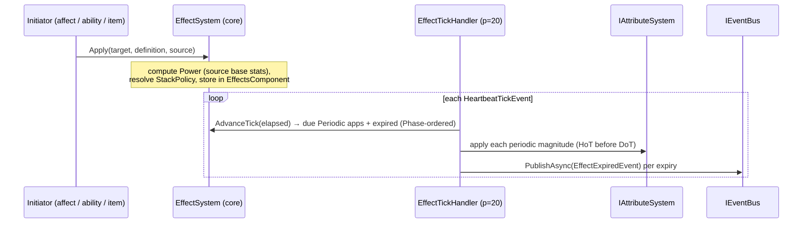

# Effects journey — apply · tick · expire

> [Back to flows index](README.md). **Trigger:** an effect is applied (by `affect`, an ability, or an item), then advanced each `HeartbeatTickEvent`.

## Summary

An effect enters through `EffectSystem.Apply` (or the modifier seam, for `StatModifier` kinds): power is computed from the source's base stats, the stacking policy resolves, and a standalone effect is stored in `EffectsComponent`. `StatModifier` effects need no tick — `IStatSystem.Get` folds `EffectSystem.GetModifiers` on every read, so consumers see the change transparently. `Timed` and `Periodic` effects advance on the heartbeat: `EffectTickHandler` (priority 20, before combat) calls `EffectSystem.AdvanceTick`, which returns the periodic applications due this tick and the just-expired effects, both ordered by `Phase` (heal-before-damage). The handler writes each periodic magnitude through `IAttributeSystem`, routes `HpCurrent` writes through `IDeathSystem.OnHpChanged` (a DoT can open incapacitation, see the [death & respawn journey](flow-20-mob-death-respawn.md)), and publishes `EffectExpiredEvent` per expiry. Persistence is lifetime-filtered — only `UntilRemoved` effects survive a restart.

## Steps

1. **Apply.** `EffectSystem.Apply` computes `Power` from the source's *base* stats (acyclic — never via `IStatSystem`), applies the `StackPolicy` (`HighestWins` keeps the stronger, etc.), and stores the effect — or, for `Instant`, returns the one-shot result without storing.
2. **Transparent read.** For `StatModifier` effects, `IStatSystem.Get` sums `EffectSystem.GetModifiers` over base + equipment, so combat / `score` / any consumer reflect the buff with no call-site change.
3. **Tick.** Each heartbeat, `EffectTickHandler` calls `AdvanceTick`; the system advances `Timed` elapsed, collects due `Periodic` applications and expiries, and returns both `Phase`-ordered. The handler writes magnitudes via `IAttributeSystem` (heal phase before damage phase) and publishes `EffectExpiredEvent` per expiry.
4. **Persist.** On flush, only `UntilRemoved` effects are written (the lifetime-filtering JSON converter); `Timed` effects are intentionally dropped on restart; source-bound effects re-derive from their sources.

## Where to look

- [`EffectSystem.cs`](../../../Core/Modules/Effects/Systems/EffectSystem.cs) · [`EffectTickHandler.cs`](../../../Core/Modules/Effects/Handlers/EffectTickHandler.cs) — the system and its tick orchestrator.
- [`effect-system.md`](../../features/effects/effect-system.md) — the model (kinds, lifetimes, stacking, power, phase, the contributor seam).
- [Flow 16](flow-16-heartbeat-tick.md) — the heartbeat that drives the tick.
