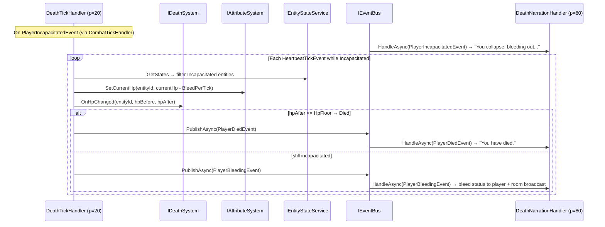

# Flow 22 — Player incapacitation and bleed-out

> [Back to flows index](README.md)

**Summary.** When a player's HP crosses from positive to zero-or-below during combat (see [Flow 18](flow-18-combat-round-pulse.md)), `CombatTickHandler` calls `IDeathSystem.OnHpChanged` and, if `BecameIncapacitated` is returned, publishes `PlayerIncapacitatedEvent`. On subsequent heartbeat ticks, `DeathTickHandler` bleeds the player by `Death:BleedPerTick` HP per tick while they remain incapacitated. `DeathNarrationHandler` (priority 80) narrates each bleed tick: a first-person status message to the player and a third-person warning to all other players in the same room.

**Trigger.** `PlayerIncapacitatedEvent` published by `CombatTickHandler` (see [Flow 18](flow-18-combat-round-pulse.md)); then `HeartbeatTickEvent` ticks while `EntityStateFlags.Incapacitated` is set.

**Steps.**

1. `PlayerIncapacitatedEvent` fires (published by `CombatTickHandler`). `DeathNarrationHandler` (priority 80) writes `"You collapse, bleeding out..."` to the player and broadcasts `"<Name> collapses!"` to the room.
2. On each subsequent `HeartbeatTickEvent`, `DeathTickHandler` (priority 20) queries all entities with `EntityStateFlags.Incapacitated`.
3. For each incapacitated entity: reads current HP, applies bleed (`IAttributeSystem.SetCurrentHp(entityId, currentHp - BleedPerTick)`).
4. Calls `IDeathSystem.OnHpChanged(entityId, hpBefore, hpAfter)`.
   - If the result is `Died` (HP ≤ `Death:HpFloor`, default -10): publishes `PlayerDiedEvent` → see [Flow 23](flow-23-player-death-respawn.md).
   - Otherwise: publishes `PlayerBleedingEvent(entityId, newHp, hpFloor)` (thin payload — no room id). `DeathNarrationHandler` resolves the room from `LocationComponent` and sends two messages: `"You are bleeding out (hp/floor). Without healing you will die."` to the player only, and `"<Name> is bleeding out and near death."` to all other players in the room (via `audienceFilter`).
5. Incapacitated players cannot use commands other than those explicitly allowlisted (`help`, `commands`, `score`) — the `CommandDispatcher` incapacitation gate blocks all others with `"You are incapacitated and cannot do that."` (see [Flow 3](flow-03-player-command-lifecycle.md)).

**Cross-references.**
- [`Core/Modules/Death/Handlers/DeathTickHandler.cs`](../../../Core/Modules/Death/Handlers/DeathTickHandler.cs)
- [`Core/Modules/Death/Handlers/DeathNarrationHandler.cs`](../../../Core/Modules/Death/Handlers/DeathNarrationHandler.cs)
- [`Core/Modules/Death/Systems/IDeathSystem.cs`](../../../Core/Modules/Death/Systems/IDeathSystem.cs)
- [`Core/Modules/Death/Events/PlayerIncapacitatedEvent.cs`](../../../Core/Modules/Death/Events/PlayerIncapacitatedEvent.cs)
- [`Core/Modules/Death/Events/PlayerBleedingEvent.cs`](../../../Core/Modules/Death/Events/PlayerBleedingEvent.cs)
- [`Core/Commands/CommandDispatcher.cs`](../../../Core/Commands/CommandDispatcher.cs) — incapacitation gate
- [Flow 18 — Combat round pulse](flow-18-combat-round-pulse.md) — incapacitation trigger
- [Flow 23 — Player death and respawn](flow-23-player-death-respawn.md) — bleed-out terminal path
- [`docs/use-cases/death-and-respawn.md`](../../use-cases/death-and-respawn.md) — slice 10 spec
