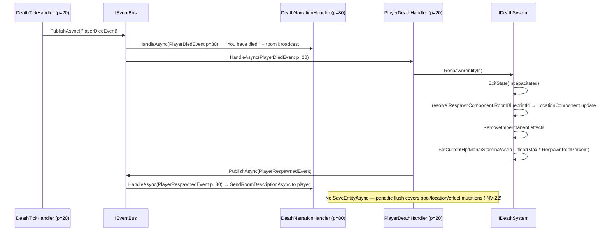

# Flow 23 — Player death and respawn

> [Back to flows index](README.md)

**Summary.** When bleed-out completes (HP ≤ `Death:HpFloor`), `DeathTickHandler` publishes `PlayerDiedEvent`. `DeathNarrationHandler` (priority 80) narrates the death. `PlayerDeathHandler` (priority 20) orchestrates the full respawn: calls `IDeathSystem.Respawn` (exits Incapacitated, teleports to respawn room, strips impermanent effects, restores pools to 25% of max). Pool/location/effect mutations are covered by the next periodic flush (INV-22 — no `SaveEntityAsync` on a runtime state transition). `DeathNarrationHandler` broadcasts the respawn description.

**Trigger.** `PlayerDiedEvent` published by `DeathTickHandler` when `IDeathSystem.OnHpChanged` returns `Died`.

**Steps.**

1. `DeathTickHandler` detects HP ≤ `Death:HpFloor` via `IDeathSystem.OnHpChanged` returning `Died`, and publishes `PlayerDiedEvent(entityId, roomEntityId)`.
2. `DeathNarrationHandler` (priority 80) writes `"You have died."` to the player and broadcasts the death message to the room.
3. `PlayerDeathHandler` (priority 20) calls `IDeathSystem.Respawn(entityId)`:
   - Calls `IEntityStateService.ExitState(entityId, Incapacitated)` — clears the flag, removes `EntityStateComponent` if no other flags remain.
   - Resolves `RespawnComponent.RoomBlueprintId` to a live room entity id (same resolution path as `CharacterHydrationHandler`). Falls back to `WorldConfiguration.StartingRoomEntityId` if unresolvable (logs warning).
   - Updates `LocationComponent` to the resolved room.
   - Calls `IEffectSystem.RemoveImpermanent(entityId)` — strips all non-`UntilRemoved` effects.
   - Restores HP/Mana/Stamina/Astra to `floor(Max × Death:RespawnPoolPercent)` (default 25% of max).
4. `PlayerDeathHandler` publishes `PlayerRespawnedEvent(entityId, roomEntityId)`.
5. `DeathNarrationHandler` handles `PlayerRespawnedEvent` and calls `IBroadcastSystem.SendRoomDescriptionAsync` to show the player their new surroundings.

> **Persistence note.** No `SaveEntityAsync` is called in this flow. The location, pool, and effect mutations are runtime state changes covered by the next `PersistenceFlushTimer` sweep (INV-22). The admin `setrespawn` command is the only Death-module path that calls `SaveEntityAsync` — it is an admin boundary save, not a runtime state transition.

**Respawn room resolution order.**
1. `RespawnComponent.RoomBlueprintId` (if present and resolvable in the live blueprint map).
2. `WorldConfiguration.StartingRoomEntityId` (fallback, with a warning log).

The admin `setrespawn <player> <roomBlueprintId>` command sets option 1 and persists it immediately (INV-22 boundary save).

**Cross-references.**
- [`Core/Modules/Death/Handlers/PlayerDeathHandler.cs`](../../../Core/Modules/Death/Handlers/PlayerDeathHandler.cs)
- [`Core/Modules/Death/Handlers/DeathNarrationHandler.cs`](../../../Core/Modules/Death/Handlers/DeathNarrationHandler.cs)
- [`Core/Modules/Death/Handlers/DeathTickHandler.cs`](../../../Core/Modules/Death/Handlers/DeathTickHandler.cs)
- [`Core/Modules/Death/Systems/IDeathSystem.cs`](../../../Core/Modules/Death/Systems/IDeathSystem.cs)
- [`Core/Modules/Death/Commands/SetRespawnCommand.cs`](../../../Core/Modules/Death/Commands/SetRespawnCommand.cs)
- [`Core/Modules/Death/Events/PlayerDiedEvent.cs`](../../../Core/Modules/Death/Events/PlayerDiedEvent.cs)
- [`Core/Modules/Death/Events/PlayerRespawnedEvent.cs`](../../../Core/Modules/Death/Events/PlayerRespawnedEvent.cs)
- [`Core/ECS/Components/RespawnComponent.cs`](../../../Core/ECS/Components/RespawnComponent.cs)
- [Flow 22 — Player incapacitation and bleed-out](flow-22-incapacitation-bleedout.md)
- [`docs/implementation-plans/death-and-respawn.md`](../../implementation-plans/death-and-respawn.md) — slice 10 spec
