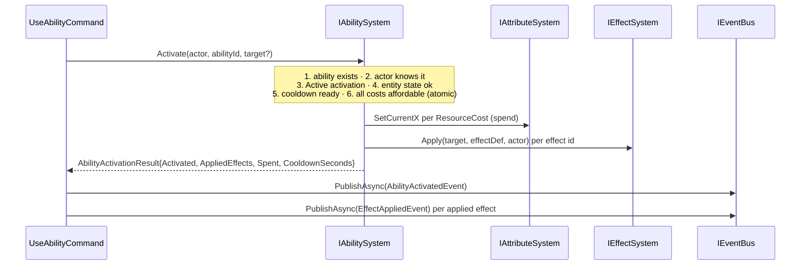
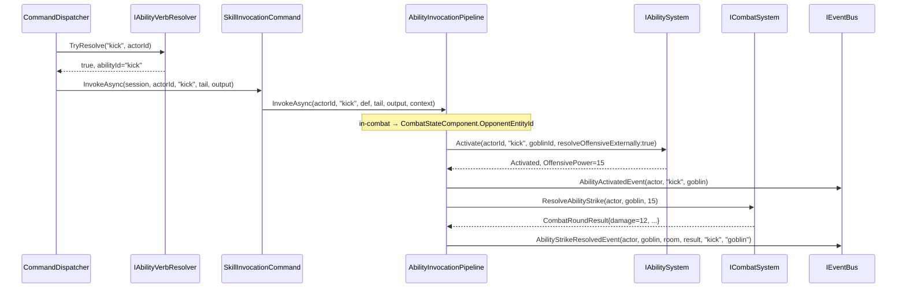
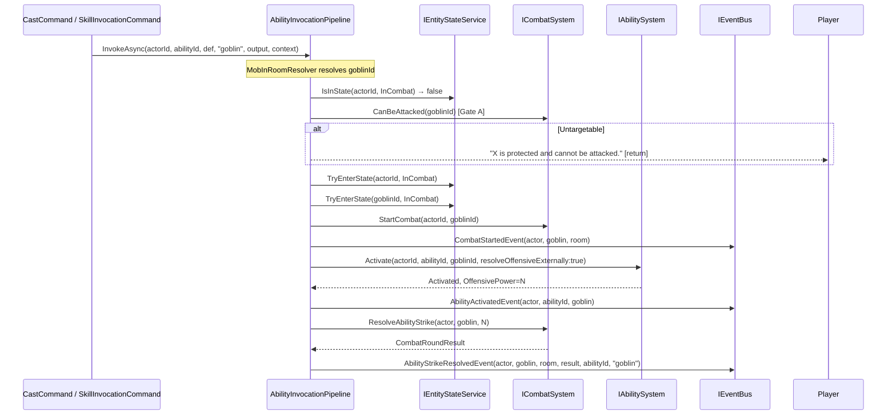

# Flow 24 — Abilities journey

> [Back to flows index](README.md) · Source: [../../features/abilities/abilities.md](../../features/abilities/abilities.md)

Three related paths, sharing the same core activation pipeline:

- **A. Activation** (admin `useability` or any path): `IAbilitySystem.Activate` runs entity-state / cooldown / cost checks → spend costs → apply effects → set cooldown → return result.
- **B. Bare-verb skill invocation** (player in combat): `CommandDispatcher` Phase 3 falls through to `IAbilityVerbResolver`; on a unique Active Skill match routes to `SkillInvocationCommand` → `AbilityInvocationPipeline`.
- **C. Offensive ability opens combat**: an offensive ability resolves a target the actor is not yet fighting — pipeline enters combat first, then activates and routes damage through `ICombatSystem.ResolveAbilityStrike`.

---

## A. Activation pipeline

**Trigger.** Admin sends `useability <abilityId> [target]`, or either player invocation path calls `IAbilitySystem.Activate`.

**Steps.**

1. Command resolves actor and optional target entity ids.
2. Calls `IAbilitySystem.Activate`.
3. `AbilitySystem` validates in order: ability exists → actor knows it → `Active` activation → not Incapacitated → cooldown ready → all costs affordable (atomic, no partial spend).
4. On success: spends each cost via `IAttributeSystem.SetCurrentX`; sets `CooldownRemaining[abilityId]`; calls `IEffectSystem.Apply` per effect id.
5. Returns `AbilityActivationResult`. On failure, returns the failing outcome + `FailReason`.
6. Command publishes `AbilityActivatedEvent` and one `EffectAppliedEvent` per applied effect. No domain logic in the command (INV-5, INV-8, INV-9).

---

## B. Bare-verb skill invocation (player, in combat)

**Trigger.** Player types a skill id or prefix (e.g. `kick`, `ki`) while in combat. No registered command matches.

**Steps.**

1. `CommandDispatcher` — Phase 1 (exact) and Phase 2 (prefix) miss.
2. Phase 3: calls `IAbilityVerbResolver.TryResolve("kick", actorId)` → unique hit.
3. Dispatcher routes to `SkillInvocationCommand`, which delegates to `AbilityInvocationPipeline`.
4. Pipeline: actor is `InCombat`, no explicit token → `CombatStateComponent.OpponentEntityId`. Already fighting — no combat-entry step.
5. Calls `Activate(actorId, "kick", goblinId, resolveOffensiveExternally: true)` — spends Stamina, sets cooldown, skips raw damage effect, returns `OffensivePower`.
6. Publishes `AbilityActivatedEvent`. `AbilityInvocationHandler` (p=80) writes room narrative.
7. Calls `ICombatSystem.ResolveAbilityStrike(actorId, goblinId, OffensivePower)` — defense-mitigated HP deduction.
8. Publishes `AbilityStrikeResolvedEvent`. `AbilityStrikeHandler` publishes `CombatRoundEvent` (damage narrative) and, if `Outcome` is terminal, `CombatEndedEvent` (reuses slice-10 death path).

**Why bare skill verbs are not `ICommand`.** Phase 3 is dispatcher-internal routing — the verb is a skill id, not a global command. Abilities are per-actor; making them discoverable via `help`/`commands` would imply they are global verbs. `skills` is the discovery surface.

---

## C. Offensive ability opens combat

**Trigger.** Player uses `cast <offensive-spell> <mob>` or a skill verb with an explicit target while not in combat.

**Steps.**

1. `CastCommand` / `SkillInvocationCommand` delegates to `AbilityInvocationPipeline`.
2. Explicit target token → `MobInRoomResolver` (or `ICombatSystem.TryFindTargetInRoom`) resolves the mob. No match → "You don't see that here."
3. `IAbilitySystem.IsOffensive(abilityId)` → true + actor not `InCombat` → combat-entry path:
   - `ICombatSystem.CanBeAttacked(goblinId)` (**Gate A — protection check**): if the target carries `ProtectionFlags.Untargetable`, write "X is protected and cannot be attacked." and return — no cost spent, no `TryEnterState`, no `StartCombat`, no `CombatStartedEvent`.
   - `TryEnterState(actorId, InCombat)` — blocked → write `failReason`, abort (no cost spent, INV-5).
   - `TryEnterState(goblinId, InCombat)` — mobs never reject; logs warning if they do.
   - `ICombatSystem.StartCombat(actorId, goblinId)` — attaches `CombatStateComponent`.
   - Publish `CombatStartedEvent` → `CombatHandler` renders "You attack goblin!".
4. `Activate(actorId, abilityId, goblinId, resolveOffensiveExternally: true)` — validates, spends costs, skips raw damage effect, returns `OffensivePower`.
5. Publish `AbilityActivatedEvent`.
6. `ResolveAbilityStrike(actorId, goblinId, OffensivePower)` — defense-mitigated damage applied.
7. Publish `AbilityStrikeResolvedEvent`. `AbilityStrikeHandler` publishes `CombatRoundEvent` + conditional `CombatEndedEvent` (reuses slice-10 death path). Subsequent heartbeat ticks drive standard melee via `CombatTickHandler`.

**Invariants.** Combat entry happens before `Activate` — if the actor's `TryEnterState` fails, the pipeline aborts without spending costs or setting a cooldown.

---

## Cross-references

- [`Core/Modules/Abilities/Systems/AbilitySystem.cs`](../../../Core/Modules/Abilities/Systems/AbilitySystem.cs)
- [`Core/Modules/Abilities/Commands/AbilityInvocationPipeline.cs`](../../../Core/Modules/Abilities/Commands/AbilityInvocationPipeline.cs)
- [`Core/Modules/Abilities/Commands/CastCommand.cs`](../../../Core/Modules/Abilities/Commands/CastCommand.cs)
- [`Core/Modules/Abilities/Commands/SkillInvocationCommand.cs`](../../../Core/Modules/Abilities/Commands/SkillInvocationCommand.cs)
- [`Core/Modules/Abilities/Commands/UseAbilityCommand.cs`](../../../Core/Modules/Abilities/Commands/UseAbilityCommand.cs)
- [`Core/Modules/Abilities/AbilityVerbResolver.cs`](../../../Core/Modules/Abilities/AbilityVerbResolver.cs)
- [Flow 16](flow-16-heartbeat-tick.md) — heartbeat trigger (for `AbilityCooldownTickHandler`)
- [Flow 17](flow-17-kill-mob-combat-initiation.md) — `kill` opens combat without an opening strike
- [Flow 21](flow-21-effect-tick.md) — effect tick (downstream consumer of applied effects)
