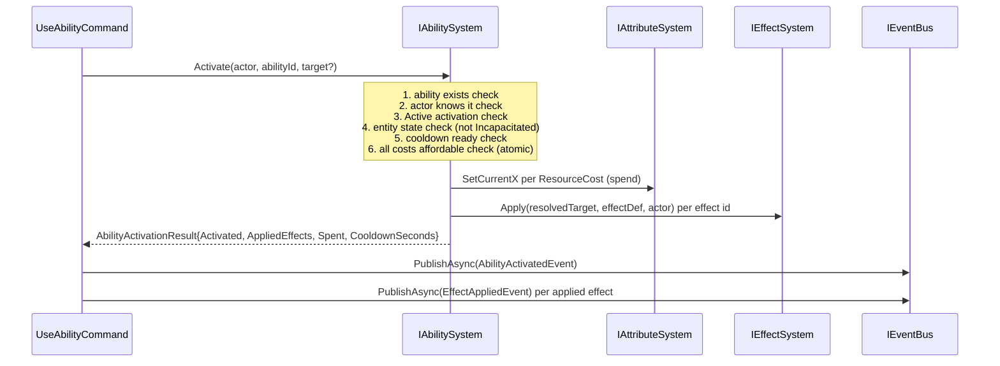

# Flow 24 — Ability activation

> [Back to flows index](README.md)

**Summary.** An initiator (admin `useability`, player `cast`, or a bare skill verb) invokes an ability. `IAbilitySystem.Activate` runs the full activation pipeline — entity state / cooldown / cost checks → spend costs → apply effects → set cooldown — then returns a structured result. The initiator publishes `AbilityActivatedEvent` and one `EffectAppliedEvent` per applied effect.

**Trigger.** Admin sends `useability <abilityId> [target]` (slice 11-a). Player sends `cast <spell> [target]` via `CastCommand` or a bare skill verb routed to `SkillInvocationCommand` (slice 11-b). Both player paths delegate to `AbilityInvocationPipeline`, which calls `Activate` with `resolveOffensiveExternally: true` and then calls `ICombatSystem.ResolveAbilityStrike` for offensive abilities (see [Flow 25](flow-25-skill-verb-invocation.md) and [Flow 26](flow-26-offensive-ability-opens-combat.md)).

**Steps.**

1. `UseAbilityCommand` receives input. It resolves the actor as the invoker's entity id, and the optional target as a character name or raw entity id (defaults to actor when omitted).
2. Calls `IAbilitySystem.Activate(actorEntityId, abilityId, targetEntityId?)`.
3. `AbilitySystem` validates in order:
   - Ability exists in `IAbilityRegistry`. Fails with `UnknownAbility`.
   - Actor's `AbilitiesComponent.Known` contains the ability id. Fails with `NotKnown`.
   - Definition's `Activation == Active`. Fails with `NotActivatable` for `Passive` or `Triggered`.
   - `IEntityStateService.IsInState(actor, Incapacitated)` is false. Fails with `StateBlocked`.
   - `AbilitiesComponent.CooldownRemaining[abilityId] == 0`. Fails with `OnCooldown`.
   - All `ResourceCost` entries are affordable (checked atomically before any spend). Fails with `InsufficientResources`.
4. On all checks passing:
   - Spends each cost via the appropriate `IAttributeSystem.SetCurrentX` setter (e.g. `SetCurrentStamina`, `SetCurrentMana`).
   - Sets `AbilitiesComponent.CooldownRemaining[abilityId] = definition.CooldownSeconds`.
   - For each effect id in `definition.Effects`, calls `IEffectSystem.Apply(resolvedTarget, effectDef, actor)`. `EffectSystem.Apply` returns the `Effect` record without storing it or mutating any pool for `Instant`-kind effects. `AbilitySystem` then calls `ApplyInstantMagnitude(resolvedTarget, effect.Params.TargetScore, effect.Power)` which routes to the appropriate `IAttributeSystem.SetCurrentX` setter — the pool mutation happens in `AbilitySystem`, not in `EffectSystem`.
5. Returns `AbilityActivationResult { Outcome = Activated, AbilityId, AppliedEffects, Spent, CooldownSeconds }`. On any validation failure, returns the appropriate non-`Activated` outcome with a `FailReason` string.
6. `UseAbilityCommand` checks `Outcome`. On non-`Activated`: writes the `FailReason` to output and returns. On `Activated`: publishes `AbilityActivatedEvent(actor, abilityId, targetEntityId?)` and one `EffectAppliedEvent(target, effect)` for each non-null effect in `AppliedEffects`.

**Why no `UseAbilityCommand` domain logic.** All validation, resource spending, cooldown mutation, and effect application happen inside `AbilitySystem`. The command is strictly an initiator — it resolves entities, calls the system, and publishes the past-tense events (INV-5, INV-8, INV-9).

**The `resolveOffensiveExternally` branch.** When `CastCommand` or `SkillInvocationCommand` invokes `Activate`, it passes `resolveOffensiveExternally: true` for offensive abilities. `AbilitySystem` skips raw HP deduction for the offensive damage effect and instead returns its raw magnitude as `AbilityActivationResult.OffensivePower`. The caller (`AbilityInvocationPipeline`) reads the ability's `Aspect` composition from `AbilityDefinition.Aspect` (an `AspectComposition?`) and passes it to `ICombatSystem.ResolveAbilityStrike`, which applies aspect affinity + resistance alongside defense mitigation — this is the same hit resolution as melee rounds, now aspect-typed. The resolved `AspectComposition` is carried in `AbilityStrikeResolvedEvent` as a point-in-time capture (INV-6). `UseAbilityCommand` (admin path) does not pass `resolveOffensiveExternally` and receives unmitigated, untyped damage.

**Cross-references.**
- [`Core/Modules/Abilities/Systems/AbilitySystem.cs`](../../../Core/Modules/Abilities/Systems/AbilitySystem.cs)
- [`Core/Modules/Abilities/Commands/UseAbilityCommand.cs`](../../../Core/Modules/Abilities/Commands/UseAbilityCommand.cs)
- [`Core/Modules/Abilities/Commands/AbilityInvocationPipeline.cs`](../../../Core/Modules/Abilities/Commands/AbilityInvocationPipeline.cs)
- [`Core/Modules/Abilities/Commands/CastCommand.cs`](../../../Core/Modules/Abilities/Commands/CastCommand.cs)
- [`docs/use-cases/ability-substrate.md`](../../use-cases/ability-substrate.md)
- [Flow 16](flow-16-heartbeat-tick.md) — heartbeat trigger (for `AbilityCooldownTickHandler`)
- [Flow 21](flow-21-effect-tick.md) — effect tick (downstream consumer of applied effects)
- [Flow 25](flow-25-skill-verb-invocation.md) — player skill bare-verb invocation (in combat)
- [Flow 26](flow-26-offensive-ability-opens-combat.md) — offensive ability opens combat
