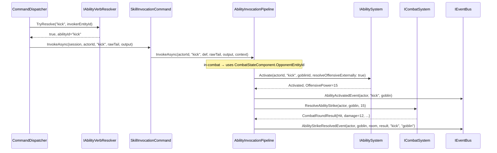

# Flow 25 — Skill Bare-Verb Invocation

> [Back to flows index](README.md)

**Summary.** A player types a skill id or prefix (e.g. `kick` or `ki`) while in combat. Because no command is registered under that verb, `CommandDispatcher` falls through to Phase 3 (`IAbilityVerbResolver`). On a unique Active Skill match the dispatcher routes to `SkillInvocationCommand`, which delegates the full invocation pipeline to `AbilityInvocationPipeline`.

**Trigger.** Player sends a line whose verb matches no registered command but prefix-matches exactly one of the player's known Active Skill ids (e.g. `kick`, `ki`).

**Steps.**

1. `CommandDispatcher` — Phase 1 (exact) and Phase 2 (prefix) both miss for `"kick"`.
2. Phase 3: calls `IAbilityVerbResolver.TryResolve("kick", actorId)` → returns `true`, `abilityId = "kick"`.
3. Dispatcher calls `SkillInvocationCommand.InvokeAsync(session, actorId, "kick", rawTail, output)`.
4. `SkillInvocationCommand` looks up the ability definition in `IAbilityRegistry`; on miss logs error and returns. On hit, delegates to `AbilityInvocationPipeline.InvokeAsync`.
5. `AbilityInvocationPipeline` calls `IAbilitySystem.IsOffensive("kick")` → `true`.
6. **Target resolution**: actor is already `InCombat` and no explicit token → reads `CombatStateComponent.OpponentEntityId` → `goblinId`.
7. Actor is already `InCombat` → combat-entry step is skipped.
8. Calls `IAbilitySystem.Activate(actorId, "kick", goblinId, resolveOffensiveExternally: true)` — validates, spends 10 Stamina, sets cooldown 6s, skips the raw HP deduction for `kick_damage`, returns `OffensivePower = 15`.
9. Publishes `AbilityActivatedEvent(actorId, "kick", goblinId)` — `AbilityInvocationHandler` checks `IsOffensive` → skips (offensive ability narrative is owned by `AbilityStrikeHandler`).
10. Calls `ICombatSystem.ResolveAbilityStrike(actorId, goblinId, 15)` — applies defense mitigation, deducts HP, returns `CombatRoundResult`.
11. Publishes `AbilityStrikeResolvedEvent(attacker, goblin, room, result, "kick", "goblin")` — `AbilityStrikeHandler` renders `"You kick goblin for 12 damage."` to attacker, broadcasts to room, and conditionally publishes `CombatEndedEvent` if outcome is terminal.

**Why `SkillInvocationCommand` is not an `ICommand`.** Phase 3 resolution is a dispatcher-internal routing decision: the player typed a raw verb that happens to be a skill id, not a recognized command. Making this discoverable via `help`/`commands` would confuse players into thinking `kick` is a command verb — it isn't; it's an ability id. The three discoverable ability commands (`skills`, `spells`, `abilities`) and `cast` are the player-facing surface.

**Cross-references.**
- [Flow 17](flow-17-kill-mob-combat-initiation.md) — `kill <mob>` opens combat, no opening strike
- [Flow 18](flow-18-combat-round-pulse.md) — heartbeat tick drives subsequent rounds
- [Flow 24](flow-24-ability-activation.md) — `Activate` chain detail
- [Flow 26](flow-26-offensive-ability-opens-combat.md) — offensive ability that opens combat
- [`Core/Modules/Abilities/Commands/SkillInvocationCommand.cs`](../../../../Core/Modules/Abilities/Commands/SkillInvocationCommand.cs)
- [`Core/Modules/Abilities/Commands/AbilityInvocationPipeline.cs`](../../../../Core/Modules/Abilities/Commands/AbilityInvocationPipeline.cs)
- [`Core/Modules/Abilities/AbilityVerbResolver.cs`](../../../../Core/Modules/Abilities/AbilityVerbResolver.cs)
