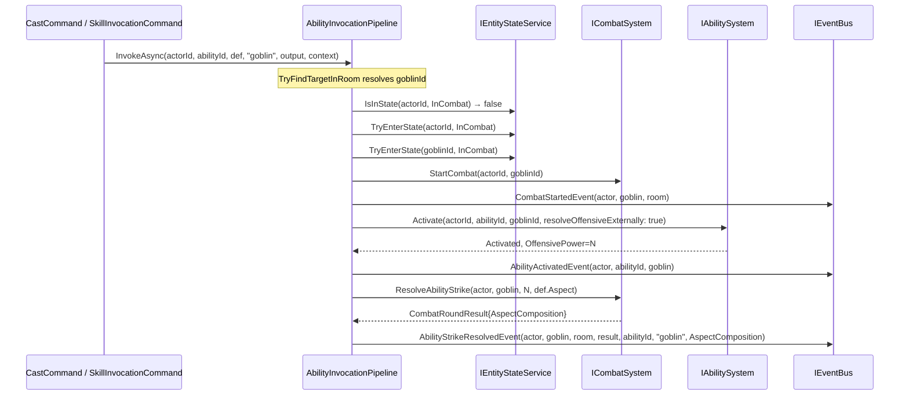

# Flow 26 — Offensive Ability Opens Combat

> [Back to flows index](README.md)

**Summary.** A player not currently in combat uses an offensive ability against a mob (e.g. `cast firebolt goblin` or `kick goblin`). The invocation pipeline detects that the actor is not `InCombat`, enters both participants into combat state, starts combat, fires the `CombatStartedEvent`, then proceeds with the ability activation and strike.

**Trigger.** Player sends `cast <offensive-spell> <mob>` or a skill verb with an explicit target token while not in combat.

**Steps.**

1. `CastCommand` resolves the spell id via `KnownSpellResolver`, or `CommandDispatcher` Phase 3 routes `SkillInvocationCommand` for a skill verb. Both delegate to `AbilityInvocationPipeline.InvokeAsync`.
2. **Target resolution**: explicit target token `"goblin"` → `ICombatSystem.TryFindTargetInRoom(roomId, "goblin")` → `goblinId`. If not found, writes "You don't see that here." and returns.
3. `IAbilitySystem.IsOffensive(abilityId)` → `true` + actor is not `InCombat` → enter combat-entry path:
   a. `IEntityStateService.TryEnterState(actorId, InCombat)` — on block: write `failReason`, abort pipeline.
   b. `IEntityStateService.TryEnterState(goblinId, InCombat)` — mobs never reject; logs warning if they do and proceeds.
   c. `ICombatSystem.StartCombat(actorId, goblinId)` — attaches `CombatStateComponent` on both.
   d. Publish `CombatStartedEvent(actorId, goblinId, roomId)` → `CombatHandler` renders `"You attack goblin!"` to attacker; broadcasts to room.
4. `IAbilitySystem.Activate(actorId, abilityId, goblinId, resolveOffensiveExternally: true)` — full activation pipeline: validates, spends costs, sets cooldown, skips raw damage effect, returns `OffensivePower`.
5. Publish `AbilityActivatedEvent` — `AbilityInvocationHandler` skips because ability is offensive.
6. `ICombatSystem.ResolveAbilityStrike(actorId, goblinId, OffensivePower, def.Aspect)` — aspect-resolved, defense-mitigated damage applied to goblin. `def.Aspect` is the ability's `AspectComposition?`; `CombatSystem` passes it through `IAspectSystem.Resolve`, applying the attacker's affinity boost and the defender's per-aspect resistance. `CombatRoundResult.AspectComposition` is set to the resolved composition (null if the ability carries none — point-in-time capture, INV-6).
7. Publish `AbilityStrikeResolvedEvent` carrying `AspectComposition` from the result (point-in-time capture, INV-6). `AbilityStrikeHandler` renders fused narrative (ability + damage), and if outcome is terminal (`MobDied` / `PlayerIncapacitated`) also publishes `CombatEndedEvent`.
8. On subsequent heartbeat ticks, `CombatTickHandler` drives standard melee rounds (Flow 18).

**Invariants.**
- Combat entry happens before `Activate` — if either `TryEnterState` fails for the actor, the pipeline aborts without spending costs or setting a cooldown (INV-5: no side effects on failure path).
- `ResolveAbilityStrike` is called only when `isOffensive && OffensivePower.HasValue` — non-offensive spells skip steps 3 (combat entry) and 6–7 entirely.

**Cross-references.**
- [Flow 17](flow-17-kill-mob-combat-initiation.md) — `kill` opens combat without any opening strike
- [Flow 18](flow-18-combat-round-pulse.md) — heartbeat tick drives subsequent melee rounds after combat is open
- [Flow 24](flow-24-ability-activation.md) — `Activate` chain detail and `resolveOffensiveExternally` branch
- [Flow 25](flow-25-skill-verb-invocation.md) — same pipeline, actor already in combat (skips step 3)
- [`Core/Modules/Abilities/Commands/AbilityInvocationPipeline.cs`](../../../../Core/Modules/Abilities/Commands/AbilityInvocationPipeline.cs)
- [`Core/Modules/Abilities/Commands/CastCommand.cs`](../../../../Core/Modules/Abilities/Commands/CastCommand.cs)
