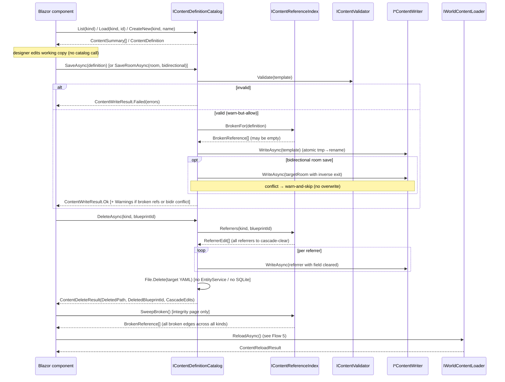
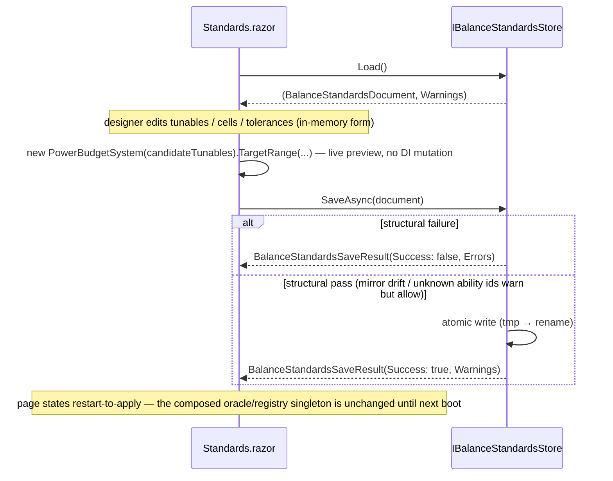
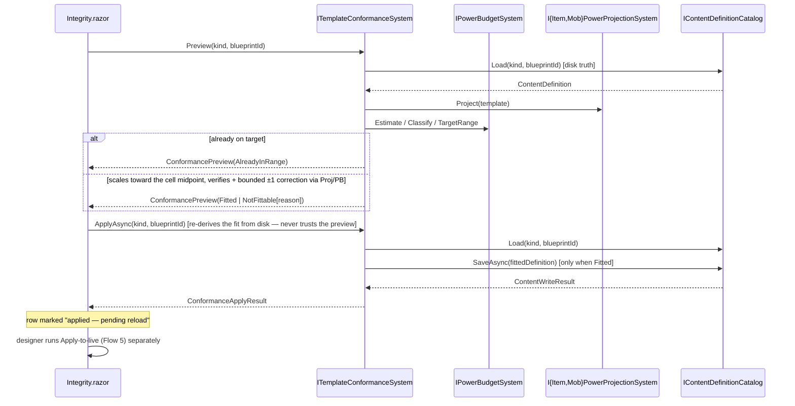

# Content-Tooling Journey (bulk generate · offline edit)

> [Back to flows index](README.md)

**Source:** [`../../features/admin-authoring/admin-authoring.md`](../../features/admin-authoring/admin-authoring.md)

**Summary.** Three offline authoring paths share the loopback `Hedron.Web` host (two share the same content-definition layer). (A) The **`generate` run-mode** is a headless CLI sweep: compose DI without gameplay hosted services, run `IContentGenerationSystem.GenerateAsync(profile)`, validate each emitted definition via `IContentValidator`, print counts, and exit. (B) The **offline Blazor editor** browses/loads/edits/saves definitions via `IContentDefinitionCatalog` and applies them to the live world via `IWorldContentLoader.ReloadAsync`. (B2) The **Standards page** (sim-1) edits the balance-standards document via `IBalanceStandardsStore` — a single criteria file deliberately outside the catalog (seed OQ1), with no `reload` leg (restart-to-apply instead). (B3) The **Integrity page's conformance fitter** (sim-5) closes the observation→correction loop: it scales a flagged template's stat vector into its target (Tier, Band) range and writes it through the same `SaveAsync` path as B. No path mutates the live world directly (INV-12/23).

---

## A — `generate` run-mode (headless CLI)

**Trigger:** `dotnet run --project Server -- generate --profile <path> [--seed N]`

```mermaid
sequenceDiagram
    participant CLI as Program.Main
    participant RM as GenerationRunMode
    participant Gen as IContentGenerationSystem
    participant W as I*ContentWriter (×4)
    participant V as IContentValidator

    CLI->>RM: Matches(args) → RunAsync(args, config)
    RM->>RM: parse --profile/--seed; deserialize GenerationProfile
    RM->>RM: CompositionRoot.Register (no gameplay hosted services)
    RM->>Gen: GenerateAsync(profile)
    Gen->>Gen: seed SeededRandom(profile.Seed); compose areas→rooms→mobs/items
    Gen->>W: WriteAsync(template) per kind (atomic tmp→rename)
    Gen-->>RM: GenerationResult
    RM->>V: Validate(template) per emitted definition
    V-->>RM: ValidationReport
    RM->>CLI: print summary; return 0 / non-zero
```

**Steps.**
1. `Program.Main` detects the `generate` token and branches before building the listener host. `--profile` is required; missing → exit 2.
2. `GenerationRunMode` deserializes the profile YAML into `GenerationProfile`. Invalid file/values → exit 2.
3. DI is composed via `CompositionRoot.Register` without `AddGameplayHostedServices` — no telnet, no heartbeat, no world-content entity spawn (INV-12/23).
4. `IContentGenerationSystem.GenerateAsync(profile)` seeds `SeededRandom(profile.Seed)`, composes connected area/room/mob/item graphs (rooms wired east/west per area; areas joined up/down), calls each `I*ContentWriter.WriteAsync` atomically. Blueprint ids are `prefix + per-kind counter`, never `Guid` (INV-26). Returns `GenerationResult`; never publishes (INV-5).
5. The run-mode validates each emitted definition via `IContentValidator.Validate` (single-definition, in-memory — no live entities).
6. Prints counts + first 10 blueprint ids + validation result; returns `0` (clean) or non-zero (validation/write failure).

---

## B — Offline Blazor editor (`Hedron.Web`)

**Trigger:** Designer opens the loopback Blazor app.



**Steps.**
1. Page calls `IContentDefinitionCatalog.List(kind)` and renders the definition table.
2. Page calls `Load(kind, blueprintId)` or `CreateNew(kind, name)`. No live entity created.
3. Designer edits form fields; form holds a working copy (no catalog call yet).
4. On save: `SaveAsync(definition)` (or `SaveRoomAsync(room, bidirectional)` for rooms) validates,
   then writes YAML via `I*ContentWriter`. The live world is untouched. Invalid definitions block
   the write and return structured errors. Cross-reference misses are non-blocking: the file is still
   written, and `ContentWriteResult.Warnings` lists the dangling refs (warn-but-allow; INV-19).
   With `bidirectional: true`, the catalog also writes the inverse exit on each target room; if a
   target already has a *different* exit in the inverse direction, that paired write is skipped and
   a warning is added (warn-and-skip; no silent overwrite).
5. On delete: `DeleteAsync(kind, blueprintId)` queries `IContentReferenceIndex.Referrers` for every
   definition pointing at the target, rewrites each via the matching writer (clearing the dangling
   field), then calls `File.Delete` on the target YAML. **YAML-file-only — no `EntityService`,
   no SQLite delete, no live-world mutation (INV-22/23).** Returns `ContentDeleteResult` with the
   deleted path and each cascade edit; the UI renders a summary.
6. Integrity page: calls `IContentReferenceIndex.SweepBroken()` directly (injected as
   `IContentReferenceIndex`). Returns every broken edge across all kinds; UI tabulates them with
   edit links back to each offending definition's editor.
7. "Apply to live": page calls `IWorldContentLoader.ReloadAsync()` — [Flow 5](flow-05-content-reload.md).
   Counts rendered. No live entities mutated.

The `Hedron.Web` host runs `AddContentBootstrapHostedServices` only (content load + registry validation; no telnet/heartbeat/persistence). Loopback-only for v1.

---

## B2 — Standards page (`/standards`, sim-1)

**Trigger:** Designer opens `/standards` in `Hedron.Web`.

Distinct from the catalog-backed editors above: the balance-standards document is a single
criteria file outside `IContentDefinitionCatalog` (seed OQ1 — no blueprint id, no delete-cascade)
and outside the compiled-rows `DefinitionRegistry` construction. No `reload` leg — edits apply on
the next host start (restart-to-apply), stated on the page.



**Steps.**
1. Page calls `IBalanceStandardsStore.Load()` on init — the same store the boot-time DI factory
   uses (Flow 1, step 2), so the page always reflects on-disk truth, not the frozen boot-time
   singleton.
2. Designer edits tunables (weights, band span, reference base scores, tracked scores), per-cell
   reference builds (gear bonuses, ability kit) and their "authored" flag, global/per-cell outcome
   tolerances, and the band-drift tolerance — all in an in-memory form.
3. The page previews derived `TargetRange` per cell live by constructing a throwaway
   `PowerBudgetSystem` over the candidate tunables — never touching the DI-composed oracle.
4. On save: `SaveAsync(document)` re-validates. Structural failure (unknown score id,
   out-of-range/duplicate cell, `BandSpan` calibration violation, negative tolerance) refuses the
   write and returns errors — no partial file. A structural pass always writes atomically
   (tmp → rename), even when mirror-drift or unknown-ability-kit warnings are present
   (warn-but-allow).
5. The page renders errors distinctly from warnings and shows the restart-to-apply notice.

---

## B3 — Conformance fitter (Integrity page, sim-5)

**Trigger:** Designer clicks **Preview fit** / **Apply** (or the bulk **Preview all flagged** / **Apply all flagged**) on a drifted row of the Integrity page's power-balance table.



**Steps.**
1. Designer clicks **Preview fit** on a row the audit sweep flagged (or **Preview all flagged**, which loops this same call over every flagged entry). The page calls `ITemplateConformanceSystem.Preview(kind, blueprintId)` (or `PreviewFlagged()`).
2. The fitter loads the template **from disk** via `IContentDefinitionCatalog.Load` — never the audit's boot-time registry — projects it, and classifies its current power. Already on target → `AlreadyInRange`, no further work.
3. Otherwise it computes a closed-form uniform scale factor toward the target cell's midpoint (the oracle's `Estimate`/`Classify`/`TargetRange` are the only source of target math), rounds per field, and verifies/corrects via the real projection seam — `Fitted` with a field-by-field diff, or `NotFittable` with a reason.
4. The page renders the preview inline under the row: status, power/cell before→after, per-field diff.
5. Designer clicks **Apply** (or **Apply all flagged**). The page calls `ApplyAsync`/`ApplyFlaggedAsync`, which **re-derives the fit from disk** (idempotent — a stale preview is never trusted) and, for a `Fitted` outcome, calls `IContentDefinitionCatalog.SaveAsync` — the identical validate-then-write, warn-but-allow path Flow B's editor save uses. `AlreadyInRange`/`NotFittable` write nothing.
6. The row is marked **applied — pending reload**; the audit table itself does not refresh (it still reflects the boot-time registry) until the designer runs the existing **Apply to live** page ([Flow 5](flow-05-content-reload.md)) — the same restart/reload-to-apply model as B2.

No event is published anywhere in this leg (INV-5) — the fitter and the catalog are domain systems that return results; the Blazor page is the initiating surface and consumes them directly.

---

## Invariants

- INV-5: `IContentGenerationSystem`, `IContentDefinitionCatalog`, and `IContentReferenceIndex` return results; they never touch the event bus.
- INV-8: no authoring logic in the run-mode CLI or Blazor components — everything lives in the Core systems.
- INV-10: the `generate` run-mode is a no-chain Initiator: composes, runs one operation, writes files, exits; publishes nothing.
- INV-12 / INV-23: YAML only — no `EntityService.CreateEntity`, no `PersistentEntity`, no SQLite in either path. **`DeleteAsync` is YAML-file-only**: it calls `File.Delete` + `I*ContentWriter` rewrites and never invokes `EntityService.DestroyEntity`, no SQLite delete, and no live-world mutation.
- INV-19: the four cross-definition reference edges (room→area, exit→room, item→spawnRoom, mob→spawnRoom, area→room) are declared once in `IContentReferenceIndex`'s edge set and drive all four consumers (delete-cascade, save-warn, integrity sweep, filter-association) without per-edge code paths.
- INV-26: all randomness in `ContentGenerationSystem` flows through `SeededRandom`; blueprint ids are counter-derived; no wall clock read. Fixed-seed run is byte-reproducible.
- **Warn-but-allow:** a `SaveAsync`/`SaveRoomAsync` result with `Success = true` may carry a non-empty `Warnings` list — these are cross-reference notices, not errors; the file was still written. Structural failures are still `Success = false` / no write.
- **Bidirectional warn-and-skip:** when `SaveRoomAsync(bidirectional: true)` encounters a target room that already has a *different* exit in the inverse direction, that paired write is skipped and a warning is added. The source room's own file is always written. No silent overwrite.
- **B2 refuse-vs-warn (sim-1):** `IBalanceStandardsStore.SaveAsync` mirrors the same posture at the document level — structural failure refuses the write entirely (`Success = false`, no file), never a partial file; mirror-drift and unknown-ability-kit notices warn but allow the write.

## Cross-references

- Systems: [`../../reference/systems.md`](../../reference/systems.md) — `IContentGenerationSystem`, `IContentDefinitionCatalog`, `IContentValidator`, the four `I*ContentWriter`s, `IBalanceStandardsStore`/`IBalanceStandardsRegistry`.
- Feature: [`../../features/admin-authoring/content-tooling.md`](../../features/admin-authoring/content-tooling.md) · [`../../features/admin-authoring/content-authoring.md`](../../features/admin-authoring/content-authoring.md) · [`../../features/progression/power-budget-system.md`](../../features/progression/power-budget-system.md) (the standards registry the B2 leg edits).
- Related flow: [Flow 5 — content reload](flow-05-content-reload.md) (the apply leg the Blazor editor reuses) · [Flow 1 — server startup](flow-01-server-startup.md) (where a B2 save takes effect on next boot) · [Flow 33 — simulation run journey](flow-33-simulation-run.md) editor leg (sim-3) — a second content-tooling journey carrying an editor-surface trigger alongside its headless run-mode, mirroring this flow's own CLI/editor duality.
