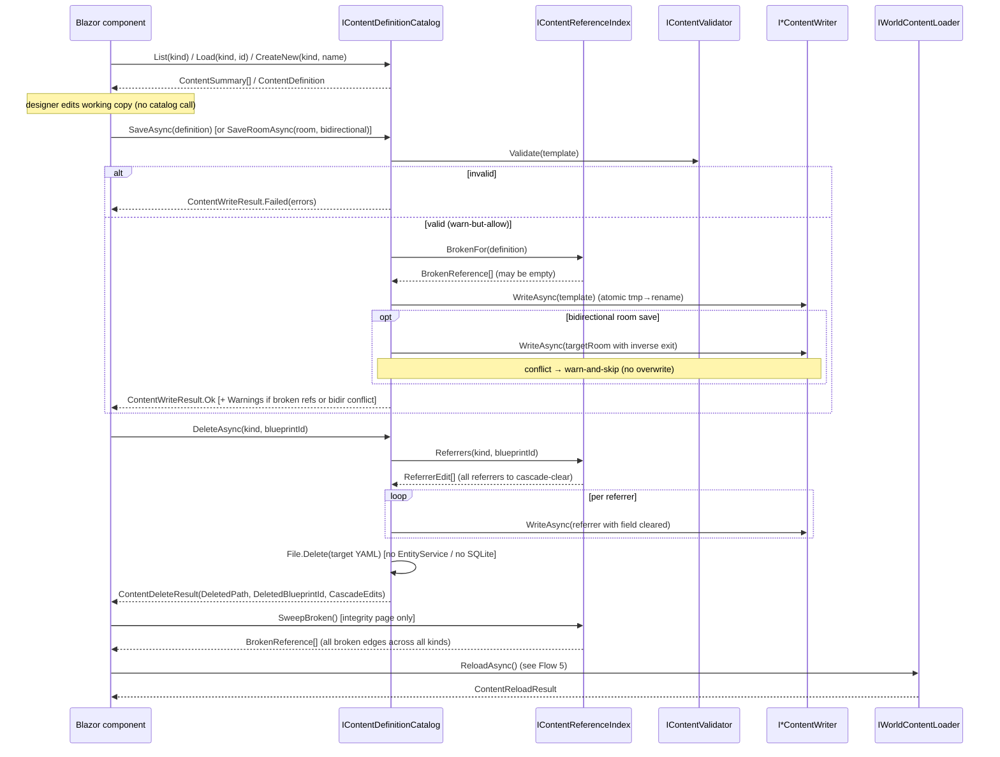

# Content-Tooling Journey (bulk generate · offline edit)

> [Back to flows index](README.md)

**Source:** [`../../features/admin-authoring/admin-authoring.md`](../../features/admin-authoring/admin-authoring.md)

**Summary.** Two offline authoring paths share the same content-definition layer. (A) The **`generate` run-mode** is a headless CLI sweep: compose DI without gameplay hosted services, run `IContentGenerationSystem.GenerateAsync(profile)`, validate each emitted definition via `IContentValidator`, print counts, and exit. (B) The **offline Blazor editor** (`Hedron.Web`) browses/loads/edits/saves definitions via `IContentDefinitionCatalog` and applies them to the live world via `IWorldContentLoader.ReloadAsync`. Neither path mutates the live world directly (INV-12/23).

---

## A — `generate` run-mode (headless CLI)

**Trigger:** `dotnet run --project Server -- generate --profile <path> [--seed N]`

```mermaid
sequenceDiagram
    participant CLI as Program.Main
    participant RM as GenerationRunMode
    participant Gen as IContentGenerationSystem
    participant W as I*ContentWriter (×4)
    participant V as IContentValidator

    CLI->>RM: Matches(args) → RunAsync(args, config)
    RM->>RM: parse --profile/--seed; deserialize GenerationProfile
    RM->>RM: CompositionRoot.Register (no gameplay hosted services)
    RM->>Gen: GenerateAsync(profile)
    Gen->>Gen: seed SeededRandom(profile.Seed); compose areas→rooms→mobs/items
    Gen->>W: WriteAsync(template) per kind (atomic tmp→rename)
    Gen-->>RM: GenerationResult
    RM->>V: Validate(template) per emitted definition
    V-->>RM: ValidationReport
    RM->>CLI: print summary; return 0 / non-zero
```

**Steps.**
1. `Program.Main` detects the `generate` token and branches before building the listener host. `--profile` is required; missing → exit 2.
2. `GenerationRunMode` deserializes the profile YAML into `GenerationProfile`. Invalid file/values → exit 2.
3. DI is composed via `CompositionRoot.Register` without `AddGameplayHostedServices` — no telnet, no heartbeat, no world-content entity spawn (INV-12/23).
4. `IContentGenerationSystem.GenerateAsync(profile)` seeds `SeededRandom(profile.Seed)`, composes connected area/room/mob/item graphs (rooms wired east/west per area; areas joined up/down), calls each `I*ContentWriter.WriteAsync` atomically. Blueprint ids are `prefix + per-kind counter`, never `Guid` (INV-26). Returns `GenerationResult`; never publishes (INV-5).
5. The run-mode validates each emitted definition via `IContentValidator.Validate` (single-definition, in-memory — no live entities).
6. Prints counts + first 10 blueprint ids + validation result; returns `0` (clean) or non-zero (validation/write failure).

---

## B — Offline Blazor editor (`Hedron.Web`)

**Trigger:** Designer opens the loopback Blazor app.



**Steps.**
1. Page calls `IContentDefinitionCatalog.List(kind)` and renders the definition table.
2. Page calls `Load(kind, blueprintId)` or `CreateNew(kind, name)`. No live entity created.
3. Designer edits form fields; form holds a working copy (no catalog call yet).
4. On save: `SaveAsync(definition)` (or `SaveRoomAsync(room, bidirectional)` for rooms) validates,
   then writes YAML via `I*ContentWriter`. The live world is untouched. Invalid definitions block
   the write and return structured errors. Cross-reference misses are non-blocking: the file is still
   written, and `ContentWriteResult.Warnings` lists the dangling refs (warn-but-allow; INV-19).
   With `bidirectional: true`, the catalog also writes the inverse exit on each target room; if a
   target already has a *different* exit in the inverse direction, that paired write is skipped and
   a warning is added (warn-and-skip; no silent overwrite).
5. On delete: `DeleteAsync(kind, blueprintId)` queries `IContentReferenceIndex.Referrers` for every
   definition pointing at the target, rewrites each via the matching writer (clearing the dangling
   field), then calls `File.Delete` on the target YAML. **YAML-file-only — no `EntityService`,
   no SQLite delete, no live-world mutation (INV-22/23).** Returns `ContentDeleteResult` with the
   deleted path and each cascade edit; the UI renders a summary.
6. Integrity page: calls `IContentReferenceIndex.SweepBroken()` directly (injected as
   `IContentReferenceIndex`). Returns every broken edge across all kinds; UI tabulates them with
   edit links back to each offending definition's editor.
7. "Apply to live": page calls `IWorldContentLoader.ReloadAsync()` — [Flow 5](flow-05-content-reload.md).
   Counts rendered. No live entities mutated.

The `Hedron.Web` host runs `AddContentBootstrapHostedServices` only (content load + registry validation; no telnet/heartbeat/persistence). Loopback-only for v1.

---

## Invariants

- INV-5: `IContentGenerationSystem`, `IContentDefinitionCatalog`, and `IContentReferenceIndex` return results; they never touch the event bus.
- INV-8: no authoring logic in the run-mode CLI or Blazor components — everything lives in the Core systems.
- INV-10: the `generate` run-mode is a no-chain Initiator: composes, runs one operation, writes files, exits; publishes nothing.
- INV-12 / INV-23: YAML only — no `EntityService.CreateEntity`, no `PersistentEntity`, no SQLite in either path. **`DeleteAsync` is YAML-file-only**: it calls `File.Delete` + `I*ContentWriter` rewrites and never invokes `EntityService.DestroyEntity`, no SQLite delete, and no live-world mutation.
- INV-19: the four cross-definition reference edges (room→area, exit→room, item→spawnRoom, mob→spawnRoom, area→room) are declared once in `IContentReferenceIndex`'s edge set and drive all four consumers (delete-cascade, save-warn, integrity sweep, filter-association) without per-edge code paths.
- INV-26: all randomness in `ContentGenerationSystem` flows through `SeededRandom`; blueprint ids are counter-derived; no wall clock read. Fixed-seed run is byte-reproducible.
- **Warn-but-allow:** a `SaveAsync`/`SaveRoomAsync` result with `Success = true` may carry a non-empty `Warnings` list — these are cross-reference notices, not errors; the file was still written. Structural failures are still `Success = false` / no write.
- **Bidirectional warn-and-skip:** when `SaveRoomAsync(bidirectional: true)` encounters a target room that already has a *different* exit in the inverse direction, that paired write is skipped and a warning is added. The source room's own file is always written. No silent overwrite.

## Cross-references

- Systems: [`../../reference/systems.md`](../../reference/systems.md) — `IContentGenerationSystem`, `IContentDefinitionCatalog`, `IContentValidator`, the four `I*ContentWriter`s.
- Feature: [`../../features/admin-authoring/content-tooling.md`](../../features/admin-authoring/content-tooling.md) · [`../../features/admin-authoring/content-authoring.md`](../../features/admin-authoring/content-authoring.md).
- Related flow: [Flow 5 — content reload](flow-05-content-reload.md) (the apply leg the Blazor editor reuses).
