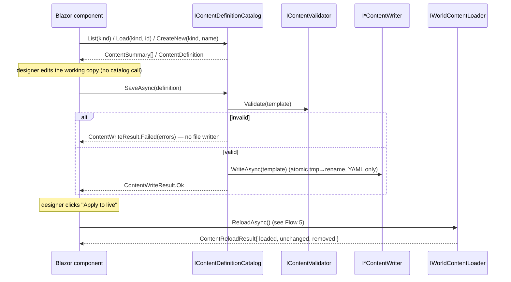

# Flow 30 — Offline content edit → save → apply (`Hedron.Web`)

> [Back to flows index](README.md)

**Trigger:** Designer opens the loopback Blazor authoring app and edits/creates an area or room.
**Actor:** Content designer / Administrator (offline, at a localhost browser).
**Modules:** `Hedron.Web/` (Blazor Server host + components), `Core/Modules/Authoring/` (`IContentDefinitionCatalog`), reuses `IContentValidator`, the `I*ContentWriter` family, and the `reload` Initiator.

## Summary

The offline Blazor editor reads, lists, loads, edits, validates, and writes the YAML content
definitions — and **never mutates the live world directly**. Every read/list/load/save call is a
thin pass-through to `IContentDefinitionCatalog`; no authoring logic lives in a Blazor component
(the fat-component analogue of a fat command, INV-8 extended). The "Apply to live" action is a thin
Initiator that calls `IWorldContentLoader.ReloadAsync()` and renders the counts — it reuses
[Flow 5 (content reload)](flow-05-content-reload.md) as its apply leg rather than redefining it. The
host runs **bootstraps only** (content load + registry validation); there is no heartbeat, no telnet
listener, and no SQLite. Authoring is entirely off the tick (INV-12 preserved).

## Sequence

## Steps

1. **Browse.** The browser page calls `IContentDefinitionCatalog.List(kind)` for the selected kind
   (one of area/room/item/mob) and renders the table (id | name | short-desc). Items and mobs are
   list/read-only in this release; areas and rooms link into their editors.
2. **Load / create.** The editor page calls `Load(kind, blueprintId)` (existing) or `CreateNew(kind, name)`
   (new, ad-hoc id) and binds the returned `ContentDefinition`'s template to the form.
3. **Edit.** The designer mutates fields in the Blazor form (name, description, exits, aspect
   affinities, etc.). No catalog call yet — the form holds a working copy of the template.
4. **Save (validate-then-write).** On save, the page calls `SaveAsync(definition)`. The catalog runs
   `IContentValidator.Validate(...)` against the working copy; on failure it returns a failed
   `ContentWriteResult` carrying the errors (rendered inline) and **writes no file**. On success it
   writes YAML through the matching `I*ContentWriter` (atomic tmp → rename). The live world is untouched.
5. **Apply to live.** The "Apply" page calls `IWorldContentLoader.ReloadAsync()` — the existing reload
   path ([Flow 5](flow-05-content-reload.md)). New templates are seeded into this host's preview world;
   existing live entities are not mutated. The page renders the `ContentReloadResult` counts.

**File-only limitation.** The reload re-derives world content from YAML **within the authoring
host's process** — a preview/validation world with no heartbeat. It does not push to a separately
running game server; that remains a separate reload/restart there. Cross-process live edit is deferred.

## Invariants

- INV-5: `IContentDefinitionCatalog` and `IContentValidator` return results; they never touch the
  event bus. Only the apply step reaches the reload path, whose Initiator owns publishing.
- INV-8 (extended to the new surface): Blazor components are thin — all read/list/load/validate/write
  logic lives in the catalog/validator; the apply action is a thin Initiator over `ReloadAsync`.
- INV-12 / INV-23: the editor writes YAML only — no `EntityService.CreateEntity`, no `PersistentEntity`,
  no `SaveEntityAsync`, no SQLite. The only live-world touch is the additive `reload`.
- INV-19: the new authoring surface obligates the callable `IContentValidator` and the split
  hosted-service registration (`AddContentBootstrapHostedServices`); both are satisfied.

## Cross-references

- Systems: `IContentDefinitionCatalog` ([`../../reference/systems.md`](../../reference/systems.md)),
  `IContentValidator`, the four `I*ContentWriter`s, `IWorldContentLoader`.
- Host: `Hedron.Web/Program.cs`; composition in `Server/CompositionRoot.AddContentBootstrapHostedServices`.
- Use case: [`../../implementation-plans/content-authoring-editor.md`](../../implementation-plans/content-authoring-editor.md).
- Related flows: [Flow 5 — content reload](flow-05-content-reload.md) (the apply leg, reused),
  [Flow 27 — admin area creation](flow-27-admin-area-creation.md) (the writer half this reuses).
