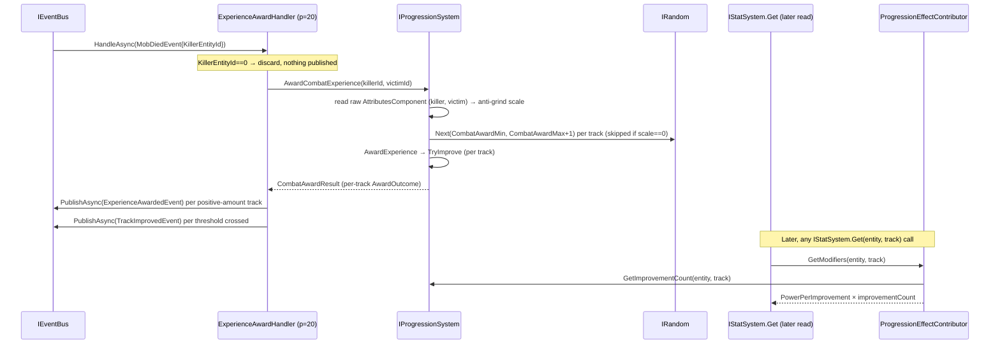

# Progression journey (combat XP award · threshold improve · contribute-on-read)

> [Back to flows index](README.md). **Trigger:** `MobDiedEvent` fires (a player kills a mob).

## Summary

`ExperienceAwardHandler` is one of three independent `MobDiedEvent` subscribers (see [flow-20](flow-20-mob-death-respawn.md)) — it reads the still-live mob to resolve the killer's combat XP award. `IProgressionSystem.AwardCombatExperience` computes a killer-vs-victim anti-grind scale from a **raw-attribute** `PowerSnapshot` (`Mind`/`Body`/`Spirit`/`Attunement` straight off `AttributesComponent`, never `IStatSystem` — see the [progression-system design doc](../../features/progression/progression-system.md#anti-grind-proxy-reads-raw-attributes) for why) run through `IPowerBudgetSystem.Estimate` (the core-tier oracle shipped slice `prog-3`; see [power-budget-system.md](../../features/progression/power-budget-system.md)), rolls a randomized per-track base amount via the injected `IRandom`, scales it, and awards each of the slice-1 combat tracks (`Body`, `HpMax`) through `AwardExperience` → threshold-check → `TryImprove`. The handler then publishes `ExperienceAwardedEvent` per positive-amount track and `TrackImprovedEvent` per threshold crossed. The power step from any improved track is never stored — it is pulled on read by `ProgressionEffectContributor` (an `IEffectContributor` registrant) the next time `IStatSystem.Get` is called for that score, e.g. from `score`, combat, or the `progress` inspector.

## Steps

1. `ExperienceAwardHandler` (priority 20) receives `MobDiedEvent`. `KillerEntityId == 0` → return (no award, no event).
2. `IProgressionSystem.AwardCombatExperience(killerEntityId, victimEntityId)`: builds a raw-attribute `PowerSnapshot` for each combatant (`Mind`/`Body`/`Spirit`/`Attunement` off `AttributesComponent`, not effect-folded — see the design doc) and calls `IPowerBudgetSystem.Estimate(snapshot)` (no tier — raw attributes only, no DI cycle) for each combatant's power, computes `scale = ratio < AntiGrindFloorRatio ? 0 : min(ratio, AntiGrindCap)` (the ratio is unchanged by the rewire — scale-invariant under the shared weight table), then for each of `ProgressionConstants.CombatTracks` (`Body`, `HpMax`): if `scale > 0`, draws a base amount via `IRandom.Next(CombatAwardMin, CombatAwardMax+1)` and scales it; if `scale == 0`, the amount is `0` with no draw.
3. Each track's scaled amount flows through `AwardExperience` → `TryImprove`: adds to cumulative XP (no-op if ≤ 0), then loops while cumulative XP ≥ the next cumulative threshold (`ThresholdBase + improvementCount × ThresholdIncrement`), incrementing the improvement count once per crossing — a single large award can cross several thresholds in one call.
4. The handler publishes one `ExperienceAwardedEvent(entityId, track, amount, XpSource.CombatKill)` per track with a positive amount, and one `TrackImprovedEvent(entityId, track, newImprovementCount)` per threshold crossed.
5. Nothing is stored beyond `ProgressionComponent`'s XP/improvement counters. The next time anything calls `IStatSystem.Get(entity, track)`, `EffectSystem.GetModifiers` sums the DI-collected `IEffectContributor`s, including `ProgressionEffectContributor`, which returns `PowerPerImprovement × improvementCount(track)` pulled fresh from `IProgressionSystem` — the INV-24 contribute-on-read fold, same pattern as equipment and ability contributors.

## Where to look

- [`Core/Modules/Progression/Handlers/ExperienceAwardHandler.cs`](../../../Core/Modules/Progression/Handlers/ExperienceAwardHandler.cs) — the entry point.
- [`Core/Modules/Progression/Systems/ProgressionSystem.cs`](../../../Core/Modules/Progression/Systems/ProgressionSystem.cs) · [`Core/Modules/Progression/ProgressionEffectContributor.cs`](../../../Core/Modules/Progression/ProgressionEffectContributor.cs) · [`Core/Modules/Progression/ProgressionConstants.cs`](../../../Core/Modules/Progression/ProgressionConstants.cs)
- [`Core/Systems/IPowerBudgetSystem.cs`](../../../Core/Systems/IPowerBudgetSystem.cs) · [`Core/Systems/PowerBudgetConstants.cs`](../../../Core/Systems/PowerBudgetConstants.cs) — the core-tier power oracle the anti-grind proxy is rewired onto (slice `prog-3`).
- [`../../features/progression/progression.md`](../../features/progression/progression.md) — the feature; [`progression-system.md`](../../features/progression/progression-system.md) for the system internals.
- [flow-20](flow-20-mob-death-respawn.md) — the mob-death fan-out this handler is one of three subscribers of.
- [flow-32](flow-32-ascension.md) — the ascension journey. As of slice `prog-2`, the "later `IStatSystem.Get`" fold in step 5 is **not progression-only**: `EffectSystem.GetModifiers` sums every DI-collected `IEffectContributor`, which now also includes `AscensionEffectContributor` (the character-wide tier's additive baseline). The two contributors fold independently and additively — a maxed progression track plus a non-zero tier both contribute to the same effective score.
