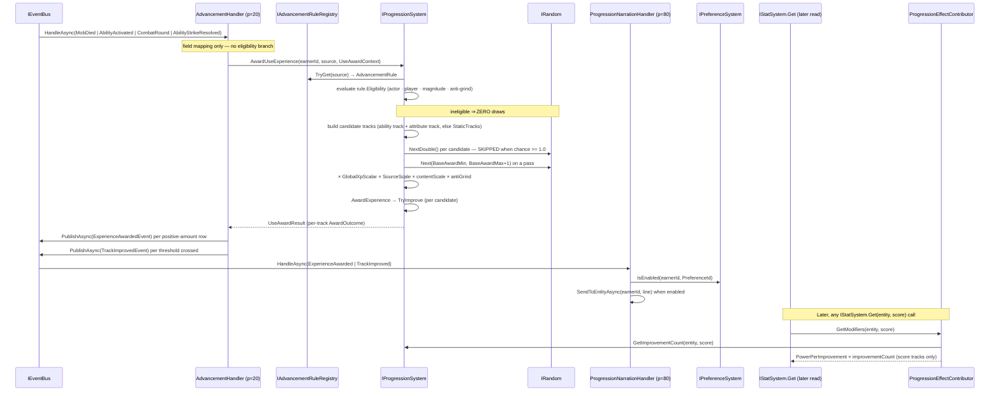

# Progression journey (use-based XP award · threshold improve · contribute-on-read)

> [Back to flows index](README.md). **Triggers:** `MobDiedEvent` (a kill), `AbilityActivatedEvent` (an ability was used), `CombatRoundEvent` / `AbilityStrikeResolvedEvent` (damage was taken).

## Summary

Every experience trigger funnels through **one** handler, `AdvancementHandler`, and **one** system entry point, `IProgressionSystem.AwardUseExperience`. The handler does no more than translate the event's fields into a `UseAwardContext`; which tracks are candidates, whether the action qualifies, how likely it is to award, and how much it awards are all **data on an `AdvancementRule`** looked up by `XpSource` through `IAdvancementRuleRegistry` (INV-8 — no game rule lives in the orchestration tier).

Per candidate track the system computes a rank-decayed chance, rolls it, and on a pass draws a base amount and multiplies the four tuning tiers — `GlobalXpScalar` (macro) × the rule's `SourceScale` × the content scale (per-ability or per-mob `XpScale`) × the anti-grind ratio — before accruing it through `AwardExperience` → `TryImprove`. The handler then publishes `ExperienceAwardedEvent` per positive-amount row and `TrackImprovedEvent` per threshold crossed; `ProgressionNarrationHandler` turns each into a line for the earning player, gated on that player's `PreferenceId`.

A track is a `ProgressionTrack` — either a score (attribute/pool) or an ability. **Score tracks grant power; ability tracks are display-only rank** and contribute exactly zero to `IStatSystem.Get`. The power step from an improved score track is never stored — it is pulled on read by `ProgressionEffectContributor` the next time `IStatSystem.Get` is called for that score.

## Steps

1. **`AdvancementHandler` (priority 20)** receives one of the four trigger events and maps its fields into a `UseAwardContext`:
   - `MobDiedEvent` → `AwardCombatExperience(killerId, victimId)`, the thin wrapper over the `CombatKill` row. The wrapper resolves the victim's `MobDataComponent.XpScale` **internally**, so a live kill and a balance-sandbox kill (which calls the wrapper directly) can never drift.
   - `AbilityActivatedEvent` → earner = actor; subject ability id from the event; `ContentScale` and `SubjectAttributeTrack` from the `AbilityDefinition`.
   - `CombatRoundEvent` / `AbilityStrikeResolvedEvent` → earner = **defender**; `Magnitude` = `Result.DamageDealt`.

   The handler holds **no discard branch** — "no attributable killer", "zero damage", and "only characters progress" are `AdvancementEligibility` data on the rule.

2. **`ProgressionSystem.AwardUseExperience`** looks up the rule and evaluates its eligibility:
   - `RequiresAttributableActor` — earner id `!= 0`.
   - `RequiresPlayerEarner` — earner carries `CharacterComponent`. Set on the two use-based rows so mobs do not accrue XP from every combat round; deliberately **off** on the kill row, whose earner in the balance sandbox is mob-shaped.
   - `RequiresPositiveMagnitude` — `Magnitude > 0`.
   - `AppliesAntiGrindPowerRatio` — `scale = ratio < AntiGrindFloorRatio ? 0 : min(ratio, AntiGrindCap)` where `ratio = victimPower / earnerPower`, each power estimated by `IPowerBudgetSystem.Estimate` over a **raw-attribute** `PowerSnapshot` (`Mind`/`Body`/`Spirit`/`Attunement` straight off `AttributesComponent`, never `IStatSystem` — see the [design doc](../../features/progression/progression-system.md#anti-grind-proxy-reads-raw-attributes) for the DI cycle this avoids). A scale of `0` makes every candidate **ineligible**.

3. **Candidate tracks** are built from the rule and the context: the ability's own track (when `IncludesSubjectTrack` and the trigger named an ability), plus the subject's `XpAttributeTrack` — falling back to the rule's `StaticTracks` when the subject declares none.

4. **The RNG draw contract (INV-26).** Per candidate: `chance = clamp01(BaseChance / (1 + improvements × ChanceDecayPerImprovement))`.
   - `chance >= 1.0` → **auto-pass with no `IRandom` call**.
   - `chance <= 0.0` → auto-fail with no call.
   - otherwise → one `NextDouble()`, passing when `roll < chance`.

   An **ineligible** candidate consumes **zero** draws — neither the chance roll nor the amount draw.

   These two rules are why the kill path is byte-identical to its pre-slice self: the `CombatKill` row is `BaseChance 1.0` with zero decay, so it draws exactly one `Next(8, 13)` per track and no `NextDouble()`, and a trivial victim still draws nothing at all. The balance sandbox shares **one** seeded `IRandom` across every system in a run, so a single extra draw would shift the whole stream and move every pinned golden. This is asserted directly by a draw-sequence test over a counting fake `IRandom`, not indirectly via "the goldens did not move".

5. **Amount** on a pass: `round(Next(BaseAwardMin, BaseAwardMax+1) × GlobalXpScalar × SourceScale × contentScale × antiGrindScale)`, away from zero.

6. **Accrual** flows through `AwardExperience` → `TryImprove`: adds to cumulative XP (no-op if ≤ 0), then loops while cumulative XP ≥ the next cumulative threshold (`ThresholdBase + improvementCount × ThresholdIncrement`), incrementing once per crossing — a single large award can cross several thresholds in one call. One curve serves score and ability tracks alike.

   Note that a chance-gated source slows **twice over**: the threshold grows *and* the chance decays. That composition is deliberate and pinned by a test; the power step itself stays linear.

7. **The handler publishes** one `ExperienceAwardedEvent(entityId, track, amount, source)` per positive-amount row and one `TrackImprovedEvent(entityId, track, newImprovementCount)` per crossing.

8. **`ProgressionNarrationHandler` (priority 80)** receives each, checks the relevant `PreferenceId` via `IPreferenceSystem`, and — when enabled — writes one line to the earner via `IBroadcastSystem.SendToEntityAsync`. Turning the preference off silences the line without touching the accrual.

9. **Nothing is stored beyond `ProgressionComponent`'s counters.** The next time anything calls `IStatSystem.Get(entity, score)`, `EffectSystem.GetModifiers` sums the DI-collected `IEffectContributor`s, including `ProgressionEffectContributor`, which returns `PowerPerImprovement × improvementCount(score)` pulled fresh — the INV-24 contribute-on-read fold. **Ability tracks are excluded from that fold**, so ability rank contributes zero power (pinned by an architecture-guard test).

## Where to look

- [`Core/Modules/Progression/Handlers/AdvancementHandler.cs`](../../../Core/Modules/Progression/Handlers/AdvancementHandler.cs) — the single entry point for every trigger.
- [`Core/Modules/Progression/Handlers/ProgressionNarrationHandler.cs`](../../../Core/Modules/Progression/Handlers/ProgressionNarrationHandler.cs) — the preference-gated lines.
- [`Core/Modules/Progression/Systems/ProgressionSystem.cs`](../../../Core/Modules/Progression/Systems/ProgressionSystem.cs) · [`ProgressionTrack.cs`](../../../Core/Modules/Progression/ProgressionTrack.cs) · [`AdvancementRule.cs`](../../../Core/Modules/Progression/AdvancementRule.cs) · [`ProgressionConstants.cs`](../../../Core/Modules/Progression/ProgressionConstants.cs) (the rule table) · [`ProgressionEffectContributor.cs`](../../../Core/Modules/Progression/ProgressionEffectContributor.cs)
- [`Core/Systems/IPowerBudgetSystem.cs`](../../../Core/Systems/IPowerBudgetSystem.cs) · [`Core/Systems/PowerBudgetTunables.cs`](../../../Core/Systems/PowerBudgetTunables.cs) — the core-tier power oracle the anti-grind proxy is rewired onto (slice `prog-3`); tunables promoted to injected data (sim-1).
- [`../../features/progression/progression.md`](../../features/progression/progression.md) — the feature; [`progression-system.md`](../../features/progression/progression-system.md) for the system internals.
- [`../../features/preferences/preference-system.md`](../../features/preferences/preference-system.md) — the `config` verb and the preference framework the narration is gated on.
- [flow-20](flow-20-mob-death-respawn.md) — the mob-death fan-out this handler is one of three subscribers of; [flow-24](flow-24-ability-activation.md) — the ability-activation path that feeds the `AbilityUse` row.
- [flow-32](flow-32-ascension.md) — the ascension journey. The "later `IStatSystem.Get`" fold in step 9 is **not progression-only**: `EffectSystem.GetModifiers` sums every DI-collected `IEffectContributor`, which also includes `AscensionEffectContributor` (the character-wide tier's additive baseline). The contributors fold independently and additively.
