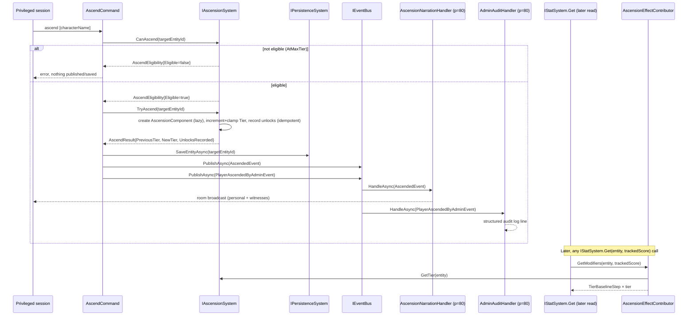

# Ascension journey (tier-up · unlock-record · baseline fold)

> [Back to flows index](README.md). **Trigger:** a privileged session issues `ascend [characterName]`.

## Summary

`AscendCommand` (Initiator) resolves the target player (defaults to the invoker when `characterName` is omitted), calls `IAscensionSystem.CanAscend` to check eligibility (the only failure in this slice is `AtMaxTier`), then `TryAscend` to mutate: `AscensionComponent` is created lazily if absent, `Tier` is incremented and clamped to `[0, AscensionConstants.MaxTier]`, and the new tier's configured unlock ids are recorded onto `GrantedUnlocks` idempotently (the unlock table is empty in `prog-2`, so nothing is recorded yet). The command performs one admin-boundary save (INV-22), then publishes `AscendedEvent` (the milestone fact) and `PlayerAscendedByAdminEvent` (the audit fact). `AscensionNarrationHandler` and `AdminAuditHandler` fan out independently at priority 80. The tier's additive power baseline is never stored — it is pulled on read by `AscensionEffectContributor` (a fourth `IEffectContributor` registrant) the next time `IStatSystem.Get` is called for a tracked score, e.g. from `score`, combat, or the `progress` inspector — the same contribute-on-read seam [flow-31](flow-31-progression-award.md) established.

## Steps

1. A privileged session issues `ascend <characterName>` (target defaults to the invoker if omitted). `AscendCommand` resolves the target player entity by connected-session character name (mirrors `SetRespawnCommand`).
2. `AscendCommand` calls `IAscensionSystem.CanAscend(targetEntityId)`. On a non-`Eligible` result (`AtMaxTier`) it writes the reason and returns — nothing published, nothing saved.
3. On `Eligible`, `AscendCommand` calls `IAscensionSystem.TryAscend(targetEntityId)` → the system creates `AscensionComponent` lazily if absent, increments `Tier` (clamped to `[0, MaxTier]`), records the new tier's configured unlock ids on `AscensionComponent.GrantedUnlocks` (the table is empty in `prog-2` → none recorded), and returns an `AscendResult`. The system publishes nothing (INV-5).
4. `AscendCommand` calls `IPersistenceSystem.SaveEntityAsync(targetEntityId)` once (INV-22 admin boundary save).
5. `AscendCommand` publishes `AscendedEvent(targetEntityId, NewTier, PreviousTier)` and `PlayerAscendedByAdminEvent(invokerEntityId, targetEntityId, NewTier)`, then writes a confirmation line to the invoker.
6. `AscensionNarrationHandler` (priority 80) consumes `AscendedEvent` → writes "You ascend to Tier N." to the ascended player and broadcasts "X ascends to Tier N!" to the room.
7. `AdminAuditHandler` (priority 80) consumes `PlayerAscendedByAdminEvent` → one structured audit log line.
8. Later, on any read: `IStatSystem.Get(entity, score)` → `IEffectSystem.GetModifiers` sums the DI-collected `IEffectContributor`s, now including `AscensionEffectContributor`, which returns `TierBaselineStep × GetTier(entity)` for the score — fresh, uncached (INV-24).

## Where to look

- [`Core/Modules/Ascension/Commands/AscendCommand.cs`](../../../Core/Modules/Ascension/Commands/AscendCommand.cs) — the entry point.
- [`Core/Modules/Ascension/Systems/AscensionSystem.cs`](../../../Core/Modules/Ascension/Systems/AscensionSystem.cs) · [`Core/Modules/Ascension/AscensionEffectContributor.cs`](../../../Core/Modules/Ascension/AscensionEffectContributor.cs) · [`Core/Modules/Ascension/AscensionConstants.cs`](../../../Core/Modules/Ascension/AscensionConstants.cs)
- [`Core/Modules/Ascension/Handlers/AscensionNarrationHandler.cs`](../../../Core/Modules/Ascension/Handlers/AscensionNarrationHandler.cs) · [`Core/Modules/Admin/Handlers/AdminAuditHandler.cs`](../../../Core/Modules/Admin/Handlers/AdminAuditHandler.cs)
- [`../../features/progression/progression.md`](../../features/progression/progression.md) — the feature this slice extends.
- [flow-31](flow-31-progression-award.md) — the contribute-on-read leg this slice adds a second contributor to; [flow-08](flow-08-admin-room-creation.md) — the admin-authoring flow the `setmob band` branch touches.
