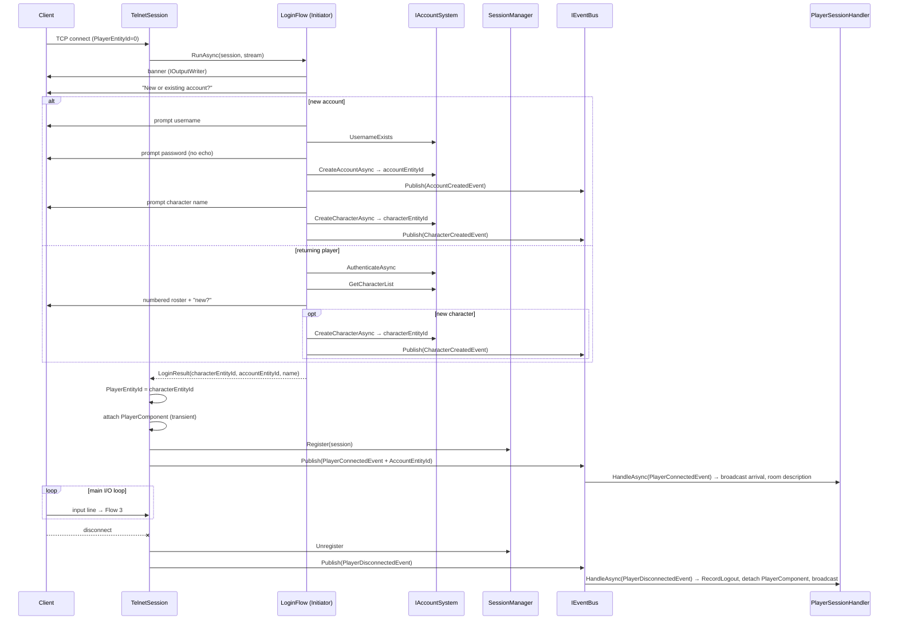

# Use Case: Account / Character Creation

**Status:** implemented
**Actors:** Player (new and returning), System
**Module:** `Core/Modules/Account/`

> **Note — persistence model superseded.** Any references in this doc to `PersistenceHandler`, `MarkDirty`, or the dirty-set flush pattern reflect the slice-5 design and are now historical. The as-built persistence model is the two-level opt-in design described in [`persistence-two-level-model.md`](persistence-two-level-model.md). Read that doc for the current save-on-change and area-scoped flush behaviour.

---

## Description

Replaces the throwaway `"What is your name?"` prompt in `TelnetSession.PromptForNameAsync` with a full account-and-character lifecycle: new players register an account (username + hashed password) and create a first character (display name + base stats); returning players authenticate and select from their existing characters. Account state is stored in a persistent `AccountComponent` on a dedicated account entity. Character state is stored in a persistent `CharacterComponent` on a player entity (replacing and extending the transient `PlayerComponent`). Both entities survive restart. The `ISession.PlayerEntityId=0-until-bound` contract is preserved: the session carries id 0 until a character is fully selected and enters the world.

This is the first slice that produces real user-facing `[Persistent]` data. It directly enables the `admin-privilege-elevation` slice (which needs reliable player-name → entity resolution).

---

## Preconditions

- Phase 3 slices 1–4 and the prefix-matching enhancement are complete: `IPersistenceSystem`, `ITemplateRegistry`, `ICommandDispatcher` (framework shape), `IOutputWriter`/`IOutputFormatterRegistry`, `IBroadcastSystem` (audience-filter), and `TelnetSession` (with `SupportsColor`) all exist.
- `ISession.PlayerEntityId` is `0` until explicitly bound (existing contract — unchanged).
- `EntityService`, `IEventBus`, `ISessionManager`, and `WorldConfiguration` exist and are injected into the session layer.
- `PersistenceSystem` can flush any entity carrying a `[Persistent]` component — no changes to the flush mechanism itself.
- The `Command-arg log redaction` backlog item **must be resolved in this slice** (see Cross-cutting surfaces): a `password` argument must not appear in `CommandExecutedEvent.ArgsSummary`. Partial resolution (redact per-argument flag) is sufficient.

---

## Postconditions

- **Account entity:** every registered player owns exactly one account entity. The entity carries `AccountComponent` (`[Persistent]`): username (case-insensitive), `PasswordHash` (BCrypt/PBKDF2 — scheme TBD in open questions), a list of character entity ids, and a `CreatedAtUtc` timestamp. The entity survives restart.
- **Character entity:** each character corresponds to one player entity carrying `CharacterComponent` (`[Persistent]`): `AccountEntityId`, `CharacterName`, base stat seed, `CreatedAtUtc`, and a `LastLoginUtc`. `LocationComponent` is also persistent from this slice onward. `PlayerComponent` is **refactored**: it remains the transient session-binding shim (`DisplayName` + `Session` ref), not persisted; `CharacterComponent` holds the durable identity.
- **Login flow:** a connecting session goes through an async login state machine in `TelnetSession` (or an extracted `LoginFlow` helper) — see Main Flow. The `ISession.PlayerEntityId` stays `0` until character selection completes. `CommandDispatcher` must not be reachable by the session until `PlayerEntityId != 0`.
- **New-player path:** registering a username + password creates an account entity, then immediately enters character-creation; the first character is created and the session binds.
- **Returning-player path:** authenticating an existing account displays the character roster; the player selects (or creates a new) character and the session binds.
- **Persistence:** account and character entities are marked dirty on creation and on every login (to update `LastLoginUtc`); they are flushed by the existing `PersistenceFlushTimer` / shutdown path.
- **Password confidentiality:** `password` inputs are never echoed to the client; they are never written to any log, including `CommandExecutedEvent.ArgsSummary`.
- **`PlayerConnectedEvent` payload extends:** it now carries the character entity id (as it did before) but also an `AccountEntityId`; downstream handlers may distinguish account from character for analytics or privilege checks.
- **`PlayerSessionHandler` refactored:** the current handler's `HandleConnectedAsync` body (which creates `PlayerComponent` and `LocationComponent` directly on the entity) is replaced by a lighter version: at `PlayerConnectedEvent` time the character entity already has all persistent components hydrated or freshly set; the handler attaches the transient `PlayerComponent` (with `Session` ref) and broadcasts the arrival.
- **`TelnetSession.PromptForNameAsync` removed** — replaced by `RunLoginFlowAsync`.
- No changes to any gameplay system, movement, combat, or output formatting.

---

## Main Flow

1. **TCP connect.** `TelnetServer` spawns a `TelnetSession` task. `PlayerEntityId` is `0`. The session calls `RunLoginFlowAsync` (replaces `PromptForNameAsync`).

2. **Welcome banner.** The session writes a `PlainMessage` banner via `IOutputWriter` (output framework, no `SendLineAsync`). The session prompts: "Do you have an account? (yes/no)".

3. **Branch: new player (registration).** Player types `no` (or `new` / `register` — all accepted). The session:
   a. Prompts for a username and validates it (min 3 chars, max 20, alphanumeric + underscore, case-insensitive uniqueness checked via `IAccountSystem.UsernameExists`).
   b. Prompts for a password (not echoed). Prompts again to confirm. If mismatch, re-prompts.
   c. Calls `IAccountSystem.CreateAccountAsync(username, password)` → creates an account entity with `AccountComponent`, marks it dirty, returns the account entity id.
   d. Proceeds to **character creation** (step 5).

4. **Branch: returning player (authentication).** Player types `yes` (or `login`). The session:
   a. Prompts for username.
   b. Prompts for password (not echoed). Calls `IAccountSystem.AuthenticateAsync(username, password)` → verifies hash, returns `AuthResult(AccountEntityId)` or failure.
   c. On failure: writes `PlainMessage("Invalid username or password.", Error)`. Allows up to 3 attempts before disconnecting.
   d. On success: proceeds to **character selection** (step 6).

5. **Character creation.** The `LoginFlow` (fresh account or returning account choosing "new character"):
   a. Prompts for a character name. Validates: min 2 chars, max 16, letters only, uniqueness checked via `IAccountSystem.CharacterNameExists`.
   b. Calls `IAccountSystem.CreateCharacterAsync(accountEntityId, characterName)`. The system creates the player entity (`EntityService.CreateEntity()`), attaches `CharacterComponent { AccountEntityId, CharacterName, CreatedAtUtc = now, LastLoginUtc = now }` and `LocationComponent { RoomEntityId = WorldConfiguration.StartingRoomEntityId }`, registers the character on the account (`AddCharacterToAccount`), marks both entities dirty, and returns the character entity id. `LoginFlow` does **not** create entities itself — entity lifecycle is the domain system's responsibility.
   c. `LoginFlow` publishes `CharacterCreatedEvent(characterEntityId, accountEntityId, characterName)`.
   d. Falls through to **world entry** (step 7).

6. **Character selection (returning player).** `IAccountSystem.GetCharacterList(accountEntityId)` returns the character names and entity ids. The session writes a numbered roster via `PlainMessage`. Player types the number or character name. On "new", go to step 5.

7. **World entry.** `LoginFlow` returns `LoginResult(characterEntityId, accountEntityId, characterName)` to `TelnetSession`. `TelnetSession` then: sets `PlayerEntityId = characterEntityId`, attaches the transient `PlayerComponent { DisplayName = CharacterName, Session = this }` to the character entity, calls `SessionManager.Register(this)`, and publishes `PlayerConnectedEvent(PlayerEntityId, CharacterName, AccountEntityId)`. `PlayerSessionHandler` fires at `HandlerPriority.Domain`: broadcasts arrival, sends room description. The main I/O loop starts; `CommandDispatcher` is now reachable.

8. **Disconnect.** On TCP close, `TelnetSession.HandleDisconnectAsync` unregisters from `SessionManager` and publishes `PlayerDisconnectedEvent`. `PlayerSessionHandler.HandleDisconnectedAsync` (priority `Domain`) then calls `IAccountSystem.RecordLogout(characterEntityId)` (updates `CharacterComponent.LastLoginUtc` and marks the entity dirty), detaches `PlayerComponent`, and broadcasts the departure message. The character entity is **not** destroyed — it persists. `PersistenceHandler` (priority 90) marks the entity dirty on `PlayerDisconnectedEvent` as belt-and-suspenders; `RecordLogout` marks it dirty in-call so the flush timer wins the race regardless of handler ordering.

---

## Events Fired

| Event | Publisher | Tier | Scope | Purpose |
|---|---|---|---|---|
| `AccountCreatedEvent(uint AccountEntityId, string Username)` | `LoginFlow` | Initiator | Once per registration | Dirty-mark account for persistence; audit log. |
| `CharacterCreatedEvent(uint CharacterEntityId, uint AccountEntityId, string CharacterName)` | `LoginFlow` | Initiator | Once per new character | Dirty-mark character for persistence; audit log. |
| `PlayerConnectedEvent(uint PlayerEntityId, string Name, uint AccountEntityId)` — **extended payload** | `TelnetSession` | Initiator | Per login | Existing event; payload gains `AccountEntityId`. `PlayerSessionHandler` continues to subscribe. |
| `PlayerDisconnectedEvent(uint PlayerEntityId, string Name)` | `TelnetSession` | Initiator | Per disconnect | Existing event; unchanged payload. `PlayerSessionHandler` calls `IAccountSystem.RecordLogout`; `PersistenceHandler` marks entity dirty. |

---

## Systems / Handlers Involved

### IAccountSystem (new — domain system)

```csharp
public interface IAccountSystem
{
    bool UsernameExists(string username);
    bool CharacterNameExists(string characterName);
    Task<uint> CreateAccountAsync(string username, string password, CancellationToken ct = default);
    Task<AuthResult> AuthenticateAsync(string username, string password, CancellationToken ct = default);
    Task<uint> CreateCharacterAsync(uint accountEntityId, string characterName, CancellationToken ct = default);
    IReadOnlyList<CharacterSummary> GetCharacterList(uint accountEntityId);
    void RecordLogout(uint characterEntityId);   // updates LastLoginUtc, marks entity dirty
}

public readonly record struct AuthResult(bool Success, uint AccountEntityId);
public readonly record struct CharacterSummary(uint CharacterEntityId, string CharacterName);
```

Lives at `Core/Modules/Account/Systems/AccountSystem.cs`. Depends on `EntityService`, `IPasswordHasher`, `IPersistenceSystem` (for `MarkDirty`), `WorldConfiguration` (starting room). Queries `AccountComponent`/`CharacterComponent` entities via `EntityService`. Never touches `IEventBus` (INV-5).

`CreateCharacterAsync` is the **sole creator of character entities**: it calls `EntityService.CreateEntity()`, attaches `CharacterComponent` and `LocationComponent`, registers the character on the account, marks both entities dirty, and returns the character entity id. `LoginFlow` calls this method and then publishes the resulting event — it does not create entities itself.

### IPasswordHasher (new — core utility)

```csharp
public interface IPasswordHasher
{
    string Hash(string password);
    bool Verify(string password, string hash);
}
```

Lives at `Core/Systems/PasswordHasher.cs`. Implementation uses `System.Security.Cryptography.Rfc2898DeriveBytes` (PBKDF2-SHA256, 100 000 iterations, 16-byte random salt, 32-byte key). Hash and salt are stored together as a single Base64 string. Algorithm is pluggable behind the interface. No external NuGet dependency.

### AccountComponent (new — `[Persistent]`)

```csharp
[Persistent]
public class AccountComponent : IComponent
{
    public string Username { get; set; } = string.Empty;          // lowercase-normalized
    public string PasswordHash { get; set; } = string.Empty;
    public List<uint> CharacterEntityIds { get; set; } = new();
    public DateTime CreatedAtUtc { get; set; }
}
```

Lives at `Core/Modules/Account/Components/AccountComponent.cs`. One per account entity.

### CharacterComponent (new — `[Persistent]`)

```csharp
[Persistent]
public class CharacterComponent : IComponent
{
    public uint AccountEntityId { get; set; }
    public string CharacterName { get; set; } = string.Empty;
    public DateTime CreatedAtUtc { get; set; }
    public DateTime LastLoginUtc { get; set; }
}
```

Lives at `Core/Modules/Account/Components/CharacterComponent.cs`. One per player entity (alongside the transient `PlayerComponent`).

### LocationComponent — promoted to `[Persistent]`

`LocationComponent` gains `[Persistent]` in this slice so a character's last room survives restart. This is a change to the existing cross-cutting component at `Core/ECS/Components/LocationComponent.cs`. The `PersistenceSystem` will automatically pick it up. No other shape change.

### PlayerComponent — shape unchanged, remains non-persistent

`PlayerComponent` continues to carry `DisplayName` (copied from `CharacterComponent.CharacterName` at bind time) and `Session` (transient ref). It is **not** tagged `[Persistent]`. This split is intentional: `CharacterComponent` is the durable identity; `PlayerComponent` is the live-session shim. `PlayerComponent` continues to live at `Core/ECS/Components/PlayerComponent.cs`.

### PlayerSessionHandler — refactored

`HandleConnectedAsync` no longer creates `PlayerComponent`, `LocationComponent`, or sets the starting room (all done by the login flow before the event fires). Its new responsibility: attach `PlayerComponent { DisplayName = CharacterName, Session = session }` from `ISessionManager.GetSession`, broadcast the arrival message, and send room description. `HandleDisconnectedAsync` gains: detach `PlayerComponent`, update `CharacterComponent.LastLoginUtc`, mark character entity dirty.

### PersistenceHandler — extended subscriptions

Adds `AccountCreatedEvent`, `CharacterCreatedEvent`, and `PlayerDisconnectedEvent` to its subscriptions at priority 90. These join the existing `EntitySpawnedByAdminEvent` / `RoomExitAuthoredByAdminEvent` subscriptions.

**Dirty-marking authority (resolves S1 from spec review):** `PersistenceHandler` is the authoritative dirty-marker for entity state changes that arrive via events. For account/character creation, the `PersistenceHandler` marks the relevant entities dirty when `AccountCreatedEvent` / `CharacterCreatedEvent` fires. `IAccountSystem.CreateAccountAsync` and `CreateCharacterAsync` also call `MarkDirty` internally — this is belt-and-suspenders: the in-call marking ensures the entity is persisted even if an event handler is missed, while the `PersistenceHandler` subscription is the conventional cross-cutting hook. There is no conflict — `MarkDirty` is idempotent. For disconnect, `IAccountSystem.RecordLogout` calls `MarkDirty` directly (no event published for the logout mutation), and `PersistenceHandler` subscribes to `PlayerDisconnectedEvent` as the trigger to persist the character entity's final state.

### LoginFlow (new — `Server/Sessions/LoginFlow.cs`)

**Tier classification: Initiator.** `LoginFlow` is an entry-point that gathers user input, calls domain systems (`IAccountSystem`), and publishes the resulting events (`AccountCreatedEvent`, `CharacterCreatedEvent`). It is the login-wizard equivalent of a command: instead of parsing a single input line, it drives a sequential multi-step interaction, but each step follows the Initiator pattern — gather input → validate via system → publish result. INV-8's prohibition on "multi-step branching" targets game-rule conditionals inside an initiator; it does not prohibit sequential input collection (a wizard). No game rules live in `LoginFlow`. `LoginFlow`'s publishing of `AccountCreatedEvent` and `CharacterCreatedEvent` is correct per INV-5 (Initiators may publish).

`LoginFlow` is distinct from `TelnetSession` because the login state machine is substantial enough to extract for readability, but both live in the session layer (`Server/Sessions/`). `TelnetSession` delegates to `LoginFlow.RunAsync` and handles the final world-entry binding (setting `PlayerEntityId`, attaching `PlayerComponent`, registering with `SessionManager`, publishing `PlayerConnectedEvent`) once `LoginFlow` returns a `LoginResult`.

`LoginFlow` depends on `IAccountSystem`, `IOutputWriterFactory`. Returns `LoginResult(uint characterEntityId, uint accountEntityId, string characterName)` once a character is bound, or `null` on disconnect/timeout/too-many-failures. It reads raw lines from the session stream directly (same pattern as the old `PromptForNameAsync`). It does **not** go through `CommandDispatcher` — the dispatcher is only entered after `PlayerEntityId != 0`.

**Why `LoginFlow` lives in `Server/Sessions/` and not `Core/`:** the login state machine is transport-coupled — it reads raw lines, never-echos password input, and would need to be rewritten for a SignalR session. The domain logic (create account, authenticate, character roster) lives in `IAccountSystem` and is transport-agnostic. This placement is consistent with `TelnetSession` living in `Server/`.

---

## Content Tooling Impact

This slice introduces persistent user data. The tooling contract:

- **No authored YAML data files** — account and character entities are created at runtime by players, not authored by designers. No `TemplateRegistry` entries are needed.
- **Admin inspection command — `whois <characterName>` (new).** Category `Admin`, `MatchingMode.Full`, `RequiredPrivileges = [AdminRequirement]`. Displays the character entity id, account entity id, account username, and `LastLoginUtc` for the named character. Allows operators to correlate a character to an account after the account slice ships. Lives at `Core/Modules/Account/Commands/WhoisCommand.cs`.
- **Data directory.** Account and character entities are flushed as `data/entities/entity-{id}.json` by the existing `PersistenceSystem` — no new directory or file format.
- **`AdminAuthorizer` — forward-compatible.** The existing `Admin:PrivilegedNames` list matches against `PlayerComponent.DisplayName` (which is set from `CharacterComponent.CharacterName`). This remains correct: the bootstrap layer checks the display name at command time, when `PlayerComponent` is attached. No change to `AdminAuthorizer` this slice.

---

## Cross-cutting surfaces stressed

- **Commands** — **Adequate.** The login flow does not use `CommandDispatcher` (it is a pre-bound state machine). The `whois` admin command is authored against the existing framework (`ICommand`, `CommandContext`, `RequiredPrivileges = [AdminRequirement]`). No new command infrastructure needed.

- **Output** — **Adequate.** `LoginFlow` uses `IOutputWriterFactory.Create(session).WriteAsync(PlainMessage(...))` for all prompts and feedback. The full output framework (formatter, color, `PlainMessage`) exists from slice 4. Note: the login flow writes output before `PlayerEntityId` is bound — `IOutputWriter` must accept a session whose `PlayerEntityId` is 0. This is already the contract (`SendLineAsync` has no entity-id dependency), but implementors should verify.

- **Persistence** — **Adequate.** `AccountComponent` and `CharacterComponent` are tagged `[Persistent]`; `PersistenceSystem` and the flush timer handle them identically to any other entity. `LocationComponent` is promoted to `[Persistent]` — the serializer will automatically include it in existing room entities that already carry it. Implementors must verify that room entities gaining a persistent `LocationComponent` do not cause unexpected flush volume (rooms should not normally have `LocationComponent`; only player/mob entities do — a quick grep is the check).

- **Persistence (startup hydration)** — **Gap exposed.** After restart, `PersistenceBootstrap.LoadAllAsync` will hydrate account and character entities. A hydrated character entity that was in-world at shutdown will have a persisted `LocationComponent`. The entity must be placed back in its room at startup, but the current `EntityHydratedEvent` handler cannot query other entities (see `persistence-substrate.md` constraint). The `WorldLoadedEvent` handler is the correct place to re-populate `LocationComponent`-bearing entities into the world index — but **no such handler exists today**. This gap must be resolved: a `CharacterHydrationHandler` subscribing to `WorldLoadedEvent` must verify that each character entity's `LocationComponent.RoomEntityId` still refers to a valid room, and fall back to `WorldConfiguration.StartingRoomEntityId` if not. **This handler lands in this slice; it is not deferred.** See Design Notes.

- **Event bus** — **Adequate.** Three new events (`AccountCreatedEvent`, `CharacterCreatedEvent`, extended `PlayerConnectedEvent`) reuse the existing `IEventBus` publish + priority-ordered handler model. No new bus machinery.

- **ECS queries** — **Adequate.** `IAccountSystem` queries by `AccountComponent` and `CharacterComponent` via `EntityService.GetEntitiesWithComponent<T>()` (or equivalent). The existing `EntityService` API supports this pattern.

- **Sessions** — **Extends.** `ISession.PlayerEntityId=0` contract is preserved and leveraged explicitly. The `CommandDispatcher` must guard against dispatching to a session with `PlayerEntityId == 0` — if a line arrives before login completes (e.g. a race), it must be silently dropped or produce a "not logged in" message. **Verify `CommandDispatcher` has this guard** — it does not currently, because the old flow set `PlayerEntityId` before registering the session. The login flow's sequencing (Register + Publish inside the login flow only after binding) preserves the invariant in practice, but the guard adds safety. Classify as **acknowledged debt** if the sequencing is provably safe; otherwise a guard is required. See Open Questions.

- **Command-arg log redaction** — **Gap exposed (must resolve in this slice).** `CommandExecutedEvent.ArgsSummary` is tracked in `backlog.md` ("Command-arg log redaction") as a prerequisite for any auth-bearing verb. This slice introduces password input. The login flow does **not** go through `CommandDispatcher`, so `ArgsSummary` is not directly triggered by password lines. However, `whois` command args (character names) are benign. The concern is future-proofing: any command added in later slices that takes a password-like argument would be at risk if redaction is not in place. **Disposition:** the login flow's pre-bound state machine bypasses the dispatcher entirely — password lines are never dispatched — so `ArgsSummary` redaction is **not a blocking gap for this slice**. The backlog item remains and is explicitly inherited. Record this reasoning here so the next reviewer does not re-examine it.

- **Broadcast** — **Adequate.** `PlayerSessionHandler` continues to use `IBroadcastSystem.SendToRoomAsync` with an audience-filter predicate (slice 4 shape). No change.

- **Time** — **Adequate.** `DateTime.UtcNow` is used directly for `CreatedAtUtc` and `LastLoginUtc`. No `ITimeSystem` dependency — these are wall-clock audit fields, not game-time fields. No `TimeSystem` exists yet; direct `DateTime.UtcNow` is the correct choice until a `TimeSystem` slice lands.

- **Configuration** — **Extends.** Adds one new key: `Account:MaxCharactersPerAccount` (int, default 5). Read by `IAccountSystem` to cap the character roster. Standard `IConfiguration` binding; no new infra.

- **Modules** — **New: `Core/Modules/Account/`** with `AccountModule.cs` exposing `AddAccountModule(IServiceCollection)`. Registered in `Server/Program.cs`.

---

## Flows introduced or modified

### Flow 2 — Player connection (replaced)

Flow 2 is substantially replaced. The current flow describes a single-step name prompt followed by entity creation in `TelnetSession` and component attachment in `PlayerSessionHandler`. This slice replaces it in full. The PR updates the Flow 2 entry in `06-flows.md` with the diagram and steps below.

**Summary.** A new TCP connection runs a multi-step login state machine (`LoginFlow`) before a player entity is bound. Once a character is selected or created, `TelnetSession` performs the final binding and fires `PlayerConnectedEvent`. Disconnect publishes `PlayerDisconnectedEvent`; `PlayerSessionHandler` calls `IAccountSystem.RecordLogout`, detaches the transient `PlayerComponent`, and broadcasts the departure — the character entity survives.

**Trigger.** Inbound TCP connection on `Server:Port`.



**Steps.**

1. `TelnetServer` accepts the TCP client and spawns a per-session task. `PlayerEntityId` starts as `0`.
2. `TelnetSession.RunAsync` calls `LoginFlow.RunAsync(session, streamReader)`.
3. `LoginFlow` writes a welcome banner via `IOutputWriterFactory.Create(session).WriteAsync(PlainMessage(...))`. All login-flow output uses `IOutputWriter` — no raw `SendLineAsync`.
4. **New-account path.** The player indicates no account (types `no`/`new`/`register`). `LoginFlow` prompts for a username, calls `IAccountSystem.UsernameExists` for uniqueness, prompts for a password (without echoing), prompts for confirmation. On success calls `IAccountSystem.CreateAccountAsync(username, password)` → returns `accountEntityId`. `LoginFlow` publishes `AccountCreatedEvent(accountEntityId, username)`. Falls through to character creation (step 6).
5. **Returning-player path.** The player indicates an existing account (types `yes`/`login`). `LoginFlow` prompts for username and password (not echoed). Calls `IAccountSystem.AuthenticateAsync(username, password)`. Up to 3 failures → disconnect. On success, calls `GetCharacterList(accountEntityId)` and writes a numbered roster. Player selects a number or `new`.
6. **Character creation** (new account or "new" from roster). `LoginFlow` prompts for a character name, calls `IAccountSystem.CharacterNameExists` for uniqueness. Calls `IAccountSystem.CreateCharacterAsync(accountEntityId, characterName)` → the system creates the player entity, attaches `CharacterComponent` + `LocationComponent`, registers the character on the account, marks both entities dirty, returns `characterEntityId`. `LoginFlow` publishes `CharacterCreatedEvent(characterEntityId, accountEntityId, characterName)`.
7. `LoginFlow` returns `LoginResult(characterEntityId, accountEntityId, characterName)` to `TelnetSession`.
8. **World entry.** `TelnetSession` sets `PlayerEntityId = characterEntityId`, attaches `PlayerComponent { DisplayName = name, Session = this }`, calls `SessionManager.Register(this)`, publishes `PlayerConnectedEvent(PlayerEntityId, name, accountEntityId)`. `PlayerSessionHandler` (priority `Domain`) broadcasts the arrival and sends room description. The main I/O loop starts. `CommandDispatcher` is now reachable (guarded by `PlayerEntityId != 0`).
9. **Disconnect.** On TCP close, `TelnetSession.HandleDisconnectAsync` calls `SessionManager.Unregister`, then publishes `PlayerDisconnectedEvent`. `PlayerSessionHandler.HandleDisconnectedAsync` calls `IAccountSystem.RecordLogout(characterEntityId)` (updates `CharacterComponent.LastLoginUtc`, marks entity dirty), detaches `PlayerComponent`, broadcasts `"<name> has left the world."`. `PersistenceHandler` (priority 90) marks the entity dirty independently. The character entity is **not** destroyed.

---

### Flow 7 — Account login / character creation (new)

This new flow is added to `06-flows.md` as Flow 7 in this slice's PR. It covers the pre-bound login phase in detail, distinct from the in-world command lifecycle (Flow 3). See the mermaid and step trace in Flow 2 above — the login wizard portion (steps 2–7 above) is the body of Flow 7. The PR adds Flow 7 pointing at `TelnetSession.RunAsync` → `LoginFlow.RunAsync` → `IAccountSystem` methods → event publishing → world-entry binding, with the index row added at the top of `06-flows.md`.

---

### Flow 4 — Persistence flush cycle (index note only)

`AccountComponent` and `CharacterComponent` are new `[Persistent]` types. The flush cycle is unchanged — `PersistenceSystem` discovers them automatically. The PR adds a footnote to Flow 4 in `06-flows.md`: *"New `[Persistent]` types added in slice 5: `AccountComponent` (account entity), `CharacterComponent` (character entity), `LocationComponent` promoted from transient."*

---

## Reference catalog updates

This slice's PR must update the following `docs/reference/` files. These are INV-16 deliverables; no gameplay code merges without them.

### `docs/reference/components.md`

**MVP components table** — update `LocationComponent` row:

| Component | Shape | Used by | Persisted? |
|---|---|---|---|
| `LocationComponent` | `RoomEntityId` (current room) | any mobile entity | **yes** (promoted in slice 5) |

**Module-owned components table** — add first real rows:

| Module | Component | Purpose | Persisted? |
|---|---|---|---|
| Account | `AccountComponent` | Username (normalized), password hash, list of character entity ids, `CreatedAtUtc` | yes |
| Account | `CharacterComponent` | `AccountEntityId`, `CharacterName`, `CreatedAtUtc`, `LastLoginUtc` | yes |

### `docs/reference/systems.md`

Add:

| System | Interface | Location | Purpose |
|---|---|---|---|
| `AccountSystem` | `IAccountSystem` | `Core/Modules/Account/Systems/` | Create/authenticate accounts, create/list characters, record logout |
| `PasswordHasher` | `IPasswordHasher` | `Core/Systems/` | PBKDF2-SHA256 hash and verify (100k iterations, 16-byte salt) |

### `docs/reference/handlers.md`

**Update `PlayerSessionHandler` row** (reconcile event names — S3 finding from spec review):

| Handler | Events | Responsibilities |
|---|---|---|
| `PlayerSessionHandler` | `PlayerConnectedEvent`, `PlayerDisconnectedEvent` | Attach transient `PlayerComponent` on connect; call `IAccountSystem.RecordLogout`, detach `PlayerComponent`, broadcast departure on disconnect |

> The existing catalog row lists `PlayerLoginEvent`/`PlayerLogoutEvent`/`CharacterCreatedEvent`/`CharacterDeletedEvent` — these are future-design names that have not been adopted. The as-shipped event names are `PlayerConnectedEvent` and `PlayerDisconnectedEvent`. Reconcile in this PR.

**Add new handler row:**

| Handler | Events | Priority | Responsibilities |
|---|---|---|---|
| `CharacterHydrationHandler` | `WorldContentReadyEvent` | `HandlerPriority.Domain` | Iterates all character entities after world content loads; validates `LocationComponent.RoomEntityId`; resets to `WorldConfiguration.StartingRoomEntityId` if room no longer exists |

**Update `PersistenceHandler` row:**

Additional subscriptions added in slice 5: `AccountCreatedEvent`, `CharacterCreatedEvent`, `PlayerDisconnectedEvent`. All at priority 90.

### `docs/reference/commands.md`

Add admin command row:

| Verb | Category | MatchingMode | Location | Description |
|---|---|---|---|---|
| `whois` | Admin | `Full` | `Core/Modules/Account/Commands/WhoisCommand.cs` | Display character entity id, account entity id, account username, and `LastLoginUtc` for the named character |

### `Core/Modules/World/Events/`

New event added this slice (required by `CharacterHydrationHandler`):

- `WorldContentReadyEvent` — published by `WorldContentBootstrap` (or `WorldContentLoader`) at the end of `LoadAndSpawnAsync`, after all rooms are spawned and `WorldConfiguration.StartingRoomEntityId` is resolved. Thin payload; no fields required beyond the `IEvent` contract. `WorldContentBootstrap` updates its `StartAsync` body to publish this event after `LoadAndSpawnAsync` returns. `CharacterHydrationHandler` is the first subscriber. Flow 1 in `06-flows.md` is updated to show `WorldContentBootstrap` → `Bus.Publish(WorldContentReadyEvent)` → `CharacterHydrationHandler`.

---

## Design Notes

- **Account entity vs. character entity are separate ECS entities.** The account entity is never in-world (no `LocationComponent`). It holds only `AccountComponent`. The character entity is the in-world player entity and carries `CharacterComponent`, `LocationComponent`, and the transient `PlayerComponent`. This separation avoids coupling the login model to the gameplay entity and keeps each entity's component set clean.

- **`LoginFlow` is a session-layer collaborator, not a domain system.** It holds the async state machine for the login UI. It calls domain systems (`IAccountSystem`) but is not itself a system — it is a helper that `TelnetSession` delegates to. It lives in `Server/Sessions/` (or a `Server/Login/` subfolder), not in `Core/`. This placement is intentional: the login state machine is transport-coupled (it reads raw lines, never-echo password) and would need to be rewritten for a SignalR session anyway. The domain logic (create account, authenticate, character roster) lives in `IAccountSystem` and is transport-agnostic.

- **`CharacterHydrationHandler` trigger must be `ContentReloadedEvent`-equivalent, not `WorldLoadedEvent`.** A startup timing issue affects the naive `WorldLoadedEvent` subscription: `WorldLoadedEvent` fires at the end of `PersistenceBootstrap.StartAsync`, before `WorldContentBootstrap` runs. At that point, YAML-authored room entities do not yet exist, and `WorldConfiguration.StartingRoomEntityId` is still `0`. A handler that validates character room ids against `EntityService.HasEntity` at this time would find no rooms and incorrectly reset every character. **Resolution:** `WorldContentBootstrap` publishes a new `WorldContentReadyEvent` at the end of `LoadAndSpawnAsync`. `CharacterHydrationHandler` subscribes to `WorldContentReadyEvent` (priority `HandlerPriority.Domain`). At this point, both hydrated-from-persistence rooms (if any) and YAML-authored rooms exist in `EntityService`, and `WorldConfiguration.StartingRoomEntityId` is set. `WorldContentReadyEvent` is a new event in `Core/Modules/World/Events/`; the PR adds it and updates `WorldContentBootstrap` and `WorldContentLoader` to publish it. `CharacterHydrationHandler` is the first subscriber.

- **No `TemplateRegistry` entries for accounts or characters.** These are runtime-created bespoke entities (INV-12 rule: "bespoke entities are built by the owning feature"). The `TemplateRegistry` is for authored content (rooms, mobs, items).

- **`IAccountSystem.UsernameExists` and `CharacterNameExists` use lazy scanning.** The `EntityService` does not maintain an index by component field value. `AccountSystem` populates an in-memory `HashSet<string>` for usernames and character names on first call by scanning all `AccountComponent`/`CharacterComponent` entities in `EntityService`. This lazy scan is safe because `EntityService` has all hydrated entities from the moment `PersistenceBootstrap` completes — before any connection is accepted. After the first scan, the set is updated synchronously when `CreateAccountAsync`/`CreateCharacterAsync` are called. No event subscription is needed: the set is a hot cache maintained by `AccountSystem`'s own write methods, not an event-driven side effect. `AccountSystem` is a singleton (consistent with existing domain system registration patterns) so the cache is stable across calls.

- **`PlayerConnectedEvent` payload extension.** Adding `AccountEntityId` is a breaking change to the existing event record. All current consumers (`PlayerSessionHandler`) are updated in this PR. The `AdminAuditHandler` does not subscribe to this event and is unaffected.

- **Password hashing.** `IPasswordHasher` uses PBKDF2-SHA256 via `System.Security.Cryptography.Rfc2898DeriveBytes`, 100 000 iterations, 16-byte random salt, 32-byte key. Hash + salt are stored together in a single Base64 string. No external NuGet dependency. BCrypt is an alternative; PBKDF2 was chosen for dependency minimalism (resolved open question).

- **Max failed login attempts.** Three failures → disconnect (implemented in `LoginFlow`). No lockout stored server-side this slice; lockout tracking is acknowledged debt.

- **Character name uniqueness is global** (not per-account). Two accounts cannot have a character with the same name. This simplifies `@teleport <name>` and `@grant <name>` lookups.

- **`LocationComponent` persistence and room entities.** Only player/mob entities have `LocationComponent` today. Room entities do not carry `LocationComponent`. Adding `[Persistent]` to `LocationComponent` causes it to be written for player entities on flush — which is the goal. Room entities are unaffected. The grep check noted in "Cross-cutting surfaces" confirms this.

- **`PlayerDisconnectedEvent` handler update.** The existing `HandleDisconnectedAsync` in `PlayerSessionHandler` calls `_entityService.DestroyEntity(@event.PlayerEntityId)`. After this slice, character entities must **not** be destroyed on disconnect. The handler removes `PlayerComponent` from the entity and marks it dirty (for `LastLoginUtc`), but leaves the entity in `EntityService`. This is a behavior change to the handler.

---

## Open Questions

**All resolved.**

1. **Password hashing library — RESOLVED: PBKDF2.** `IPasswordHasher` uses `System.Security.Cryptography.Rfc2898DeriveBytes` (PBKDF2-SHA256, 100 000 iterations, 16-byte salt, 32-byte key). No external NuGet dependency.

2. **`CommandDispatcher` guard for `PlayerEntityId == 0` — RESOLVED: add the guard.** A cheap `if (session.PlayerEntityId == 0) return;` is added as defense-in-depth. Sequencing alone is sufficient in practice, but the guard costs nothing and prevents any future race from reaching game logic.

3. **Character deletion — RESOLVED: out of scope.** A returning player can only select or create a character this slice. A `delete` option in the character-selection menu is acknowledged future work; leave a comment placeholder in `LoginFlow`.

4. **Max characters per account — RESOLVED: 5.** `Account:MaxCharactersPerAccount` defaults to `5`.

5. **Welcome banner content — RESOLVED: implementer writes placeholder text.** The login banner is a design concern; operators can adjust it later. No config key needed this slice.

6. **`AccountComponent.CharacterEntityIds` serialization — RESOLVED: compatible.** `List<uint>` serializes as a JSON array with `System.Text.Json` — confirmed compatible with the existing `ComponentSerializer`.

---

## Related

- [`persistence-substrate.md`](persistence-substrate.md) — slice 1; provides `IPersistenceSystem`, `PersistenceBootstrap`, and the `[Persistent]` mechanism. `AccountComponent` and `CharacterComponent` plug directly into it.
- [`world-content-loading-and-admin-substrate.md`](world-content-loading-and-admin-substrate.md) — slice 2; `AdminAuthorizer` checks `PlayerComponent.DisplayName` (set from `CharacterComponent.CharacterName` at bind time); unchanged by this slice.
- [`command-framework.md`](command-framework.md) — slice 3; `whois` command is authored against the framework shape. `CommandExecutedEvent.ArgsSummary` redaction backlog item is explicitly inherited (see Cross-cutting surfaces).
- [`output-framework.md`](output-framework.md) — slice 4; `IOutputWriterFactory` is used by `LoginFlow` for all pre-bound output.
- [`admin-privilege-elevation.md`](admin-privilege-elevation.md) — deferred slice; its precondition "a real player-account / display-name resolution path exists" is satisfied by this slice. `whois` in this slice and `@grant` in that slice both resolve characters by name.

For the slice queue, see [`../roadmap/plan.md`](../roadmap/plan.md).
