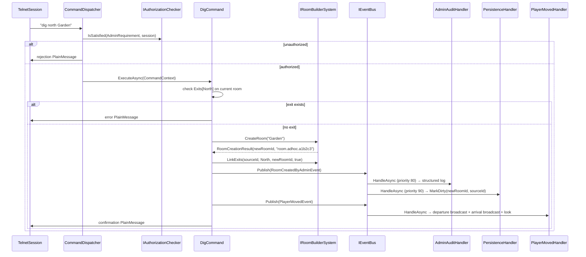

# Use Case: Bare-Bones Content Spawning

**Status:** implemented
**Actors:** Administrator
**Module:** `Core/Modules/Admin/` (commands, events, handler extensions); new domain system `Core/Modules/Admin/Systems/RoomBuilderSystem.cs`

---

## Description

Provides in-game admin commands (`dig`, `set`) to create and edit room content at runtime without pre-authored YAML files. `dig <direction> [name]` creates a new room entity in the named direction from the administrator's current position, wires bidirectional exits, and auto-moves the administrator into the new room. `set <property> <value>` mutates the name or description of the room the administrator is currently standing in. Both commands delegate domain logic to a new `IRoomBuilderSystem` so the same operations can be reused by a future in-game editor without a live session. This slice unblocks functional testing of slices 6+ (items, mobs) by letting administrators build testable room networks at runtime rather than pre-authoring YAML.

The `dig` command introduced in slice 2 (`dig <direction> <targetRoomBlueprintId>`) is **replaced** by the new behaviour described here. The old "connect to an existing room" path is dropped in this slice.

---

## Preconditions

- Slices 1–5 are complete. The following exist and are not re-introduced by this slice:
  - `IAdminAuthorizer`, `AdminRequirement` privilege gate (slice 2).
  - `spawn`, `teleport`/`tp`, `dig`, `reload` commands (slice 2); `dig` is replaced in this slice.
  - `EntitySpawnedByAdminEvent`, `PlayerTeleportedByAdminEvent`, `RoomExitAuthoredByAdminEvent`, `ContentReloadedEvent` (slice 2). `RoomExitAuthoredByAdminEvent` remains defined but `dig` no longer publishes it (see Design Notes).
  - `AdminAuditHandler` (slice 2) — subscribes to admin events; extended here.
  - `PersistenceHandler` — marks entities dirty on admin events; extended here.
  - `PlayerMovedHandler` — handles `PlayerMovedEvent` with broadcast + look; unchanged.
  - `ITemplateRegistry`, `RoomTemplate`, `EntityService`, `IEventBus`.
  - `RoomComponent` (`Name`, `Description`, `Exits: Dictionary<Direction, uint>`).
  - `LocationComponent` (`RoomEntityId: uint`, `[Persistent]`).
  - `BlueprintComponent` (`BlueprintId: string`, `[Persistent]`).
  - Full command framework (slice 3): `ICommand`, `CommandContext`, `CommandArgument`, `CommandArgumentKind`, `CommandMatchingMode`, `AdminRequirement`.
  - Output framework (slice 4): `IOutputWriter`, `PlainMessage`, `OutputSeverity`.
  - Account/character system (slice 5): `AccountComponent`, `CharacterComponent`, `PlayerComponent`.
- The administrator is connected with a fully bound session (`PlayerEntityId != 0`) and has admin rights (`IAdminAuthorizer.IsPrivileged` returns `true`).
- The administrator is standing in a room entity that has a `RoomComponent` and a `LocationComponent`.
- Entity IDs are `uint` (runtime). Blueprint IDs are `string` (designer-facing, e.g. `room.adhoc.<shortid>`).

---

## Postconditions

### After `dig <direction> [name]`

- A new room entity exists in `EntityService` with `RoomComponent` (Name, Description), and `BlueprintComponent` (auto-generated id `room.adhoc.<shortid>`).
- The new room is registered in `ITemplateRegistry` via a minimal `RoomTemplate`.
- The source room's `RoomComponent.Exits[direction]` points to the new room entity id.
- The new room's `RoomComponent.Exits[Opposite(direction)]` points to the source room entity id.
- Both source and new room are marked dirty in `IPersistenceSystem`.
- A `RoomCreatedByAdminEvent` is published.
- The administrator has been moved into the new room; the existing `PlayerMovedHandler` has fired broadcast + look.
- If an exit already existed in the named direction, the command fails with a clear error message; no room is created.

### After `set <property> <value>`

- `RoomComponent.Name` or `RoomComponent.Description` on the administrator's current room is updated to `value`.
- The room entity is marked dirty in `IPersistenceSystem`.
- A `RoomPropertySetByAdminEvent` is published.
- The administrator receives a one-line confirmation.

---

## Main Flow

### Flow A — `dig <direction> [name]`

1. **Privilege gate.** `CommandDispatcher` evaluates `AdminRequirement` via `IAuthorizationChecker`. Non-privileged sessions receive a rejection `PlainMessage` and the command body does not execute.
2. **Conflict check.** `DigCommand` reads the invoker's `LocationComponent.RoomEntityId`, retrieves the `RoomComponent` for that entity, and checks whether `Exits` already contains the requested `Direction`. If yes, writes a `PlainMessage` error ("An exit already exists in that direction.") and returns.
3. **Room creation.** The command calls `IRoomBuilderSystem.CreateRoom(name)` (default name `"New Room"` if omitted). `RoomBuilderSystem` generates a unique blueprint id (see Design Notes), calls `EntityService.CreateEntity()`, attaches `RoomComponent` and `BlueprintComponent`, registers a minimal `RoomTemplate` with `ITemplateRegistry`, and returns `RoomCreationResult(RoomEntityId, BlueprintId)`.
4. **Exit wiring.** The command calls `IRoomBuilderSystem.LinkExits(sourceRoomId, direction, newRoomId, bidirectional: true)`. `RoomBuilderSystem` mutates `RoomComponent.Exits` on both rooms and updates both in-memory `RoomTemplate` exit maps.
5. **Event publication.** The command publishes `RoomCreatedByAdminEvent(AdminEntityId, NewRoomEntityId, BlueprintId, SourceRoomEntityId, Direction, BidirectionalLinkCreated: true)` then publishes `PlayerMovedEvent(AdminEntityId, SourceRoomEntityId, NewRoomEntityId)`. Both are unconditional, direct consequences of `dig` — no game-rule branch separates them. The command then writes a confirmation `PlainMessage` (e.g. `"Room 'New Room' (room.adhoc.a1b2c3) created to the north."`).
6. **`AdminAuditHandler` fires (priority 80).** Writes a structured log entry for `RoomCreatedByAdminEvent`.
7. **`PersistenceHandler` fires (priority 90).** Marks both the new room and the source room dirty.
8. **`PlayerMovedHandler` fires** on `PlayerMovedEvent`. Handles departure broadcast on the source room, arrival broadcast on the new room, `look` sent to the administrator.

### Flow B — `set <property> <value>`

1. **Privilege gate.** Same as Flow A step 1.
2. **Argument parsing.** `CommandDispatcher` parses `property` as a `Token` arg (`name` or `description`) and `value` as a `RestOfLine` arg. If `property` is unrecognized, the parser writes a usage hint and publishes `CommandExecutedEvent(ParseFailed)`.
3. **Mutation.** The command calls `IRoomBuilderSystem.SetRoomName(roomId, value)` or `IRoomBuilderSystem.SetRoomDescription(roomId, value)` against the invoker's current `LocationComponent.RoomEntityId`.
4. **Event publication.** The command publishes `RoomPropertySetByAdminEvent(AdminEntityId, RoomEntityId, PropertyName, NewValue)`.
5. **Handlers fire.** `AdminAuditHandler` (priority 80) writes a structured log entry. `PersistenceHandler` (priority 90) marks the room dirty.
6. **Confirmation.** The command writes a `PlainMessage` (e.g. `"Room name set to 'Market Square'."`) via `context.Output`.

---

## Events Fired

| Event | Publisher | Payload | Purpose |
|---|---|---|---|
| `RoomCreatedByAdminEvent` | `DigCommand` | `uint AdminEntityId, uint NewRoomEntityId, string BlueprintId, uint SourceRoomEntityId, Direction Direction, bool BidirectionalLinkCreated` | Triggers persistence dirty-mark on both rooms; audit log; future map/editor hooks. |
| `RoomPropertySetByAdminEvent` | `SetCommand` | `uint AdminEntityId, uint RoomEntityId, string PropertyName, string NewValue` | Triggers persistence dirty-mark on the room; audit log. |
| `PlayerMovedEvent` | `DigCommand` (auto-move leg) | existing payload — `uint EntityId, uint FromRoomEntityId, uint ToRoomEntityId` | Consumed by existing `PlayerMovedHandler`; published directly by the command because auto-move is an unconditional consequence of `dig`. |

**Note on `RoomExitAuthoredByAdminEvent`:** This event was published by the slice-2 `dig` command. The new `dig` publishes `RoomCreatedByAdminEvent` instead. `RoomExitAuthoredByAdminEvent` remains defined (future commands may use it for connecting existing rooms) but is no longer fired by `dig`. Any handler that subscribed only because of `dig` must be reviewed — `PersistenceHandler` and `AdminAuditHandler` will stop subscribing to it for `dig`-sourced mutations and subscribe to `RoomCreatedByAdminEvent` instead.

---

## Systems / Handlers Involved

### IRoomBuilderSystem (new — domain system)

**Location:** `Core/Modules/Admin/Systems/RoomBuilderSystem.cs`

```
IRoomBuilderSystem
  RoomCreationResult CreateRoom(string name, string description = "")
  void LinkExits(uint sourceRoomId, Direction direction, uint targetRoomId, bool bidirectional)
  void SetRoomName(uint roomId, string name)
  void SetRoomDescription(uint roomId, string description)
```

`RoomCreationResult` is a readonly record struct: `(uint RoomEntityId, string BlueprintId)`.

**`CreateRoom`** must: call `EntityService.CreateEntity()`; attach `RoomComponent(Name, Description = "")` and `BlueprintComponent(BlueprintId = "room.adhoc.<shortid>")`; register a minimal `RoomTemplate` with `ITemplateRegistry`; return `RoomCreationResult`. Does not publish events.

**`LinkExits`** must: set `sourceRoom.Exits[direction] = targetRoomId`; if `bidirectional`, set `targetRoom.Exits[Opposite(direction)] = sourceRoomId`; update the in-memory `RoomTemplate` exits on both rooms (same pattern as the old `DigCommand`). Does not publish events.

**`SetRoomName` / `SetRoomDescription`** must: mutate `RoomComponent.Name` or `.Description` directly. Do not publish events — that is the command's responsibility.

**Rationale for extraction.** Room creation logic must be reusable without a live player session (a future in-game editor will call the same operations). Commands are thin orchestrators; systems hold domain logic. One builder system per content type is the pattern; a `IWorldBuilderFacade` coordinator may be introduced when multi-type operations need shared context (deferred to when evidence of need exists).

**Dependencies:** `EntityService`, `ITemplateRegistry`, `ILogger<RoomBuilderSystem>`.

### DigCommand (replaces slice 2 implementation)

**Location:** `Core/Modules/Admin/Commands/DigCommand.cs`
**Verb:** `dig`
**Aliases:** none
**Matching mode:** `CommandMatchingMode.Full`
**Required privilege:** `AdminRequirement`
**Argument schema:**
  - `direction` — `Token`, required, `Direction` enum (prefix matching applies: `n`/`no`/`nor` → `North`)
  - `name` — `RestOfLine`, optional (default `"New Room"` when absent or blank)

**Body:** conflict check → `IRoomBuilderSystem.CreateRoom` → `IRoomBuilderSystem.LinkExits` → publish `RoomCreatedByAdminEvent` → publish `PlayerMovedEvent` → write confirmation `PlainMessage`. Both events are unconditional direct consequences of `dig`; no game-rule branch separates them (see INV-8).

### SetCommand (new)

**Location:** `Core/Modules/Admin/Commands/SetCommand.cs`
**Verb:** `set`
**Aliases:** none
**Matching mode:** `CommandMatchingMode.Full`
**Required privilege:** `AdminRequirement`
**Argument schema:**
  - `property` — `Token`, required, accepted values: `name`, `description`
  - `value` — `RestOfLine`, required

**Body:** resolve invoker's current room → `IRoomBuilderSystem.SetRoomName` or `SetRoomDescription` → publish `RoomPropertySetByAdminEvent` → write confirmation `PlainMessage`.

### AdminAuditHandler (extended)

New subscriptions: `RoomCreatedByAdminEvent`, `RoomPropertySetByAdminEvent`. Priority 80 (unchanged). Writes one structured-log entry per event with stable event name `AdminCommandExecuted`.

### PersistenceHandler (extended)

New subscriptions:
- `RoomCreatedByAdminEvent` — marks `NewRoomEntityId` and `SourceRoomEntityId` dirty.
- `RoomPropertySetByAdminEvent` — marks `RoomEntityId` dirty.

Priority 90 (unchanged).

### PlayerMovedHandler (no change)

The auto-move in `dig` publishes the existing `PlayerMovedEvent`. The handler handles it normally — no extension required.

---

## Content Tooling Impact

This slice **is** content tooling. Every room created via `dig` is immediately live and addressable.

**Blueprint ID scheme.** Auto-generated blueprint ids use the format `room.adhoc.<shortid>` where `<shortid>` is a short (6–8 char) alphanumeric unique string generated at creation time (not a sequential integer, to remain stable if entities are deleted and recreated). The generated id is shown in the confirmation message so the administrator can reference the room by blueprint id for debugging.

**Admin commands introduced or replaced:**

| Verb | Purpose | Status |
|---|---|---|
| `dig <direction> [name]` | Create a new room in the named direction; auto-move invoker into it | Replaces slice-2 `dig` |
| `set <property> <value>` | Set `name` or `description` on the current room | New |

**`TemplateRegistry` entries.** `IRoomBuilderSystem.CreateRoom` registers a `RoomTemplate` entry for every new room it creates. The template carries only `Name` and `Description` in this slice; exits are added by `LinkExits`. This ensures a same-session `reload` does not orphan the new entity.

**Inspectability.** An administrator can inspect a newly created room by simply moving into it (via `dig`) or teleporting to it (via `tp <blueprintId>`) and reading the room description. `look` (existing command) renders `RoomComponent.Name`, `Description`, and `Exits`. No additional inspection command is required in this slice.

**No YAML authoring required.** Rooms created via `dig` exist only in memory and in the persistence layer (`data/entities/entity-{id}.json`). They are not written to `data/content/`. A future "save room to YAML" command is tracked in the backlog as an extension to the existing `dig` write-back debt.

---

## Cross-Cutting Surfaces Stressed

### Commands — **Adequate**

The full command framework (slice 3) covers `DigCommand` and `SetCommand` without modification. `RestOfLine` args, `Token` args, `AdminRequirement`, and `CommandMatchingMode.Full` all exist. `Direction` enum prefix matching was validated in slice 3a.

### Output — **Adequate**

`PlainMessage` via `IOutputWriter` covers all output in this slice (confirmation lines, error rejections). No new `IOutputMessage` shapes are needed.

### Persistence — **Adequate**

`IPersistenceSystem.MarkDirty` is the correct dirty-tracking seam. The extension to `PersistenceHandler` follows the established pattern (subscribe to new admin events, call `MarkDirty`). `RoomComponent` is currently **not** tagged `[Persistent]`; only `BlueprintComponent` and `LocationComponent` are. This is pre-existing — any room mutations survive via `BlueprintComponent` identity and the fact that `RoomComponent` data is seeded from `RoomTemplate` on reload. However, `SetRoomName` / `SetRoomDescription` mutate `RoomComponent` directly and those mutations are **not** `[Persistent]`. This is acknowledged debt (see Design Notes).

### Event bus — **Adequate**

Two new past-tense events (`RoomCreatedByAdminEvent`, `RoomPropertySetByAdminEvent`) follow the existing thin-payload pattern. The event bus interface is unchanged.

### ECS queries — **Adequate**

`EntityService.HasComponent<RoomComponent>`, `EntityService.GetComponent<LocationComponent>`, and `EntityService.GetComponent<RoomComponent>` are the query patterns used. All exist.

### Broadcast — **Adequate**

The auto-move in `dig` uses `PlayerMovedEvent` → `PlayerMovedHandler` → `IBroadcastSystem`. No direct `IBroadcastSystem` calls are made from new code; the existing handler owns that.

### Time — **Not exercised.** No time-based logic in this slice.

### Content templates — **Adequate**

`ITemplateRegistry.Register` and the minimal `RoomTemplate.Apply` pattern are established in slice 2. `RoomBuilderSystem` calls `Register` with a programmatically constructed `RoomTemplate`. No YAML deserialization path is exercised.

### Configuration — **Adequate**

No new configuration keys. The admin command framework reads `Admin:PrivilegedNames` (existing).

### Sessions — **Adequate**

`CommandContext.Session` provides `PlayerEntityId` for all invoker resolution. No new session state.

### Modules — **Adequate**

`AdminModule.AddAdminModule(IServiceCollection)` is extended to register `IRoomBuilderSystem` (singleton) and the two updated/new commands (`DigCommand` replacing the old, `SetCommand` new). No new module entry-point.

### `RoomComponent` persistence — **Resolved in this slice**

`RoomComponent` is tagged `[Persistent]` by this slice (pre-existing gap from slice 2, closed here). `PersistenceSystem` will now save and restore `Name`, `Description`, and `Exits` on every room entity. Ad-hoc rooms created by `dig` survive server restart: `PersistenceBootstrap` hydrates `RoomComponent` alongside `BlueprintComponent`; `WorldContentLoader`'s skip-on-conflict pass leaves the hydrated entity intact. `set` changes to `Name` / `Description` are flushed on the next `PersistenceFlushTimer` tick and restored correctly on restart.

---

## Flows Introduced or Modified

### Flow 5 — Content reload (no change)

`reload` is not modified by this slice. Ad-hoc rooms created by `dig` are registered in `ITemplateRegistry`; a subsequent `reload` will not seed them again (they already have live entities) and will not destroy them.

### Flow 3 — Player command lifecycle (extended, not structurally changed)

Two new commands plug into Flow 3 via the existing dispatcher. No change to the dispatcher's sequence diagram. The mermaid diagram in `06-flows.md` does not need updating — the command additions are registered commands, not dispatcher changes.

### New flow — Admin room creation (`dig` command)

A new canonical flow entry must be added to `06-flows.md` for this slice covering the `dig` command path. This is a recurring flow (every content-building session exercises it) that does not yet have a canonical entry.

**Flow title:** Admin room creation (`dig`)
**Trigger:** Privileged session sends `dig <direction> [name]`
**Participants:** `TelnetSession`, `CommandDispatcher`, `IAuthorizationChecker`, `DigCommand`, `IRoomBuilderSystem`, `IEventBus`, `AdminAuditHandler`, `PersistenceHandler`, `PlayerMovedHandler`



**PR must add this flow to `06-flows.md`** (new entry: Flow 8 — Admin room creation).

---

## Design Notes

- **`RoomComponent` is tagged `[Persistent]` in this slice.** This resolves a gap carried from slice 2: previously `Name`, `Description`, and `Exits` were not saved to disk, meaning ad-hoc rooms lost their `RoomComponent` on restart and `set` changes were discarded. Tagging `[Persistent]` means `PersistenceSystem` saves all three fields; the blueprint-seeds-world skip-on-conflict pass correctly leaves fully-hydrated room entities alone. `RoomBuilderSystem.SetRoomName` and `SetRoomDescription` mutate the live `RoomComponent` only — no template mirroring is required for durability. `LinkExits` still mirrors to the in-memory `RoomTemplate` for same-session `reload` consistency.

- **`RoomExitAuthoredByAdminEvent` is retained but no longer fired by `dig`.** The event remains in the codebase for potential future use (e.g. a command that connects two existing rooms). `AdminAuditHandler` and `PersistenceHandler` do not need to subscribe to it on behalf of `dig`-sourced mutations — `RoomCreatedByAdminEvent` covers that path. Any handler previously subscribing only to handle `dig`-sourced state changes should migrate to `RoomCreatedByAdminEvent`.

- **`set` scope is intentionally narrow.** Only `RoomComponent.Name` and `RoomComponent.Description` are settable in this slice. Expanding `set` to target items, mobs, and other entity types is deferred to slices 6+ when those types exist. The command argument schema (`property` as a `Token`) makes expansion additive — new accepted values are added without changing the schema shape.

- **Locale enhancements deferred.** Room-to-area membership (`RoomComponent.AreaId` or a dedicated component), coordinate system (`CoordinateComponent` with `int X, Y, Z`), and area-level properties (PvP, respawn, lighting) are deferred together. See `backlog.md` entry: `🔵 Locale enhancements`.

- **Short-id generation and uniqueness.** `RoomBuilderSystem.CreateRoom` generates the `<shortid>` suffix for blueprint ids using 8 characters from Base36 of a `Guid`-derived value. Before calling `ITemplateRegistry.Register`, it calls `ITemplateRegistry.TryGet` to confirm the generated id is not already taken; on collision (statistically negligible but possible) it regenerates. This places uniqueness responsibility on the caller, not on `Register` — `TemplateRegistry.Register` performs a bare upsert and does not collision-guard, matching its existing contract. The generated id is shown in the confirmation message so the admin can use it with `teleport`.

- **`mkitem` and `mkmob` are not in this slice.** In-game item and mob creation commands follow the same pattern as `IRoomBuilderSystem` (logic extracted into a domain system, command as thin orchestrator) and are deferred to the slices that introduce those entity types: `mkitem` lands with slice 6 (items + inventory) and `mkmob` lands with slice 8 (mobs + wandering). This slice intentionally limits scope to room authoring.

- **`dig` drops the "connect to an existing room" path.** The slice-2 `dig <direction> <targetRoomBlueprintId>` syntax is replaced entirely. If an administrator needs to connect two existing rooms, a future `link <direction> <targetBlueprintId>` command (not in this slice) would publish `RoomExitAuthoredByAdminEvent` for that case.

- **No `mkroom` standalone command.** A standalone orphan-room creation command was considered and dropped; `dig` covers the creation use case while immediately placing the administrator in context. An orphaned room with no exits is not useful without a follow-up dig anyway.

---

## Reference Catalog Updates (required in same PR)

Per INV-16, every new or changed system, component, handler, or command must update the reference catalogs in the same PR. Checklist:

| File | Change |
|---|---|
| `docs/reference/systems.md` | Add `IRoomBuilderSystem` entry (domain system, `Core/Modules/Admin/`, dependencies: `EntityService`, `ITemplateRegistry`) |
| `docs/reference/components.md` | Update `RoomComponent` row: `Persisted?` → `yes` (tagged `[Persistent]` in this slice) |
| `docs/reference/commands.md` | Replace `dig` entry (new schema: `dig <direction> [name]`, fires `RoomCreatedByAdminEvent`); add `set` entry |
| `docs/reference/handlers.md` | Update `AdminAuditHandler` subscription list (add `RoomCreatedByAdminEvent`, `RoomPropertySetByAdminEvent`); update `PersistenceHandler` subscription list (same two events) |
| `docs/use-cases/README.md` | Add index row: `planned` \| `bare-bones-content-spawning.md` \| Phase 3 slice 5a |
| `docs/architecture/06-flows.md` | Add Flow 8 (Admin room creation) with full mermaid diagram and index row |

---

## Related

- [`world-content-loading-and-admin-substrate.md`](world-content-loading-and-admin-substrate.md) — slice 2; introduced `dig`, `spawn`, `teleport`, `reload`, `RoomExitAuthoredByAdminEvent`, `AdminAuditHandler`, `PersistenceHandler` extensions. This slice replaces `dig`'s behaviour and adds `set`.
- [`persistence-substrate.md`](persistence-substrate.md) — slice 1; `PersistenceSystem` and `MarkDirty` pattern used by new `PersistenceHandler` subscriptions.
- [`command-framework.md`](command-framework.md) — slice 3; `ICommand`, `CommandContext`, `CommandArgumentKind`, `AdminRequirement` used by both new commands.
- [`output-framework.md`](output-framework.md) — slice 4; `PlainMessage` and `IOutputWriter` used for all command output.
- [`account-character-creation.md`](account-character-creation.md) — slice 5; provides `PlayerComponent`, `CharacterComponent`, and the `PlayerEntityId`-bound session this slice's commands run under.
- [`admin-privilege-elevation.md`](admin-privilege-elevation.md) — deferred; future persisted `AdminPrivilegeComponent` layer on top of the config allowlist used by `AdminRequirement`.
